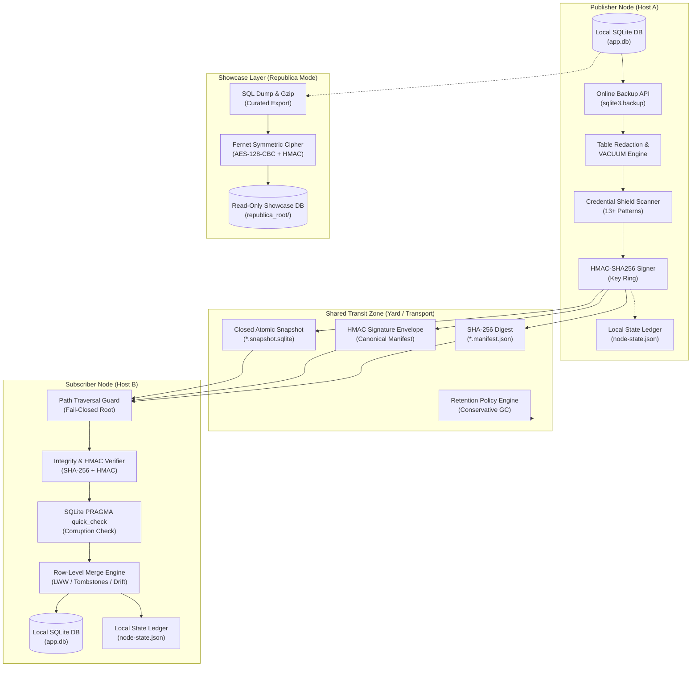
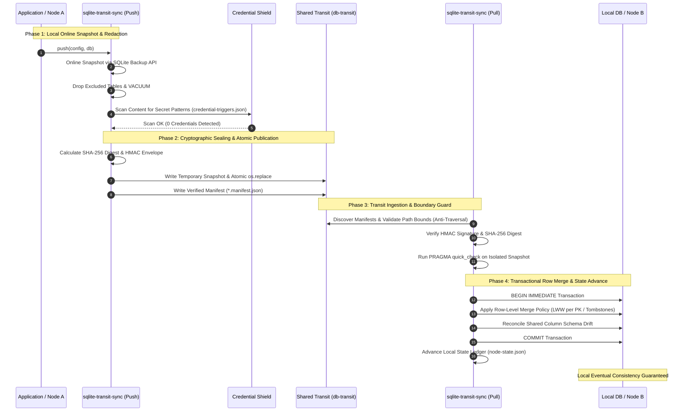

# sqlite-transit-sync


[](https://github.com/ellmos-ai/sqlite-transit-sync/actions/workflows/ci.yml)
[](CHANGELOG.md)
[](#tests)
[](https://www.python.org/)
[](#)
[](#)
[](THIRD_PARTY_LICENSES.md)
[](SECURITY.md)
[](SECURITY.md)
[](THIRD_PARTY_LICENSES.md)
[](NOTICE)
[](MARKETING-LOG.txt)
[](LICENSE)
[](https://github.com/ellmos-ai)
[](https://github.com/open-bricks)
[](llms.txt)

> [!NOTE]
> **LLM & AI Agent Context**: A structured machine-readable sitemap, architectural overview, and API guide is available at [`llms.txt`](llms.txt).

**🇩🇪 [Deutsche Version](README_de.md)** | **🛡️ [Security Policy](SECURITY.md)** | **📝 [Changelog](CHANGELOG.md)** | **📋 [llms.txt](llms.txt)**

## 🧭 Quick Navigation

1. [Executive Summary & Core Identity](#what-is-sqlite-transit-sync)
2. [Visual Architecture Topology & Decoupled Layers](#system-architecture-topology)
3. [End-to-End Snapshot & Synchronization Lifecycle](#end-to-end-snapshot-synchronization-lifecycle)
4. [Target Personas & High-Intent SEO Queries](#marketing--target-personas)
5. [Comparative Matrix vs. Alternatives](#comparison-with-distributed-sql)
6. [Governance & Runtime Invariants Matrix](#governance-runtime-invariants-matrix)
7. [Core Capabilities & Decoupled Features](#what-it-provides)
8. [Read-Only Application Projections](#read-only-application-projections)
9. [Installation & Prerequisites](#install)
10. [Quickstart & Multi-Node Workflow](#quick-start)
11. [Configuration Reference & Credential Triggers](#configuration)
12. [Republica Showcase & Cipher Method](#republica-the-showcase-method)
13. [Python API & Extension Points](#python-api)
14. [Safety, Threat Model & Operational Limits](#safety-and-limits)
15. [Third-Party Licenses & Level 1 SBOM](#third-party-licenses--transparency)
16. [Ecosystem, Sibling Tools & Bundles](#ecosystem--sibling-tools)
17. [Testing, Verification & CI Matrix](#tests)
18. [Statutory Notice, Liability Limitation & License (§ 521 BGB)](#license)

---

<a id="what-is-sqlite-transit-sync"></a><a id="core-identity"></a><a id="executive-summary--core-identity"></a>
## 1. Executive Summary & Core Identity

Version, module status, visibility and verification-date authority are defined
in [`METADATA_CONTRACT.md`](METADATA_CONTRACT.md); they do not constitute a
release or public-upload approval.

Local-first synchronization for independent SQLite databases through verified
snapshots and application-selectable merge policies. It is extracted from the
BACH ProSync architecture without BACH, OneDrive, host-name, or user-path
dependencies.

This is **not a distributed SQL server**. Every node owns and opens only its
local database. A shared folder, object-store mount, removable drive, or other
file transport carries closed snapshots plus manifests. Pulling verifies and
merges a snapshot into the local database inside one transaction.

Pairs well with [sync-master](https://github.com/dev-bricks/sync-master)
(same module family): a sync-master yard is a natural transit transport —
point `--transit` at a tool-owned `db-transit/<namespace>/` zone inside the
yard (its protocol rule R9). sync-master carries the documents, this module
owns database integrity and merging; both stay independent.

---

<a id="system-architecture-topology"></a><a id="system-architecture"></a>
## 2. Visual Architecture Topology & Decoupled Layers

The following diagram illustrates the multi-node decoupled topology where local SQLite databases are bridged exclusively through closed, verified snapshot bundles in transit storage:



---

<a id="end-to-end-snapshot-synchronization-lifecycle"></a><a id="lifecycle"></a>
## 3. End-to-End Snapshot & Synchronization Lifecycle

The end-to-end synchronization workflow guarantees that live databases are never exposed to file-level synchronization locks, and all data crossing node boundaries is cryptographically authenticated, credential-scanned, and transactionally merged:



---

<a id="marketing--target-personas"></a><a id="target-personas--discoverability-queries"></a><a id="target-personas"></a>
## 4. Target Personas & High-Intent SEO Queries

Designed for modular, decentralized ecosystems, `sqlite-transit-sync` addresses 4 core stakeholder personas:

- **`[PERSONA-01]` Autonomous AI Agent Engineers & Multi-Host Swarm Architects:**
  - *Challenge:* Multi-agent swarms operating across workstations, laptops, and servers require local state persistence without file-lock collisions.
  - *Solution:* Decoupled transit snapshots with credential shielding prevent token leaks into shared storage while maintaining asynchronous convergence.
- **`[PERSONA-02]` Multi-Device Desktop & Edge Application Developers:**
  - *Challenge:* Power users exchanging personal notes and task databases over file sync (e.g. sync-master, Syncthing, Nextcloud) suffer database corruption and `-wal` lock-ups.
  - *Solution:* Atomic publication via SQLite backup API and transactional row-level merge ensure local SQLite files are never directly exposed to cloud sync daemons.
- **`[PERSONA-03]` Local-First, Zero-Egress & Air-Gapped Tool Builders:**
  - *Challenge:* Applications requiring true data sovereignty cannot tolerate cloud lock-in, recurring database hosting fees, or background network egress.
  - *Solution:* 100% offline-capable synchronization using local filesystem directories, mount points, or removable drives with zero external dependencies.
- **`[PERSONA-04]` Enterprise Security, Privacy & Compliance Officers:**
  - *Challenge:* Strict zero-trust mandates forbid accidental credential synchronization, unverified binary blobs, and privileged background services.
  - *Solution:* Pre-publication regex scanning across 13+ secret families (`credential-triggers.json`), HMAC manifest sealing, SHA-256 integrity verification, and unprivileged `RunAsInvoker` user-mode execution.

### High-Intent Search Queries (Bilingual EN & DE)

| Intent Category | English (EN) Search Queries | German (DE) Suchbegriffe |
|:---|:---|:---|
| **Local-First Synchronization** | `sqlite synchronization python zero-dependency`, `local-first database snapshot sync`, `offline sqlite multi-device sync` | `lokale datenbank synchronisation offline snapshots`, `sqlite abgleich python ohne abhaengigkeiten`, `lokale datenbank replikation dateibasiert` |
| **Integrity & Credential Shield** | `credential shielded sqlite transfer zero-egress`, `hmac verified sqlite snapshot manifest`, `anti-traversal sqlite transit sync` | `zero egress datenbank replikation snapshot`, `geheimsichere sqlite synchronisation regex`, `integritaetsgepruefte datenbank snapshote` |
| **Row-Level Merge & Conflicts** | `row level merge lww sqlite offline`, `sqlite last write wins schema drift tolerance`, `tombstone merge policy sqlite` | `row level merge lww sqlite offline`, `last-write-wins datenbank abgleich zeitstempel`, `schema drift toleranz sqlite merge` |
| **Decoupled Architecture** | `sqlite multi-node sync without distributed sql`, `sqlite over syncthing without corruption`, `sqlite transit yard architecture` | `sqlite synchronisation ohne verteilten server`, `sqlite ueber cloud sync ohne datenbankkorruption`, `transit yard sqlite synchronisation` |

For detailed persona breakdowns, high-intent search queries, and competitive positioning, consult [MARKETING-LOG.txt](MARKETING-LOG.txt).

---

<a id="comparison-with-distributed-sql"></a><a id="comparative-matrix--alternatives"></a><a id="comparative-matrix"></a>
## 5. Comparative Matrix vs. Alternatives

The table below contrasts `sqlite-transit-sync` with four common architectural approaches to multi-node database synchronization across the 10 core technical dimensions and runtime invariants:

| Technical Dimension | Invariant | `sqlite-transit-sync` | Distributed SQL (Cockroach/TiDB) | Litestream / LiteFS | Direct SQLite over Cloud-Sync | Ad-Hoc Dump/JSON Scripts |
|:---|:---|:---|:---|:---|:---|:---|
| **1. Execution Privacy & Egress** | `INV-LOCAL-01` | **100% Local-First / Zero-Egress** | Multi-node cluster network required | Streaming replication to S3/Cloud | Relies on 3rd-party cloud sync service | Unverified / Manual |
| **2. Snapshot Atomicity** | `INV-SNAP-02` | **Online backup API + atomic `os.replace`** | Distributed Raft/Paxos consensus | Continuous WAL frame streaming | Partial file syncing while DB is active | Uncoordinated DB copy while locked |
| **3. Lock Contention & Sidecars** | `INV-ROLL-03` | **Fail-closed purge of `-wal`/`-shm`** | Distributed lock manager / MVCC | Requires active WAL monitoring | Fatal SQLite locking errors & file conflicts | Unhandled lock timeouts |
| **4. Filesystem Boundary Guard** | `INV-PATH-04` | **Strict root containment & anti-traversal** | Network socket protocol boundary | Object store key path | Host filesystem path sync | Unrestricted file paths |
| **5. Integrity & Sanity Verification** | `INV-VERIFY-05` | **SHA-256 + SQLite `PRAGMA quick_check`** | Raft log checksums | WAL segment checksums | None (relies on file size/hash) | None or fragile JSON parsing |
| **6. Credential Shielding** | `INV-SHIELD-06` | **Pre-publication scan (13+ secret families)** | Database role RBAC | None (replicates all bytes) | None (exfiltrates secrets to cloud) | None |
| **7. Authenticity & Envelope** | `INV-HMAC-07` | **HMAC-SHA256 signature over manifest** | Mutual TLS (mTLS) | Cloud IAM / AWS SigV4 | Cloud provider token | None |
| **8. Row Merge & Schema Drift** | `INV-MERGE-08` | **Transactional LWW per PK + tombstones** | Global serializable ACID transactions | Whole-replica restore (no row merge) | Binary conflict copies (no row merge) | Fragile custom SQL scripts |
| **9. Retention & Multi-Node Scope** | `INV-RET-09` | **Dry-run default, node-scoped cleanup** | Automated TTL / table compaction | S3 bucket lifecycle | Cloud recycle bin / version history | Uncontrolled disk growth |
| **10. Non-Elevation & Platform SLA** | `INV-SLA-10` | **Unprivileged `RunAsInvoker`, 48h SLA** | Complex multi-server daemon setup | Dedicated background daemon | System background daemon | Unverified execution |

### Distributed SQL Detailed Comparison

| Aspect | `sqlite-transit-sync` | Distributed SQL, for example CockroachDB or YugabyteDB |
|---|---|---|
| Basic model | Every node owns an independent local SQLite database | All servers form one logical SQL database |
| Writes | Local first, synchronized later | Coordinated directly by the cluster |
| Synchronization | Asynchronous snapshot pull and row merge | Continuous replication between cluster nodes |
| Consistency | Eventual consistency after successful exchange | Usually strong or serializable consistency |
| Consensus and quorum | None required | Usually Raft-based majority consensus |
| Global transactions | No | Yes, including transactions spanning nodes or shards |
| Conflict handling | Application-specific `MergePolicy`; timestamp LWW is the default | Transactions, MVCC, locking and consensus |
| Offline operation | A node can continue reading and writing independently | Writes normally require a reachable quorum |
| Network outage | Local work continues; synchronization waits | Minority partitions may lose write availability |
| Failure handling | Local databases remain usable; transit and backups need separate protection | Replication and automatic failover while quorum remains available |
| Data visibility | Changes become shared after push and pull | Committed changes are immediately authoritative in the cluster |
| Schema changes | The application migrates every local database | Cluster-wide SQL migrations |
| Deletions | Require tombstones or a custom policy | Normal transactional SQL deletes |
| Infrastructure | Python, SQLite and a configurable file transport | Multiple permanent database servers, TLS, monitoring and backups |
| Minimum always-on servers | None; one node is sufficient | Commonly at least three for fault tolerance |
| Primary strength | Offline-first simplicity, low cost and domain-specific merge rules | Strong consistency, concurrent writers and high availability |
| Primary limitation | No global ACID transaction or immediate shared truth | Considerably higher operational complexity and resource use |

### Advantages, Disadvantages and Typical Use Cases

| System | Advantages | Disadvantages | Good use cases | Poor use cases |
|---|---|---|---|---|
| `sqlite-transit-sync` | Very small footprint; works offline; no central server; local privacy; transport-independent; merge rules can follow the application domain | Delayed visibility; application-owned conflict, deletion, clock and migration semantics; no global ACID; no quorum failover | Personal knowledge and task databases; local AI agents; laptop/workstation/server exchange; field and edge applications; desktop software with optional synchronization; research notes | Payments, scarce inventory, seat reservations, real-time collaboration on the same records, or many concurrent writers |
| Distributed SQL | Shared authoritative database; strong consistency; global transactions; coordinated concurrent writes; automatic replication and failover; horizontal scaling | Requires permanent servers, networking, certificates, monitoring and upgrades; quorum can reduce write availability during partitions; higher latency and cost | Financial and booking systems; SaaS platforms; e-commerce inventory; global accounts; multiplayer backends; high-availability enterprise services | Small personal tools, intermittently connected devices, single-user desktop applications, or workloads already handled reliably by local SQLite |

### Quick Decision Guide

| Requirement | Prefer |
|---|---|
| Nodes must keep working offline | `sqlite-transit-sync` |
| Updates may become visible after a synchronization step | `sqlite-transit-sync` |
| Data should remain local and conflicts are infrequent | `sqlite-transit-sync` |
| Many clients modify the same records concurrently | Distributed SQL |
| Every commit must be globally authoritative immediately | Distributed SQL |
| Global transactions or automatic cluster failover are mandatory | Distributed SQL |

For a small number of intermittently connected personal or edge devices,
`sqlite-transit-sync` is usually the simpler fit. A central PostgreSQL service
is often the next step when real concurrent writers appear. Distributed SQL
becomes compelling when strong consistency must also survive server failures
across several permanently operated nodes.

---

<a id="governance-runtime-invariants-matrix"></a><a id="governance--runtime-invariants"></a>
## 6. Governance & Runtime Invariants Matrix

`sqlite-transit-sync` strictly adheres to 10 core governance and runtime invariants ensuring data integrity, boundary isolation, and security:

| # | Invariant | Architectural Scope | Guarantee & Verification Mechanism |
|---|---|---|---|
| 1 | **INV-LOCAL-01: 100% Local-First & Zero-Egress** | System Architecture | Operates exclusively against local SQLite database files (`app.db`). Zero telemetry, zero outbound HTTP/API calls, zero cloud dependencies. |
| 2 | **INV-SNAP-02: Offline Snapshot Atomicity** | Transit Publication | Live database files are never shared over file-sync. Online snapshots are taken via `sqlite3.backup` and published via atomic `os.replace`. |
| 3 | **INV-ROLL-03: Rollback Journal Clean Isolation** | Sidecar Prevention | Backups are closed in rollback-journal mode; all temporary SQLite sidecars (`-wal`, `-shm`, `-journal`) are cleaned fail-closed before manifest creation. |
| 4 | **INV-PATH-04: Strict Transit Path Containment** | Filesystem Boundary | Manifest and snapshot paths must be direct regular files within canonical transit root. Path traversal (`../`), symlinks, and reparse points fail closed. |
| 5 | **INV-VERIFY-05: Two-Stage Integrity & Sanity Verification** | Pre-Merge Validation | Every received snapshot must pass SHA-256 cryptographic digest matching and SQLite `PRAGMA quick_check` before inspecting or merging data. |
| 6 | **INV-SHIELD-06: Pre-Publication Credential Shielding** | Content Inspection | Content is systematically scanned for credential patterns across 13+ secret families (`credential-triggers.json`). Triggers fail-closed push abort naming `table.column`. |
| 7 | **INV-HMAC-07: HMAC Authenticity Envelope** | Identity & Non-Repudiation | Optional pluggable HMAC-SHA256 signature envelope over canonical manifest payload (protocol, namespace, sender ID, filename, SHA-256, size, redaction list). |
| 8 | **INV-MERGE-08: Deterministic Row-Level Merge** | Data Convergence | Transactional row-level merge (LWW per PK, shared column union for schema drift, explicit tombstone policy). Content hash tie-breaker ensures deterministic convergence. |
| 9 | **INV-RET-09: Conservative Retention & Authority Scoping** | Garbage Collection | Snapshot cleanup is dry-run by default, scoped strictly to the local node's artifacts. Cross-node deletion (`--all-nodes`) requires explicit administrative opt-in. |
| 10 | **INV-SLA-10: Non-Elevation & Multi-OS Parity** | Platform Runtime | Runs unprivileged in user mode (RunAsInvoker). Strict operational parity across Linux, Microsoft Windows, and macOS with zero external native dependencies and 48h security SLA. |

---

<a id="what-it-provides"></a><a id="core-capabilities"></a><a id="part-of-the-ellmos-stack-family"></a>
## 7. Core Capabilities & Decoupled Features

`sqlite-transit-sync` is a companion to
[dev-bricks/sync-master](https://github.com/dev-bricks/sync-master) in the
same module family: sync-master owns file transport (`sync.files`), this
module owns database integrity and merging (`sync.database`). Both work
standalone or composed into stacks from the
[ellmos-ai](https://github.com/ellmos-ai) family — see the
[ellmos-ai/stacks](https://github.com/ellmos-ai/stacks) catalog. Its role in
that toolkit: no live SQLite over file-sync — only verified snapshots plus
application-selectable merge policies.

### Key Capabilities

- consistent online snapshots through SQLite's backup API;
- atomic publication using a temporary file and `os.replace`;
- closed, rollback-journal snapshots with fail-closed cleanup of every temporary
  SQLite sidecar before publication;
- manifest and snapshot paths are restricted to direct regular files in the
  canonical transit directory; traversal, absolute paths, symlinks and reparse
  points fail closed before hashing or merge;
- SHA-256 manifest and `PRAGMA quick_check` verification;
- optional API-injected HMAC-SHA256 authentication over the canonical manifest,
  sender identity, protocol version and snapshot hash, with explicit key IDs;
- per-node local pull state and idempotent replay;
- row-level last-write-wins per primary key for timestamped tables;
- an opt-in `TombstoneMergePolicy` reference adapter for explicit deletions;
- shared-column merge for basic schema drift tolerance;
- configurable table exclusion and snapshot redaction with post-delete VACUUM;
- a content-level credential scan that aborts publication when a snapshot still
  contains credential-shaped values (on by default; reports `table.column`, never
  the value itself);
- custom `MergePolicy` support for domain rules, tombstones or CRDTs;
- verified snapshot cleanup with a dry-run default, local-node scope by default,
  and explicit opt-ins for deletion and foreign-node administration;
- selected pending pulls for thin application lifecycle adapters without duplicating merge or
  state-advancement logic;
- strict versioned read-only projection contracts with exact schema/privacy allowlists,
  provenance, checkpoint, loop and offline-tombstone verification;
- an optional [Republica showcase mode](#republica-the-showcase-method) that distributes a database
  one way as an encrypted payload and materialises it as a separate read-only showcase,
  instead of merging it;
- dependency-free Python API and JSON CLI (Republica mode adds `cryptography`).

---

<a id="read-only-application-projections"></a><a id="projections"></a>
## 8. Read-Only Application Projections

`verify-projection` validates a closed, application-owned SQLite projection
without copying, merging, migrating, scheduling, or advancing state. The
application supplies its consumer identity and reviewed maximum offline interval;
the verifier rejects loops, stale checkpoints, insufficient tombstone retention,
unlisted tables or columns, and non-opaque record references.

Six narrow contracts are bundled for account-balance summaries, AboTracker
subscription status, HausLagerist replenishment dates, medication
due/inventory-warning state, routine due/completion state, and insurance
deadlines. The AboTracker contract is
status-only because export schema v1 has no confirmed next due or renewal date;
it never derives a reminder from payment date plus billing cycle. Test fixtures
are synthetic JSON recipes, and domain identities or private details remain
outside the allowlists.

The bundled names are `abotracker-subscription-status-projection.v1`,
`accounts-balance-projection.v1`, `hauslagerist-replenishment-projection.v1`,
`mediplaner-reminder-projection.v1`,
`routinika-reminder-projection.v1`, and
`versicherungsmanager-deadline-projection.v1`.
See [Read-only projection contracts](PROJECTION_CONTRACTS.md) and the
[German companion](PROJECTION_CONTRACTS_de.md).

```bash
sqlite-transit-sync verify-projection \
  --contract mediplaner-reminder-projection.v1 \
  --database ./closed-projection.sqlite \
  --consumer-id reminder-consumer \
  --minimum-offline-seconds 2592000 \
  --previous-checkpoint 41
```

---

<a id="install"></a><a id="installation"></a>
## 9. Installation & Prerequisites

```bash
python -m pip install -e .
```

---

<a id="quick-start"></a><a id="quickstart"></a>
## 10. Quickstart & Multi-Node Workflow

Create a config on every node. Each node uses its own database and state file,
but the same transit directory and namespace.

```bash
sqlite-transit-sync init \
  --config node.json \
  --database ./app.db \
  --transit ./shared-transit \
  --node-id laptop \
  --namespace my-app

sqlite-transit-sync push --config node.json
sqlite-transit-sync pull --config node.json --dry-run
sqlite-transit-sync pull --config node.json
sqlite-transit-sync status --config node.json
sqlite-transit-sync verify --config node.json
sqlite-transit-sync cleanup --config node.json
# Review the JSON plan, then explicitly apply it:
sqlite-transit-sync cleanup --config node.json --apply
```

The application schema must already exist on each node. Automatic first-copy
is intentionally disabled because a generic module cannot decide which schema,
secrets, local tables or migrations belong to an application.

---

<a id="configuration"></a><a id="configuration-reference"></a>
## 11. Configuration Reference & Credential Triggers

```json
{
  "database": "./app.db",
  "transit": "./shared-transit",
  "state": "./node-state.json",
  "node_id": "laptop",
  "namespace": "my-app",
  "timestamp_columns": ["updated_at", "modified_at", "created_at"],
  "exclude_tables": ["secrets", "sqlite_sequence"],
  "snapshot_exclude_tables": ["secrets"],
  "scan_snapshot_for_secrets": true,
  "secret_scan_skip_tables": [],
  "secret_scan_extra_patterns": [],
  "secret_patterns_file": null
}
```

Relative paths are resolved from the config file. The live database must never
be located inside the transit directory, and the state file must be outside the
transit tree. `SyncConfig`, `from_file`, `from_bytes` and CLI `init` reject an
invalid state path before creating transit or state directories; no migration is
performed automatically.

Applications that need an audit hash for exactly the parsed configuration can
read the bytes once and use the same source-relative parser without a second
file read:

```python
import hashlib
from pathlib import Path

from sqlite_transit_sync import SyncConfig

config_path = Path("node.json").resolve()
payload = config_path.read_bytes()
config = SyncConfig.from_bytes(payload, source_path=config_path)
config_sha256 = hashlib.sha256(payload).hexdigest()
```

### All keys and their defaults

| Key | Default | Meaning |
|---|---|---|
| `database` | *(required)* | Live SQLite database owned by this node |
| `transit` | *(required)* | Shared directory carrying snapshots and manifests |
| `state` | `./.sync-state.json` | Per-node pull state; keep it out of the transit |
| `node_id` | machine hostname | Identifies the publishing node in snapshot names |
| `namespace` | `"default"` | Separates unrelated datasets in one transit |
| `timestamp_columns` | `["updated_at","modified_at","created_at"]` | Columns consulted for last-write-wins |
| `exclude_tables` | `["secrets","sqlite_sequence"]` | Tables never **merged** into the local database |
| `snapshot_exclude_tables` | `["secrets"]` | Tables whose rows are **deleted from the snapshot** before publication (then `VACUUM`) |
| `scan_snapshot_for_secrets` | `true` | Abort publication when snapshot content still looks like a credential |
| `secret_scan_skip_tables` | `[]` | Tables the scan ignores — use for a single noisy table instead of disabling the scan |
| `secret_scan_extra_patterns` | `[]` | Additional regexes, on top of the trigger file |
| `secret_patterns_file` | `null` (bundled file) | Path to your own trigger file; **replaces** the built-in patterns |
| `key_file` | `null`, else `$SQLITE_TRANSIT_SYNC_KEY_FILE` | Fernet key for Republica mode; must stay outside the transit |
| `republica_root` | `~/.republica` | Where imported showcases are written; must stay outside the transit |
| `allow_key_in_synced_folder` | `false` | Waives the check that refuses a key inside a cloud-sync folder |

The `state` default in this table applies when a JSON configuration is loaded
without that key. `sqlite-transit-sync init` instead writes
`.<config-stem>-state.json` when `--state` is omitted (for `node.json`:
`.node-state.json`).

### The credential scan, and how to turn it off

`snapshot_exclude_tables` can only drop a table you already anticipated. The scan
answers the question that rule cannot: *did a credential end up pasted into a
free-text column* — a note, a log line, a session summary? It runs on the snapshot
copy after redaction and before publication. On a match it raises `SyncError`
naming `table.column`; the matched value is never included, so the credential does
not travel into logs, tracebacks or CI output. The partial snapshot is discarded,
so nothing reaches the transit directory.

**Turning it off is a legitimate choice**, not a workaround. If your transit is a
storage location you control and trust — your own server, an EU-hosted volume under
your contract, an encrypted removable drive — and you *want* credentials to travel
with the data, then set:

```json
{ "scan_snapshot_for_secrets": false }
```

Prefer `secret_scan_skip_tables` when only one table produces false positives:
keeping the scan on everywhere else is worth more than silencing it globally.

### Tuning the triggers

Patterns live in data, not code — `sqlite_transit_sync/credential-triggers.json` —
so detection can be tightened over time without waiting for a release:

```json
{
  "version": 1,
  "patterns": [
    { "name": "github", "regex": "gh[pousr]_[A-Za-z0-9]{16,}", "prefilter": "gh" },
    { "name": "acme-internal", "regex": "ACME-[0-9]{4}", "prefilter": "ACME-" }
  ]
}
```

- `prefilter` is an optional literal used as a cheap SQL `LIKE` pre-filter so large
  snapshots stay fast. It **must** appear in every value the regex can match,
  otherwise findings are missed. Omit it when no such literal exists — the scanner
  then reads the column in full for correctness.
- Point `secret_patterns_file` at your own copy to replace the defaults entirely,
  or use `secret_scan_extra_patterns` to add to them.

Patterns are deliberately vendor-prefixed. A generic "long hexadecimal string" rule
would flag checksums, UUIDs and git SHAs, which are legitimate database content — and
a scanner with a high false-positive rate gets switched off, which protects nothing.
Treat a clean scan as "no known pattern matched", never as "this snapshot is free of
secrets".

### This is not a secrets manager

The scan **removes** credentials from the sync path. It does not **distribute** them.
If your actual problem is "my machines need the same passwords or API keys", this
module is the wrong tool — and so is any document-sync folder. Pick one of these
instead; all of them keep the plaintext away from a provider you do not control:

| Approach | Good for | Notes |
|---|---|---|
| **Vaultwarden** (self-hosted Bitwarden) | humans + CLI on several machines | Runs on a small always-on box; reach it over a private network (WireGuard, Tailscale) instead of exposing it. Official Bitwarden clients, browser extensions and the `bw` CLI work against it, so scripts and agents can fetch secrets too. |
| **SOPS + age** | secrets that belong next to code | Encrypted files are safe to commit and safe to put in any sync folder, because only ciphertext travels. Per-recipient keys, works well with git review. |
| **`pass`** (GPG) + git | Unix-minded single users and small teams | One file per secret, ordinary git remote, no server at all. |
| **KeePassXC database over Syncthing** | no server, no cloud account | Peer-to-peer file sync; the vault itself stays a single encrypted file. |
| **Infisical / OpenBao (Vault fork)** | teams, machine identities, rotation | Real secret servers with audit logs and dynamic credentials — more moving parts than a household needs. |
| **Platform-native stores** | one machine, one app | macOS Keychain, Windows DPAPI/Credential Manager, `systemd-creds`, or your CI's secret store. No sync, but no exposure either. |

Whichever you choose, the split that matters is the same: **one channel for data,
another for credentials.** Then this module's job is simply to make sure the first
channel never quietly becomes the second — which is exactly what the scan enforces.

---

<a id="republica-the-showcase-method"></a><a id="republica-showcase"></a>
## 12. Republica Showcase & Cipher Method

Each machine puts an **encrypted showcase** of its database into a shared file area. Every
other machine can look at it; none can change it. Hence the name — a re-publication of a
database, readable only by whoever holds the key.

Use it when `push`/`pull` does not fit: you want to *read* what another node knows without
merging it into your rows, or the only thing the machines share is a folder — no server, no
open ports, no trust setup — and that folder must not see your content in the clear.

### Two modes, deliberately redundant

Republica is **not a stopgap until a proper tunnel exists.** It is the second of two modes
meant to run side by side, so that a failure in one does not stop the other:

| Failure | Direct sync (`push`/`pull`) | Republica |
|---|---|---|
| A machine is asleep or offline | stalls (no peer) | keeps working — drop off now, pick up later |
| VPN/SSH down, network blocks the tunnel | stalls | keeps working over the file area |
| Key rotation or trust setup pending | stalls | keeps working with the shared key |
| Shared folder broken, full or desynced | keeps working | stalls |
| No merge policy agreed for a dataset | not applicable | keeps working — nothing is merged |

The whole value is that it works on the day the other path does not, so keep it configured
and exercised even while the direct path is healthy.

### Setup cost: one key transfer

The shared key must reach the other machines through **some channel that is not the
transport itself** — an existing encrypted tunnel, a password manager, a USB stick, reading
it out over the phone. Once. After that a plain shared folder is enough, forever, even one
you do not trust.

```text
republica_root/
  laptop/my-app.sqlite      <- read-only showcase of laptop's database
  workstation/my-app.sqlite <- read-only showcase of workstation's database
```

```bash
# Once per key, on local disk - never inside the transit, never in a synced folder.
# Then copy this file to the other machines out of band; do NOT run keygen there.
sqlite-transit-sync keygen --key-file ~/.keys/republica.key

sqlite-transit-sync init --config node.json \
  --database ./app.db --transit ./shared-transit \
  --node-id laptop --namespace my-app \
  --key-file ~/.keys/republica.key

sqlite-transit-sync republica-publish --config node.json   # encrypt and publish
sqlite-transit-sync republica-list    --config node.json   # what other nodes offer
sqlite-transit-sync republica-import  --config node.json   # materialise them locally
```

Requires the optional cipher: `pip install 'sqlite-transit-sync[crypto]'`.

**What travels** is not a database file but a curated SQL dump, gzip-compressed and
Fernet-encrypted. On a real 53.6 MB knowledge database that is 11.0 MB in transit, because
full-text index internals are rebuilt on arrival instead of shipped (35370 of 49636 dump
statements). The publication passes the same gate as a merge snapshot — redaction,
credential scan, `quick_check`, manifest.

**What it protects:** the transport sees ciphertext, and Fernet's HMAC detects deliberate
modification even when the manifest hash was recomputed to match.

**What it does not:** Fernet authenticates the *key*, not the *sender* — anyone holding it
can publish a valid snapshot. That is exactly why a replica is kept separate and never
merged. Keep the key out of the transport: a key inside the transit directory is refused,
and so is one in a folder that looks synchronised (override with
`allow_key_in_synced_folder`). The same rule applies to `republica_root` — a decrypted
replica inside the transit would be redistributed in the clear.

**Limit:** a full-text index without its own content (`content=''`) cannot be rebuilt,
because there is nothing to rebuild it from. Such tables are reported in the manifest as
`contentless_fts` instead of arriving silently empty.

### Sealed envelope: one file, same channel, never a database

The bootstrap problem: two machines share no secure channel *yet*, and that is exactly why a
credential has to cross. The same key and the same folder can carry a single encrypted file.

```bash
sqlite-transit-sync envelope-send    --config node.json --file ./api-token.txt --label api-token
sqlite-transit-sync envelope-receive --config node.json --into ~/credentials
```

The file arrives **as a file** (mode `0600`), named `<source-node>__<filename>`, and never
enters a database — a secret in a database gets copied onward by every backup, index and
sync that touches it. Notes should record where a secret lives, never the secret.

Two showcase rules are inverted on purpose: the **credential scan does not apply** (it would
block the very payload being moved), and the envelope is **removed from the transit** after
receipt, so a secret does not linger in a shared folder. Unsealing into the transit or into a
folder that looks cloud-synced is refused, and the filename is re-sanitised on arrival so a
crafted manifest cannot write outside the target directory.

This is a courier, not a password manager and not file sync — keep envelopes few and small.

---

<a id="python-api"></a><a id="api"></a>
## 13. Python API & Extension Points

```python
from sqlite_transit_sync import SyncConfig, TransitSync

sync = TransitSync(SyncConfig.from_file("node.json"))
snapshot = sync.push()
pending = sync.pending()
selected_reports = sync.pull_selected([pending[-1].path.name]) if pending else []
reports = sync.pull()
cleanup_plan = sync.cleanup()
print(
    snapshot.sha256,
    [report.as_dict() for report in reports],
    [report.as_dict() for report in selected_reports],
    cleanup_plan,
)
```

`pull_selected()` accepts only explicitly named snapshots that are currently pending and reuses
the same verification, merge and state gates as `pull()`. A thin lifecycle adapter can therefore
choose one eligible snapshot without copying the carrier's data mechanics.

### Optional authenticated manifests and read-only preflight

An integrating application can describe keys with non-secret
`HMACKeyReference` values. `load_hmac_authenticator()` obtains the bytes only
through an injected `SecretResolver`; `OSKeyringSecretResolver` is an optional,
lazy adapter for the separately installed `keyring` package. JSON config and
the CLI never carry key material:

```python
from sqlite_transit_sync import (
    HMACKeyReference,
    OSKeyringSecretResolver,
    load_hmac_authenticator,
    verify_authenticated_snapshot,
)

auth = load_hmac_authenticator(
    [HMACKeyReference(
        key_id="node-a-v2",
        service="ellmos-ocean-transit",
        account="node-a-v2",
        sender="node-a",
    )],
    active_key_id="node-a-v2",
    resolver=OSKeyringSecretResolver(),
    trusted_senders={"node-a"},
)
snapshot = verify_authenticated_snapshot(
    manifest_path,
    snapshot_path,
    authenticator=auth,
)
```

The reference adapter uses shared-key HMAC-SHA256, not non-repudiating public
signatures. Its canonical payload covers protocol, namespace, node, snapshot
name, SHA-256, size, redaction list and the algorithm/key/sender/trust-source header. Keep
old keys in the verifier key ring during rotation. A configured verifier rejects
missing, malformed, foreign or mismatched signatures. The explicit preflight
also rejects missing files and SQLite sidecars before hashing; it never opens
SQLite, merges rows, or reads/writes sync state. Its success authenticates the
named file bytes, not their SQLite schema or application semantics.
`TransitSync(..., authenticator=auth)` remains available for existing callers;
an already-pulled replay is a state-backed no-op, not a freshness guarantee. An
unconfigured reader makes no authenticity claim. Freshness and key storage
remain application concerns.

### Tombstone reference policy

For applications that need deletions, call `ensure_tombstone_table()` during
their own schema setup and use `TombstoneMergePolicy`. The reserved table stores
`table_name`, a canonical JSON array of primary-key values, and `deleted_at` as
the deletion version. A tombstone wins ties and older rows; a later row timestamp
may resurrect the key. The adapter never infers deletion from a missing row and
never prunes tombstones, so retention must cover the maximum offline interval.
Unknown tables and schema mismatches are left protected or fail closed; no
automatic migration is attempted.

Pass an object implementing `MergePolicy.merge(local, remote, snapshot)` to
`TransitSync` when timestamp LWW is not sufficient.

### Opt-in snapshot retention

Retention is explicit and dry-run by default. It never infers deletion from a
filename: only a verified snapshot in the configured namespace, owned by the
current node, no longer pending, and accepted by the caller's `acknowledge`
callback can be eligible. Foreign, unknown, incomplete, unverified and
unacknowledged artifacts are retained. Age boundaries are strict (`age >
max_age`); `keep_latest` and `max_age` may be combined.

```python
from datetime import timedelta
from sqlite_transit_sync import SnapshotRetentionPolicy

policy = SnapshotRetentionPolicy(
    max_age=timedelta(days=30),
    keep_latest=3,
    acknowledge=lambda snapshot: application_has_acked(snapshot),
)
report = sync.apply_retention(policy, dry_run=True, audit_path="retention-report.json")
# Apply only after reviewing exact planned paths and reasons:
report = sync.apply_retention(policy, dry_run=False, audit_path="retention-report.json")
```

The mutation re-reads and verifies every planned pair, deletes only its exact
snapshot and manifest, records errors without broad cleanup, and is safe to
repeat. Sidecars and incomplete artifacts stay retained. This is a neutral
core contract, not a BACH retention adapter.

### BACH compatibility golden comparison

Before any BACH compatibility adapter, run the committed synthetic comparison:

```bash
python scripts/compare_bach_golden.py --output golden/bach_compatibility_report.json
```

The seven fixtures cover closed backup, manifest/integrity failure,
redaction/credential abort, timestamp/schema merge, pull acknowledgement,
rollback and retention ownership. The report intentionally remains
`blocked_no_authorized_bach_golden` until an authorized BACH reference result
exists for every scenario; no adapter or compatibility claim follows.

---

<a id="safety-and-limits"></a><a id="threat-model"></a>
## 14. Safety, Threat Model & Operational Limits

- Never open a live SQLite database from a network or cloud-sync folder.
- Keep per-node state outside the shared transit; invalid equal/child paths are
  rejected before any directory or state write.
- Manifest reads accept one relative snapshot filename only; path containment
  and link/reparse checks happen before SHA-256, SQLite verification or merge.
- SHA-256 detects corruption but does not authenticate a hostile transport.
- HMAC authentication is optional shared-key identity checking, not a key
  distribution service, freshness protocol or public-key signature.
- Default LWW assumes comparable timestamps and does not infer deletions.
- Tombstone retention, clocks, key storage and application migrations remain
  integration responsibilities.
- Equal timestamps converge through a deterministic content tie-breaker; this is a
  technical fallback, not a substitute for domain conflict rules.
- Tables without a primary key or timestamp column are skipped.
- Snapshot redaction deletes listed tables and VACUUMs the snapshot, but it must
  still list every table containing credentials or private data; the generic
  module cannot discover domain secrets reliably.
- Application migrations, clock policy, retention parameters and conflict semantics stay
  with the integrating application. `cleanup` supplies only the mechanism: it verifies every
  pair, performs a dry-run by default, keeps the newest ten snapshots per node, and manages
  foreign nodes only when `--all-nodes` is explicit.
- Run only one sync process per node unless the host application adds a process lock.

See [ARCHITECTURE.md](ARCHITECTURE.md), [README_de.md](README_de.md) and
[SECURITY.md](SECURITY.md).

---

<a id="third-party-licenses--transparency"></a><a id="level-1-sbom"></a>
## 15. Third-Party Licenses & Level 1 SBOM

`sqlite-transit-sync` is dedicated to 100% local-first sovereignty with zero runtime telemetry and zero external runtime dependencies.

- **Zero Runtime Dependencies**: The core synchronization engine requires **only** the Python Standard Library (`>=3.10`).
- **Optional Showcase Layer**: The Republica encrypted showcase mode optionally utilizes [`cryptography`](https://github.com/pyca/cryptography) (Apache-2.0 / BSD-3-Clause). Optional OS keyring HMAC lookup uses [`keyring`](https://github.com/jaraco/keyring) (MIT).
- **Audit & Invariants**: Formally audited on 2026-09-20 with 100% permissive licenses (MIT, Apache-2.0, BSD-3-Clause, PSFL). Governed by **INV-LOCAL-01** (Zero-Egress) and **INV-SLA-10** (RunAsInvoker unprivileged execution).
- **Full Inventory & SBOM**: Detailed license texts, Zero-Copyleft isolation guarantee, RunAsInvoker certification, and Invariant Cross-Reference Matrix are documented in [THIRD_PARTY_LICENSES.md](THIRD_PARTY_LICENSES.md).
- **Formal Attribution**: Legal attribution notice is recorded in [NOTICE](NOTICE).

---

<a id="ecosystem--sibling-tools"></a><a id="sibling-tools"></a>
## 16. Ecosystem, Sibling Tools & Bundles

`sqlite-transit-sync` is part of the **ellmos-ai** and **open-bricks** local-first software ecosystem. Together with its sister repositories, it forms a modular suite for resilient, offline-first development, documentation, and agent orchestration:

| Repository | Focus / Domain | Description |
|---|---|---|
| [dev-bricks/sync-master](https://github.com/dev-bricks/sync-master) | File Sync Yard | Robust local-first file transport companion (`sync.files`) powering transit zones. |
| [ellmos-ai/policy-registry](https://github.com/ellmos-ai/policy-registry) | Policy Registry | Cryptographic policy evaluation and capability-bound agent execution. |
| [ellmos-ai/system-gap-master](https://github.com/ellmos-ai/system-gap-master) | System Topology | System drift inspection, sync yard health auditing, and topology validation. |
| [ellmos-ai/lock-master](https://github.com/ellmos-ai/lock-master) | Lock Management | Multi-agent concurrency coordinator with cooperative locking and deadlock detection. |
| [ellmos-ai/ticket-master](https://github.com/ellmos-ai/ticket-master) | Task Tracking | Local-first ticket and milestone tracking without external server dependencies. |
| [ellmos-ai/clutch](https://github.com/ellmos-ai/clutch) | Process Bridge | Subprocess management, stdio isolation, and process supervision for LLM tools. |
| [ellmos-ai/memoryhooker](https://github.com/ellmos-ai/memoryhooker) | Long-Term Memory | Persistent memory and context hooks for LLM interactions. |
| [ellmos-ai/workflowhooker](https://github.com/ellmos-ai/workflowhooker) | Workflow Automation | Event-driven pipeline interception and automated lifecycle hooks. |
| [ellmos-ai/ellmos-controlcenter-mcp](https://github.com/ellmos-ai/ellmos-controlcenter-mcp) | Control Center MCP | Unified orchestration gateway for tools, models, stacks, and subagents. |
| [ellmos-ai/ellmos-filecommander-mcp](https://github.com/ellmos-ai/ellmos-filecommander-mcp) | File Commander MCP | Safe, hardened file system operations with audit logs and boundary enforcement. |
| [ellmos-ai/ellmos-codecommander-mcp](https://github.com/ellmos-ai/ellmos-codecommander-mcp) | Code Commander MCP | High-level code analysis, AST transformations, and import diagnostic MCP server. |
| [dev-bricks/automation-master](https://github.com/dev-bricks/automation-master) | Automation Engine | Local event-sourced automation pipeline with projection-based execution. |
| [dev-bricks/DevCenter](https://github.com/dev-bricks/DevCenter) | Developer Cockpit | Desktop GUI for managing projects, environments, and multi-repo workflows. |
| [dev-bricks/CodeBox](https://github.com/dev-bricks/CodeBox) | Code Management | Local-first code library and AST pattern index. |
| [doc-bricks/PDFtoPDFocr](https://github.com/doc-bricks/PDFtoPDFocr) | Document OCR | Zero-egress searchable PDF conversion with OCR layer integration. |
| [open-bricks/open-bricks](https://github.com/open-bricks) | Umbrella Hub | Meta-repository and umbrella documentation for all open-source bricks. |

<!-- BEGIN GENERATED ELLMOS BUNDLE DISCOVERY -->

### Bundles and partners

Generated discovery projection for `module:sqlite-transit-sync` from `catalog:v4-bundles` (`546290dafbaafd810df1d59ef5a3d7183738472b48cd5a8a81f1e8f2b64d852e`).
Target repository visibility: `public`. Bundle manifests remain the membership authority; this section does not install or activate components.
Discovery approval: `public` module-registry record, explicit default-deny bundle allowlist.

#### `ellmos-sync-federation-bundle`

- Bundle recipe visibility: `private`; role: `declared-component`; requirement: `recommended`.
- module partners: `module:cloud-safe-exporter`, `module:direct-beam`, `module:receipt-validator`, `module:sync`, `module:system-explorer-export`, `module:system-gap-master`.
- skill partners: `skill:agent-config-sync`, `skill:mcp-config-sync`, `skill:system-onboarding`.

Composition and runtime details are intentionally omitted.

<!-- END GENERATED ELLMOS BUNDLE DISCOVERY -->

### Machine-Readable Index

For AI agents, LLMs, and automated tools, a structured sitemap and API index is available at [llms.txt](llms.txt).

---

<a id="tests"></a><a id="testing--verification"></a>
## 17. Testing, Verification & CI Matrix

```bash
python -m unittest discover -s tests -v
python -m pytest -q -ra
python -m pytest --collect-only -q
```

The suite uses only synthetic databases and temporary transit directories. The
CLI help, retention contract, golden comparison and JSON
init/status/push/list/verify/pull smoke are part of the verified test
collection; no live database, BACH runtime or external transport is used.

---

<a id="license"></a><a id="statutory-notice--liability-limitation"></a><a id="license--statutory-liability-limitation"></a>
## 18. Statutory Notice, Liability Limitation & License (§ 521 BGB)

### Statutory Disclaimer (§ 521 BGB Gefälligkeitsrecht)

Dieses Open-Source-Softwareprodukt wird als **unentgeltliche Schenkung** im Sinne der §§ 516 ff. BGB bereitgestellt. Gemäß **§ 521 BGB** ist die Haftung des Urhebers und der Beitragenden auf **Vorsatz und grobe Fahrlässigkeit** beschränkt. Ergänzend gelten die nachstehenden Haftungsausschlüsse der MIT-Lizenz.

Nutzung auf eigenes Risiko. Keine Wartungsverpflichtung, keine Verfügbarkeitszusicherung, keine Gewähr für Fehlerfreiheit oder Eignung für einen bestimmten Einsatzzweck.

### English Summary

This project is an unpaid open-source donation. In accordance with § 521 of the German Civil Code (BGB), liability is restricted strictly to cases of intentional misconduct and gross negligence. Supplemental liability disclaimers are set forth in the MIT License below.

Use entirely at your own risk. No maintenance commitments, no availability guarantees, and no warranties regarding fitness for any particular purpose.

### License & Attribution

Distributed under the terms of the [MIT License](LICENSE).<br>
Copyright (c) 2026 Lukas Geiger. See [LICENSE](LICENSE) and [NOTICE](NOTICE) for full details.<br>
Third-party dependency licenses and Level 1 SBOM notices are audited in [THIRD_PARTY_LICENSES.md](THIRD_PARTY_LICENSES.md).

### Provenance

Extracted in 2026 from BACH `system/hub/db_sync.py` (ProSync). The standalone
module replaces BACH-specific paths, handlers, secrets and table assumptions
with configuration and policy interfaces. It also merges per primary key and
adds verified manifests.
