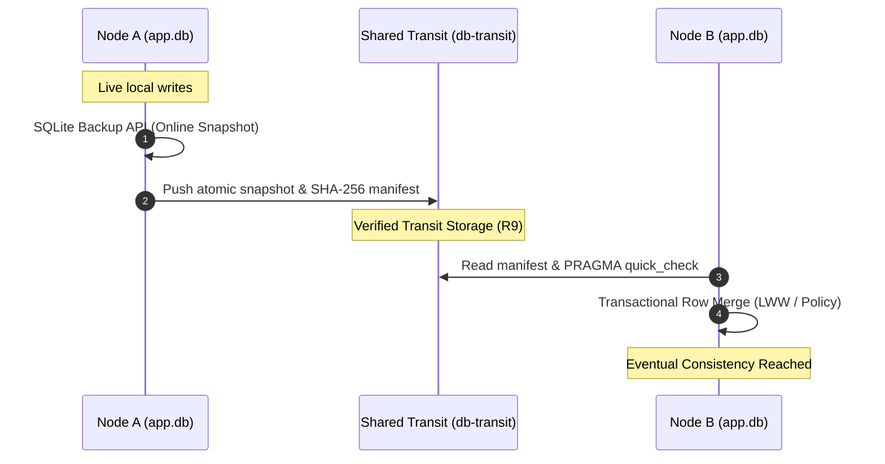

# sqlite-transit-sync


[English](README.md) | [Deutsch](README_de.md)

[](LICENSE)
[](https://www.python.org/)
[](#part-of-the-ellmos-stack-family)
[](#tests)
[](llms.txt)

> [!NOTE]
> **LLM & AI Agent Context**: A structured machine-readable sitemap, architectural overview, and API guide is available at [`llms.txt`](llms.txt).

Version, module status, visibility and verification-date authority are defined
in [`METADATA_CONTRACT.md`](METADATA_CONTRACT.md); they do not constitute a
release or public-upload approval.

Local-first synchronization for independent SQLite databases through verified
snapshots and application-selectable merge policies. It is extracted from the
BACH ProSync architecture without BACH, OneDrive, host-name, or user-path
dependencies.

This is **not a distributed SQL server**. Every node owns and opens only its
local database. A shared folder, object-store mount, removable drive, or other
file transport carries closed snapshots plus manifests. Pulling verifies and
merges a snapshot into the local database inside one transaction.

Pairs well with [sync-master](https://github.com/dev-bricks/sync-master)
(same module family): a sync-master yard is a natural transit transport —
point `--transit` at a tool-owned `db-transit/<namespace>/` zone inside the
yard (its protocol rule R9). sync-master carries the documents, this module
owns database integrity and merging; both stay independent.

## Architecture & Data Flow



## Part of the ellmos stack family

`sqlite-transit-sync` is a companion to
[dev-bricks/sync-master](https://github.com/dev-bricks/sync-master) in the
same module family: sync-master owns file transport (`sync.files`), this
module owns database integrity and merging (`sync.database`). Both work
standalone or composed into stacks from the
[ellmos-ai](https://github.com/ellmos-ai) family — see the
[ellmos-ai/stacks](https://github.com/ellmos-ai/stacks) catalog. Its role in
that toolkit: no live SQLite over file-sync — only verified snapshots plus
application-selectable merge policies.

## What it provides

- consistent online snapshots through SQLite's backup API;
- atomic publication using a temporary file and `os.replace`;
- closed, rollback-journal snapshots with fail-closed cleanup of every temporary
  SQLite sidecar before publication;
- manifest and snapshot paths are restricted to direct regular files in the
  canonical transit directory; traversal, absolute paths, symlinks and reparse
  points fail closed before hashing or merge;
- SHA-256 manifest and `PRAGMA quick_check` verification;
- optional API-injected HMAC-SHA256 authentication over the canonical manifest,
  sender identity, protocol version and snapshot hash, with explicit key IDs;
- per-node local pull state and idempotent replay;
- row-level last-write-wins per primary key for timestamped tables;
- an opt-in `TombstoneMergePolicy` reference adapter for explicit deletions;
- shared-column merge for basic schema drift tolerance;
- configurable table exclusion and snapshot redaction with post-delete VACUUM;
- a content-level credential scan that aborts publication when a snapshot still
  contains credential-shaped values (on by default; reports `table.column`, never
  the value itself);
- custom `MergePolicy` support for domain rules, tombstones or CRDTs;
- dependency-free Python API and JSON CLI.

## Install

```bash
python -m pip install -e .
```

## Quick start

Create a config on every node. Each node uses its own database and state file,
but the same transit directory and namespace.

```bash
sqlite-transit-sync init \
  --config node.json \
  --database ./app.db \
  --transit ./shared-transit \
  --node-id laptop \
  --namespace my-app

sqlite-transit-sync push --config node.json
sqlite-transit-sync pull --config node.json --dry-run
sqlite-transit-sync pull --config node.json
sqlite-transit-sync status --config node.json
sqlite-transit-sync verify --config node.json
```

The application schema must already exist on each node. Automatic first-copy
is intentionally disabled because a generic module cannot decide which schema,
secrets, local tables or migrations belong to an application.

## Configuration

```json
{
  "database": "./app.db",
  "transit": "./shared-transit",
  "state": "./node-state.json",
  "node_id": "laptop",
  "namespace": "my-app",
  "timestamp_columns": ["updated_at", "modified_at", "created_at"],
  "exclude_tables": ["secrets", "sqlite_sequence"],
  "snapshot_exclude_tables": ["secrets"],
  "scan_snapshot_for_secrets": true,
  "secret_scan_skip_tables": [],
  "secret_scan_extra_patterns": [],
  "secret_patterns_file": null
}
```

Relative paths are resolved from the config file. The live database must never
be located inside the transit directory, and the state file must be outside the
transit tree. `SyncConfig`, `from_file`, `from_bytes` and CLI `init` reject an
invalid state path before creating transit or state directories; no migration is
performed automatically.

Applications that need an audit hash for exactly the parsed configuration can
read the bytes once and use the same source-relative parser without a second
file read:

```python
import hashlib
from pathlib import Path

from sqlite_transit_sync import SyncConfig

config_path = Path("node.json").resolve()
payload = config_path.read_bytes()
config = SyncConfig.from_bytes(payload, source_path=config_path)
config_sha256 = hashlib.sha256(payload).hexdigest()
```

### All keys and their defaults

| Key | Default | Meaning |
|---|---|---|
| `database` | *(required)* | Live SQLite database owned by this node |
| `transit` | *(required)* | Shared directory carrying snapshots and manifests |
| `state` | `./.sync-state.json` | Per-node pull state; keep it out of the transit |
| `node_id` | machine hostname | Identifies the publishing node in snapshot names |
| `namespace` | `"default"` | Separates unrelated datasets in one transit |
| `timestamp_columns` | `["updated_at","modified_at","created_at"]` | Columns consulted for last-write-wins |
| `exclude_tables` | `["secrets","sqlite_sequence"]` | Tables never **merged** into the local database |
| `snapshot_exclude_tables` | `["secrets"]` | Tables whose rows are **deleted from the snapshot** before publication (then `VACUUM`) |
| `scan_snapshot_for_secrets` | `true` | Abort publication when snapshot content still looks like a credential |
| `secret_scan_skip_tables` | `[]` | Tables the scan ignores — use for a single noisy table instead of disabling the scan |
| `secret_scan_extra_patterns` | `[]` | Additional regexes, on top of the trigger file |
| `secret_patterns_file` | `null` (bundled file) | Path to your own trigger file; **replaces** the built-in patterns |

The `state` default in this table applies when a JSON configuration is loaded
without that key. `sqlite-transit-sync init` instead writes
`.<config-stem>-state.json` when `--state` is omitted (for `node.json`:
`.node-state.json`).

### The credential scan, and how to turn it off

`snapshot_exclude_tables` can only drop a table you already anticipated. The scan
answers the question that rule cannot: *did a credential end up pasted into a
free-text column* — a note, a log line, a session summary? It runs on the snapshot
copy after redaction and before publication. On a match it raises `SyncError`
naming `table.column`; the matched value is never included, so the credential does
not travel into logs, tracebacks or CI output. The partial snapshot is discarded,
so nothing reaches the transit directory.

**Turning it off is a legitimate choice**, not a workaround. If your transit is a
storage location you control and trust — your own server, an EU-hosted volume under
your contract, an encrypted removable drive — and you *want* credentials to travel
with the data, then set:

```json
{ "scan_snapshot_for_secrets": false }
```

Prefer `secret_scan_skip_tables` when only one table produces false positives:
keeping the scan on everywhere else is worth more than silencing it globally.

### Tuning the triggers

Patterns live in data, not code — `sqlite_transit_sync/credential-triggers.json` —
so detection can be tightened over time without waiting for a release:

```json
{
  "version": 1,
  "patterns": [
    { "name": "github", "regex": "gh[pousr]_[A-Za-z0-9]{16,}", "prefilter": "gh" },
    { "name": "acme-internal", "regex": "ACME-[0-9]{4}", "prefilter": "ACME-" }
  ]
}
```

- `prefilter` is an optional literal used as a cheap SQL `LIKE` pre-filter so large
  snapshots stay fast. It **must** appear in every value the regex can match,
  otherwise findings are missed. Omit it when no such literal exists — the scanner
  then reads the column in full for correctness.
- Point `secret_patterns_file` at your own copy to replace the defaults entirely,
  or use `secret_scan_extra_patterns` to add to them.

Patterns are deliberately vendor-prefixed. A generic "long hexadecimal string" rule
would flag checksums, UUIDs and git SHAs, which are legitimate database content — and
a scanner with a high false-positive rate gets switched off, which protects nothing.
Treat a clean scan as "no known pattern matched", never as "this snapshot is free of
secrets".

## This is not a secrets manager

The scan **removes** credentials from the sync path. It does not **distribute** them.
If your actual problem is "my machines need the same passwords or API keys", this
module is the wrong tool — and so is any document-sync folder. Pick one of these
instead; all of them keep the plaintext away from a provider you do not control:

| Approach | Good for | Notes |
|---|---|---|
| **Vaultwarden** (self-hosted Bitwarden) | humans + CLI on several machines | Runs on a small always-on box; reach it over a private network (WireGuard, Tailscale) instead of exposing it. Official Bitwarden clients, browser extensions and the `bw` CLI work against it, so scripts and agents can fetch secrets too. |
| **SOPS + age** | secrets that belong next to code | Encrypted files are safe to commit and safe to put in any sync folder, because only ciphertext travels. Per-recipient keys, works well with git review. |
| **`pass`** (GPG) + git | Unix-minded single users and small teams | One file per secret, ordinary git remote, no server at all. |
| **KeePassXC database over Syncthing** | no server, no cloud account | Peer-to-peer file sync; the vault itself stays a single encrypted file. |
| **Infisical / OpenBao (Vault fork)** | teams, machine identities, rotation | Real secret servers with audit logs and dynamic credentials — more moving parts than a household needs. |
| **Platform-native stores** | one machine, one app | macOS Keychain, Windows DPAPI/Credential Manager, `systemd-creds`, or your CI's secret store. No sync, but no exposure either. |

Whichever you choose, the split that matters is the same: **one channel for data,
another for credentials.** Then this module's job is simply to make sure the first
channel never quietly becomes the second — which is exactly what the scan enforces.

## Python API

```python
from sqlite_transit_sync import SyncConfig, TransitSync

sync = TransitSync(SyncConfig.from_file("node.json"))
snapshot = sync.push()
reports = sync.pull()
print(snapshot.sha256, [report.as_dict() for report in reports])
```

### Optional authenticated manifests

An integrating application can inject an application-owned authenticator; the
JSON config and CLI never carry key material:

```python
from sqlite_transit_sync import HMACKey, HMACSnapshotAuthenticator, TransitSync

auth = HMACSnapshotAuthenticator(
    keys={"node-a-v2": HMACKey(sender="node-a", secret=key_store.read_bytes())},
    active_key_id="node-a-v2",
    trusted_senders={"node-a"},
)
sync = TransitSync(config, authenticator=auth)
```

The reference adapter uses shared-key HMAC-SHA256, not non-repudiating public
signatures. Its canonical payload covers protocol, namespace, node, snapshot
name, SHA-256, size, redaction list and the algorithm/key/sender/trust-source header. Keep
old keys in the verifier key ring during rotation. A configured verifier rejects
missing, malformed, foreign or mismatched signatures before verification/merge;
an already-pulled replay is a state-backed no-op, not a freshness guarantee. An
unconfigured reader makes no authenticity claim. Freshness and key storage
remain application concerns.

### Tombstone reference policy

For applications that need deletions, call `ensure_tombstone_table()` during
their own schema setup and use `TombstoneMergePolicy`. The reserved table stores
`table_name`, a canonical JSON array of primary-key values, and `deleted_at` as
the deletion version. A tombstone wins ties and older rows; a later row timestamp
may resurrect the key. The adapter never infers deletion from a missing row and
never prunes tombstones, so retention must cover the maximum offline interval.
Unknown tables and schema mismatches are left protected or fail closed; no
automatic migration is attempted.

Pass an object implementing `MergePolicy.merge(local, remote, snapshot)` to
`TransitSync` when timestamp LWW is not sufficient.

### Opt-in snapshot retention

Retention is explicit and dry-run by default. It never infers deletion from a
filename: only a verified snapshot in the configured namespace, owned by the
current node, no longer pending, and accepted by the caller's `acknowledge`
callback can be eligible. Foreign, unknown, incomplete, unverified and
unacknowledged artifacts are retained. Age boundaries are strict (`age >
max_age`); `keep_latest` and `max_age` may be combined.

```python
from datetime import timedelta
from sqlite_transit_sync import SnapshotRetentionPolicy

policy = SnapshotRetentionPolicy(
    max_age=timedelta(days=30),
    keep_latest=3,
    acknowledge=lambda snapshot: application_has_acked(snapshot),
)
report = sync.apply_retention(policy, dry_run=True, audit_path="retention-report.json")
# Apply only after reviewing exact planned paths and reasons.
report = sync.apply_retention(policy, dry_run=False, audit_path="retention-report.json")
```

The mutation re-reads and verifies every planned pair, deletes only its exact
snapshot and manifest, records errors without broad cleanup, and is safe to
repeat. Sidecars and incomplete artifacts stay retained. This is a neutral
core contract, not a BACH retention adapter.

### BACH compatibility golden comparison

Before any BACH compatibility adapter, run the committed synthetic comparison:

```bash
python scripts/compare_bach_golden.py --output golden/bach_compatibility_report.json
```

The seven fixtures cover closed backup, manifest/integrity failure,
redaction/credential abort, timestamp/schema merge, pull acknowledgement,
rollback and retention ownership. The report intentionally remains
`blocked_no_authorized_bach_golden` until an authorized BACH reference result
exists for every scenario; no adapter or compatibility claim follows.

## Comparison with distributed SQL

| Aspect | `sqlite-transit-sync` | Distributed SQL, for example CockroachDB or YugabyteDB |
|---|---|---|
| Basic model | Every node owns an independent local SQLite database | All servers form one logical SQL database |
| Writes | Local first, synchronized later | Coordinated directly by the cluster |
| Synchronization | Asynchronous snapshot pull and row merge | Continuous replication between cluster nodes |
| Consistency | Eventual consistency after successful exchange | Usually strong or serializable consistency |
| Consensus and quorum | None required | Usually Raft-based majority consensus |
| Global transactions | No | Yes, including transactions spanning nodes or shards |
| Conflict handling | Application-specific `MergePolicy`; timestamp LWW is the default | Transactions, MVCC, locking and consensus |
| Offline operation | A node can continue reading and writing independently | Writes normally require a reachable quorum |
| Network outage | Local work continues; synchronization waits | Minority partitions may lose write availability |
| Failure handling | Local databases remain usable; transit and backups need separate protection | Replication and automatic failover while quorum remains available |
| Data visibility | Changes become shared after push and pull | Committed changes are immediately authoritative in the cluster |
| Schema changes | The application migrates every local database | Cluster-wide SQL migrations |
| Deletions | Require tombstones or a custom policy | Normal transactional SQL deletes |
| Infrastructure | Python, SQLite and a configurable file transport | Multiple permanent database servers, TLS, monitoring and backups |
| Minimum always-on servers | None; one node is sufficient | Commonly at least three for fault tolerance |
| Primary strength | Offline-first simplicity, low cost and domain-specific merge rules | Strong consistency, concurrent writers and high availability |
| Primary limitation | No global ACID transaction or immediate shared truth | Considerably higher operational complexity and resource use |

### Advantages, disadvantages and typical use cases

| System | Advantages | Disadvantages | Good use cases | Poor use cases |
|---|---|---|---|---|
| `sqlite-transit-sync` | Very small footprint; works offline; no central server; local privacy; transport-independent; merge rules can follow the application domain | Delayed visibility; application-owned conflict, deletion, clock and migration semantics; no global ACID; no quorum failover | Personal knowledge and task databases; local AI agents; laptop/workstation/server exchange; field and edge applications; desktop software with optional synchronization; research notes | Payments, scarce inventory, seat reservations, real-time collaboration on the same records, or many concurrent writers |
| Distributed SQL | Shared authoritative database; strong consistency; global transactions; coordinated concurrent writes; automatic replication and failover; horizontal scaling | Requires permanent servers, networking, certificates, monitoring and upgrades; quorum can reduce write availability during partitions; higher latency and cost | Financial and booking systems; SaaS platforms; e-commerce inventory; global accounts; multiplayer backends; high-availability enterprise services | Small personal tools, intermittently connected devices, single-user desktop applications, or workloads already handled reliably by local SQLite |

### Quick decision guide

| Requirement | Prefer |
|---|---|
| Nodes must keep working offline | `sqlite-transit-sync` |
| Updates may become visible after a synchronization step | `sqlite-transit-sync` |
| Data should remain local and conflicts are infrequent | `sqlite-transit-sync` |
| Many clients modify the same records concurrently | Distributed SQL |
| Every commit must be globally authoritative immediately | Distributed SQL |
| Global transactions or automatic cluster failover are mandatory | Distributed SQL |

For a small number of intermittently connected personal or edge devices,
`sqlite-transit-sync` is usually the simpler fit. A central PostgreSQL service
is often the next step when real concurrent writers appear. Distributed SQL
becomes compelling when strong consistency must also survive server failures
across several permanently operated nodes.

## Safety and limits

- Never open a live SQLite database from a network or cloud-sync folder.
- Keep per-node state outside the shared transit; invalid equal/child paths are
  rejected before any directory or state write.
- Manifest reads accept one relative snapshot filename only; path containment
  and link/reparse checks happen before SHA-256, SQLite verification or merge.
- SHA-256 detects corruption but does not authenticate a hostile transport.
- HMAC authentication is optional shared-key identity checking, not a key
  distribution service, freshness protocol or public-key signature.
- Default LWW assumes comparable timestamps and does not infer deletions.
- Tombstone retention, clocks, key storage and application migrations remain
  integration responsibilities.
- Equal timestamps converge through a deterministic content tie-breaker; this is a
  technical fallback, not a substitute for domain conflict rules.
- Tables without a primary key or timestamp column are skipped.
- Snapshot redaction deletes listed tables and VACUUMs the snapshot, but it must
  still list every table containing credentials or private data; the generic
  module cannot discover domain secrets reliably.
- Application migrations, clock policy, retention and conflict semantics stay
  with the integrating application.
- Run only one sync process per node unless the host application adds a process lock.

See [ARCHITECTURE.md](ARCHITECTURE.md), [README_de.md](README_de.md) and
[SECURITY.md](SECURITY.md).

<!-- BEGIN GENERATED ELLMOS BUNDLE DISCOVERY -->

## Bundles and partners

Generated discovery projection for `module:sqlite-transit-sync` from `catalog:v4-bundles` (`a52688938bcad21469beb546acfe6dd79ca40196a2bbaf246e5bd6aaac4bbbd7`).
Target repository visibility: `public`. Bundle manifests remain the membership authority; this section does not install or activate components.
Discovery approval: `public` module-registry record, explicit default-deny bundle allowlist.

### `ellmos-sync-federation-bundle`

- Bundle recipe visibility: `private`; role: `declared-component`; requirement: `recommended`.
- module partners: `module:cloud-safe-exporter`, `module:receipt-validator`, `module:sync`, `module:system-explorer-export`, `module:system-gap-master`.
- skill partners: `skill:agent-config-sync`, `skill:mcp-config-sync`, `skill:system-onboarding`.

Composition and runtime details are intentionally omitted.

<!-- END GENERATED ELLMOS BUNDLE DISCOVERY -->

## Machine-Readable Index

For AI agents, LLMs, and automated tools, a structured sitemap and API index is available at [llms.txt](llms.txt).

## Tests

```bash
python -m unittest discover -s tests -v
python -m pytest -q -ra
python -m pytest --collect-only -q
```

The suite uses only synthetic databases and temporary transit directories. The
CLI help, retention contract, golden comparison and JSON
init/status/push/list/verify/pull smoke are part of the same 53-test
collection; no live database, BACH runtime or external transport is used.

## Provenance

Extracted in 2026 from BACH `system/hub/db_sync.py` (ProSync). The standalone
module replaces BACH-specific paths, handlers, secrets and table assumptions
with configuration and policy interfaces. It also merges per primary key and
adds verified manifests.

MIT — see [LICENSE](LICENSE).
