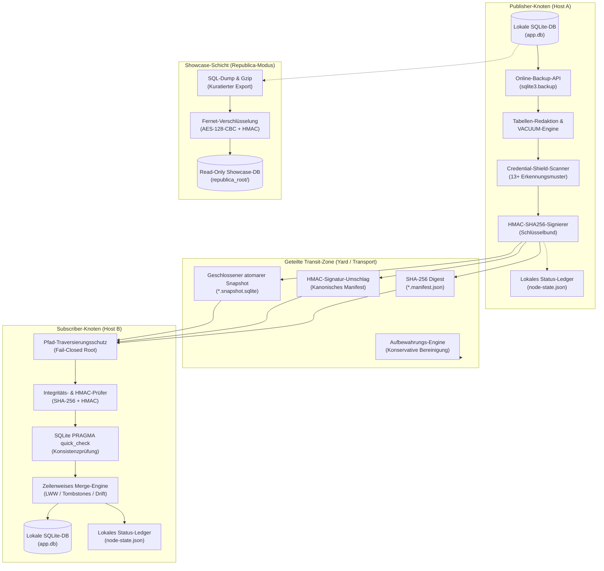
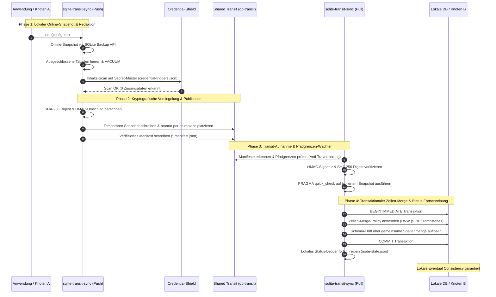

# sqlite-transit-sync


[](https://github.com/ellmos-ai/sqlite-transit-sync/actions/workflows/ci.yml)
[](CHANGELOG.md)
[](#tests-und-qualitaetssicherung)
[](https://www.python.org/)
[](#)
[](#)
[](THIRD_PARTY_LICENSES.md)
[](SECURITY.md)
[](SECURITY.md)
[](THIRD_PARTY_LICENSES.md)
[](NOTICE)
[](MARKETING-LOG.txt)
[](LICENSE)
[](https://github.com/ellmos-ai)
[](https://github.com/open-bricks)
[](llms.txt)

> [!NOTE]
> **Kontext für LLMs und KI-Agenten**: Ein strukturierter maschinenlesbarer Verzeichnisbaum, ein Architekturüberblick und ein API-Leitfaden stehen unter [`llms.txt`](llms.txt) bereit.

**🇬🇧 [English Version](README.md)** | **🛡️ [Sicherheitsrichtlinie](SECURITY.md)** | **📝 [Changelog](CHANGELOG.md)** | **📋 [llms.txt](llms.txt)**

## 🧭 Schnellnavigation

1. [Überblick & Kernidentität](#was-ist-sqlite-transit-sync)
2. [Visuelle Architekturtopologie & Entkoppelte Ebenen](#systemarchitektur-topologie)
3. [End-to-End Snapshot- und Synchronisations-Lebenszyklus](#end-to-end-snapshot--und-synchronisations-lebenszyklus)
4. [Zielgruppen & High-Intent Suchanfragen](#marketing--zielgruppen)
5. [Vergleichsmatrix gegenüber Alternativen](#vergleich-mit-distributed-sql)
6. [Governance- & Laufzeit-Invarianten-Matrix](#governance--laufzeit-invarianten-matrix)
7. [Eigenschaften & Kernfähigkeiten](#eigenschaften)
8. [Schreibgeschützte Anwendungsprojektionen](#schreibgeschuetzte-anwendungsprojektionen)
9. [Installation & Voraussetzungen](#installation)
10. [Kurzstart & Multi-Knoten-Arbeitsablauf](#kurzstart)
11. [Konfigurationsreferenz & Secret-Erkennung](#konfiguration)
12. [Republica — die Schaufenster-Methode & Chiffrierung](#republica-die-schaufenster-methode)
13. [Python-API & Erweiterungspunkte](#python-api)
14. [Sicherheit, Bedrohungsmodell & Betriebsgrenzen](#sicherheit-und-grenzen)
15. [Drittanbieter-Lizenzen & Level 1 SBOM](#drittanbieter-lizenzen--transparenz)
16. [Ökosystem, Partner-Werkzeuge & Bündel](#oekosystem--partner-werkzeuge)
17. [Tests, Verifikation & CI-Matrix](#tests-und-qualitaetssicherung)
18. [Gesetzlicher Hinweis, Haftungsbeschränkung & Lizenz (§ 521 BGB)](#lizenz--gesetzliche-haftungsbeschraenkung)

---

<a id="was-ist-sqlite-transit-sync"></a><a id="ueberblick--kernidentitaet"></a><a id="kernidentitaet"></a>
## 1. Überblick & Kernidentität

Die Autorität für Version, Modulstatus, Sichtbarkeit und Prüfdatum steht in
[`METADATA_CONTRACT.md`](METADATA_CONTRACT.md); daraus folgt keine Freigabe
für Veröffentlichung oder Upload.

Local-first-Synchronisierung für unabhängige SQLite-Datenbanken über geprüfte
Snapshots und von der Anwendung wählbare Merge-Policies. Das Modul wurde aus der
BACH-ProSync-Architektur extrahiert und enthält keine Abhängigkeiten von BACH,
OneDrive, Rechnernamen oder Benutzerpfaden.

Dies ist **kein verteilter SQL-Server**. Jeder Knoten besitzt und öffnet nur seine
lokale Datenbank. Ein gemeinsamer Ordner, ein eingebundener Object Store, ein
Wechseldatenträger oder ein anderer Dateitransport überträgt geschlossene Snapshots
mit Manifesten. Beim Pull wird ein Snapshot geprüft und innerhalb einer Transaktion
in die lokale Datenbank zusammengeführt.

Passt gut zu [sync-master](https://github.com/dev-bricks/sync-master) aus derselben
Modulfamilie: Ein sync-master-Yard ist ein natürlicher Transit-Transport. Dazu wird
`--transit` auf eine werkzeugeigene Zone `db-transit/<namespace>/` im Yard gesetzt
(dort Protokollregel R9). sync-master transportiert die Dokumente, dieses Modul
verantwortet Datenbankintegrität und Merge; beide bleiben unabhängig.

---

<a id="systemarchitektur-topologie"></a><a id="systemarchitektur"></a>
## 2. Visuelle Architekturtopologie & Entkoppelte Ebenen

Das folgende Diagramm visualisiert die entkoppelte Multi-Knoten-Architektur, bei der lokale SQLite-Datenbanken ausschließlich über geschlossene, validierte Snapshot-Bündel im Transitspeicher synchronisiert werden:



---

<a id="end-to-end-snapshot--und-synchronisations-lebenszyklus"></a><a id="lebenszyklus"></a>
## 3. End-to-End Snapshot- und Synchronisations-Lebenszyklus

Der End-to-End-Lebenszyklus stellt sicher, dass Live-Datenbanken niemals Dateisystem-Sperren von Synchronisationsdiensten ausgesetzt werden und sämtliche knotenübergreifenden Daten kryptografisch verifiziert, geheimnisfrei und transaktional zusammengeführt werden:



---

<a id="marketing--zielgruppen"></a><a id="zielgruppen--high-intent-suchanfragen"></a><a id="zielgruppen"></a>
## 4. Zielgruppen & High-Intent Suchanfragen

`sqlite-transit-sync` wurde für modulare, dezentrale Ökosysteme entwickelt und adressiert 4 Kern-Zielgruppen:

- **`[PERSONA-01]` Entwickler autonomer KI-Agenten & Multi-Host-Schwärme:**
  - *Herausforderung:* Multi-Agenten-Schwärme auf Laptops, Workstations und Servern benötigen lokale Zustandsspeicherung ohne Dateisperren-Kollisionen.
  - *Lösung:* Entkoppelte Transit-Snapshots mit Credential Shielding verhindern Secret-Leaks in gemeinsame Speicher bei asynchroner Datenkonvergenz.
- **`[PERSONA-02]` Multi-Device-Desktop- & Edge-Entwickler:**
  - *Herausforderung:* Entwickler persönlicher Notizen- und Task-Tools über File-Sync (z. B. sync-master, Syncthing, Nextcloud) leiden unter Dateikorruption und hängenden `-wal`-Sperren.
  - *Lösung:* Atomare Bereitstellung über die SQLite Backup-API und transaktionaler Zeilen-Merge schützen lokale SQLite-Dateien vor Cloud-Sync-Dämonen.
- **`[PERSONA-03]` Local-First-, Zero-Egress- & Air-Gapped-Softwarebauer:**
  - *Herausforderung:* Anwendungen mit strikter Datenhoheit dürfen weder Cloud-Lock-in noch monatliche Hosting-Gebühren oder Hintergrund-Telemetrie aufweisen.
  - *Lösung:* 100% offlinefähiger Datenabgleich über lokale Dateisystempfade, Mount-Points oder Wechseldatenträger ohne externe Abhängigkeiten.
- **`[PERSONA-04]` Enterprise-Sicherheits-, Datenschutz- & Compliance-Verantwortliche:**
  - *Herausforderung:* Strikte Zero-Trust-Richtlinien verbieten versehentliche Secret-Synchronisierung, unkontrollierte Binärdateien und privilegierte Hintergrunddienste.
  - *Lösung:* Regex-Inhaltsprüfungen vor der Veröffentlichung auf 13+ Secret-Familien (`credential-triggers.json`), HMAC-Manifest-Versiegelung, SHA-256-Integritätsprüfung und unprivilegierte `RunAsInvoker`-Benutzermodus-Ausführung.

### High-Intent Suchanfragen (Bilingual EN & DE)

| Kategorie | Englische (EN) Suchbegriffe | Deutsche (DE) Suchanfragen |
|:---|:---|:---|
| **Local-First Synchronisation** | `sqlite synchronization python zero-dependency`, `local-first database snapshot sync`, `offline sqlite multi-device sync` | `lokale datenbank synchronisation offline snapshots`, `sqlite abgleich python ohne abhaengigkeiten`, `lokale datenbank replikation dateibasiert` |
| **Integrität & Secret-Schutz** | `credential shielded sqlite transfer zero-egress`, `hmac verified sqlite snapshot manifest`, `anti-traversal sqlite transit sync` | `zero egress datenbank replikation snapshot`, `geheimsichere sqlite synchronisation regex`, `integritaetsgepruefte datenbank snapshote` |
| **Zeilen-Merge & Konflikte** | `row level merge lww sqlite offline`, `sqlite last write wins schema drift tolerance`, `tombstone merge policy sqlite` | `row level merge lww sqlite offline`, `last-write-wins datenbank abgleich zeitstempel`, `schema drift toleranz sqlite merge` |
| **Entkoppelte Topologie** | `sqlite multi-node sync without distributed sql`, `sqlite over syncthing without corruption`, `sqlite transit yard architecture` | `sqlite synchronisation ohne verteilten server`, `sqlite ueber cloud sync ohne datenbankkorruption`, `transit yard sqlite synchronisation` |

Ausführliche Zielgruppenanalysen, Suchbegriffe und Wettbewerbsvergleiche sind in [MARKETING-LOG.txt](MARKETING-LOG.txt) dokumentiert.

---

<a id="vergleich-mit-distributed-sql"></a><a id="vergleichsmatrix-gegenueber-alternativen"></a><a id="vergleichsmatrix"></a>
## 5. Vergleichsmatrix gegenüber Alternativen

Die folgende Matrix vergleicht `sqlite-transit-sync` mit vier verbreiteten Ansätzen zur knotenübergreifenden Datenbanksynchronisation entlang der 10 Kern-Laufzeitinvarianten:

| Technische Dimension | Invariante | `sqlite-transit-sync` | Distributed SQL (Cockroach/TiDB) | Litestream / LiteFS | Direkte SQLite über Cloud-Sync | Ad-Hoc Dump/JSON Skripte |
|:---|:---|:---|:---|:---|:---|:---|
| **1. Ausführungsprivatsphäre & Egress** | `INV-LOCAL-01` | **100% Local-First / Zero-Egress** | Multi-Knoten-Clusternetzwerk nötig | Streaming-Replikation zu S3/Cloud | Verlässt sich auf Cloud-Dienst | Ungeprüft / Manuell |
| **2. Snapshot-Atomarität** | `INV-SNAP-02` | **Online-Backup-API + atomarer `os.replace`** | Verteiltes Raft/Paxos-Quorum | Kontinuierliches WAL-Frame-Streaming | Teilsynchronisierung aktiver DBs | Unkoordinierte Kopie offener DBs |
| **3. Lock-Konflikte & Sidecars** | `INV-ROLL-03` | **Fail-closed Löschung von `-wal`/`-shm`** | Verteilter Lock-Manager / MVCC | Erfordert aktive WAL-Überwachung | Fatale SQLite Locking-Fehler & Konflikte | Unbehandelte Lock-Timeouts |
| **4. Pfadgrenzen-Wächter** | `INV-PATH-04` | **Strikte Root-Isolierung & Anti-Traversierung** | Socket-Protokollgrenze | Object-Store-Schlüsselpfad | Host-Dateisystempfad-Sync | Beliebige Dateipfade |
| **5. Integritäts- & Konsistenzprüfung** | `INV-VERIFY-05` | **SHA-256 + SQLite `PRAGMA quick_check`** | Raft-Log-Checksummen | WAL-Segment-Checksummen | Keine (nur Dateigröße/Hash) | Keine oder fragiles JSON-Parsing |
| **6. Secret-Schutz (Credential Shield)** | `INV-SHIELD-06` | **Prä-Publikations-Scan (13+ Familien)** | Rollenbasierte DB-Rechte | Keine (repliziert alle Bytes) | Keine (lädt Secrets in Cloud) | Keine |
| **7. Authentizität & Umschlag** | `INV-HMAC-07` | **HMAC-SHA256 über Manifest-Nutzlast** | Mutual TLS (mTLS) | Cloud IAM / AWS SigV4 | Provider-Token | Keine |
| **8. Zeilen-Merge & Schema-Drift** | `INV-MERGE-08` | **Transaktionales LWW je PK + Tombstones** | Globale serialisierbare ACID-Transaktionen | Voll-Replikat-Wiederherstellung | Binäre Konfliktkopien (kein Merge) | Fragile Skripte |
| **9. Aufbewahrung & Knoten-Umfang** | `INV-RET-09` | **Standardmäßiger Dry-Run, knotenbezogen** | Automatische TTL / Compaction | S3 Bucket-Lebenszyklus | Cloud-Papierkorb / Versionen | Unkontrolliertes Plattenwachstum |
| **10. Nicht-Eskalation & Plattform-SLA** | `INV-SLA-10` | **Unprivilegiertes `RunAsInvoker`, 48h SLA** | Komplexes Multi-Server-Setup | Dedizierter Hintergrunddienst | System-Hintergrunddienst | Unverifizierte Ausführung |

### Ausführlicher Vergleich mit Distributed SQL

| Kriterium | `sqlite-transit-sync` | Distributed SQL, z. B. CockroachDB oder YugabyteDB |
|---|---|---|
| Grundmodell | Jeder Knoten besitzt eine unabhängige lokale SQLite-Datenbank | Alle Server bilden eine einzige logische SQL-Datenbank |
| Schreibvorgänge | Zuerst lokal, später synchronisiert | Werden direkt vom Cluster koordiniert |
| Synchronisierung | Asynchroner Snapshot-Pull und Zeilen-Merge | Kontinuierliche Replikation zwischen Clusterknoten |
| Konsistenz | Eventual Consistency nach erfolgreichem Abgleich | In der Regel starke oder serialisierbare Konsistenz |
| Konsens und Quorum | Keiner erforderlich | Meist Raft-basierter Mehrheitskonsens |
| Globale Transaktionen | Nein | Ja, auch über mehrere Knoten oder Shards hinweg |
| Konfliktbehandlung | Anwendungsspezifische `MergePolicy`; Zeitstempel-LWW ist Standard | Transaktionen, MVCC, Sperren und Konsens |
| Offline-Betrieb | Ein Knoten kann unabhängig weiter lesen und schreiben | Schreibzugriffe erfordern in der Regel ein erreichbares Quorum |
| Netzwerkausfall | Lokale Arbeit läuft weiter; Synchronisierung wartet | Minderheits-Partitionen können Schreibverfügbarkeit verlieren |
| Fehlerbehandlung | Lokale Datenbanken bleiben nutzbar; Transit und Backups müssen separat geschützt werden | Replikation und automatisches Failover solange ein Quorum existiert |
| Datensichtbarkeit | Änderungen werden erst nach Push und Pull geteilt | Festgeschriebene Änderungen sind im Cluster sofort maßgeblich |
| Schemaänderungen | Die Anwendung migriert jede lokale Datenbank | Clusterweite SQL-Migrationen |
| Löschungen | Benötigen Tombstones oder eine eigene Policy | Normale transaktionale SQL-Löschungen |
| Infrastruktur | Python, SQLite und ein konfigurierbarer Dateitransport | Mehrere dauerhafte Datenbankserver, TLS, Monitoring und Backups |
| Mindestanzahl dauerhafter Server | Keine; ein einzelner Knoten genügt | Häufig mindestens drei für Fehlertoleranz |
| Größte Stärke | Einfachheit, Offline-Fähigkeit, geringe Kosten und fachliche Merge-Regeln | Starke Konsistenz, parallele Schreiber und Hochverfügbarkeit |
| Wichtigste Grenze | Keine globale ACID-Transaktion oder sofortige gemeinsame Wahrheit | Deutlich höherer Betriebsaufwand und Ressourcenbedarf |

### Vor- und Nachteile sowie typische Einsatzbereiche

| System | Vorteile | Nachteile | Geeignete Use Cases | Ungeeignete Use Cases |
|---|---|---|---|---|
| `sqlite-transit-sync` | Sehr geringer Ressourcenbedarf; offlinefähig; kein zentraler Server; lokale Datenhaltung; transportunabhängig; Merge-Regeln können der Fachdomäne folgen | Änderungen werden verzögert sichtbar; Konflikte, Löschungen, Zeitregeln und Migrationen bleiben Anwendungsverantwortung; keine globalen ACID-Transaktionen und kein Quorum-Failover | Persönliche Wissens- und Taskdatenbanken; lokale KI-Agenten; Laptop-, Workstation- und Serveraustausch; Außen- und Edge-Anwendungen; Desktop-Software mit optionaler Synchronisierung; Forschungsnotizen | Zahlungen, knappe Lagerbestände, Sitzplatzreservierungen, Echtzeit-Zusammenarbeit am selben Datensatz oder viele konkurrierende Writer |
| Distributed SQL | Gemeinsame autoritative Datenbank; starke Konsistenz; globale Transaktionen; koordinierte parallele Schreibzugriffe; automatische Replikation und Failover; horizontale Skalierung | Dauerhafte Server, Netzwerk, Zertifikate, Monitoring und Upgrades erforderlich; Quorum kann bei Partitionen Schreibzugriffe blockieren; höhere Latenz und Kosten | Finanz- und Buchungssysteme; SaaS-Plattformen; E-Commerce-Bestand; globale Benutzerkonten; Multiplayer-Backends; hochverfügbare Unternehmensdienste | Kleine persönliche Werkzeuge, zeitweise getrennte Geräte, Einzelbenutzer-Desktop-Anwendungen oder bereits zuverlässig durch lokale SQLite-Datenbanken abgedeckte Workloads |

### Schnelle Entscheidungshilfe

| Anforderung | Bevorzugter Ansatz |
|---|---|
| Knoten müssen offline weiterarbeiten | `sqlite-transit-sync` |
| Änderungen dürfen erst nach einem Synchronisierungsschritt sichtbar werden | `sqlite-transit-sync` |
| Daten sollen lokal bleiben und Konflikte sind selten | `sqlite-transit-sync` |
| Viele Clients verändern dieselben Datensätze gleichzeitig | Distributed SQL |
| Jeder Commit muss sofort global autoritativ sein | Distributed SQL |
| Globale Transaktionen oder automatisches Cluster-Failover sind Pflicht | Distributed SQL |

Für wenige zeitweise verbundene persönliche oder Edge-Geräte ist
`sqlite-transit-sync` meist die einfachere Lösung. Sobald echte konkurrierende
Writer entstehen, ist häufig eine zentrale PostgreSQL-Instanz der nächste sinnvolle
Schritt. Distributed SQL wird interessant, wenn starke Konsistenz zusätzlich den
Ausfall einzelner Server über mehrere dauerhaft betriebene Knoten überstehen muss.

---

<a id="governance--laufzeit-invarianten-matrix"></a><a id="governance--laufzeit-invarianten"></a>
## 6. Governance- & Laufzeit-Invarianten-Matrix

`sqlite-transit-sync` folgt 10 verbindlichen Architektur- und Laufzeit-Invarianten:

| # | Invariante | Architekturbereich | Garantie & Prüfmechanismus |
|---|---|---|---|
| 1 | **INV-LOCAL-01: 100% Local-First & Zero-Egress** | Systemarchitektur | Arbeitet ausschließlich auf lokalen SQLite-Dateien (`app.db`). Keine Telemetrie, keine ausgehenden Netzwerkverbindungen, keine Cloud-Abhängigkeiten. |
| 2 | **INV-SNAP-02: Offline Snapshot-Atomarität** | Transit-Publikation | Live-Datenbanken werden niemals über File-Sync geteilt. Online-Snapshots erfolgen über `sqlite3.backup` und werden per atomarem `os.replace` bereitgestellt. |
| 3 | **INV-ROLL-03: Saubere Rollback-Journal-Isolation** | Sidecar-Schutz | Snapshots werden im Rollback-Journal-Modus geschlossen; alle temporären Sidecars (`-wal`, `-shm`, `-journal`) werden vor Manifest-Erzeugung fail-closed bereinigt. |
| 4 | **INV-PATH-04: Strikte Transit-Pfadgrenzen** | Dateisystemgrenzen | Manifest- und Snapshot-Pfade müssen reguläre Dateien im kanonischen Transit-Root sein. Traversierung (`../`), absolute Pfade, Symlinks und Reparse-Points werden abgewiesen. |
| 5 | **INV-VERIFY-05: Zweistufige Integritäts- & Konsistenzprüfung** | Vorab-Validierung | Jeder empfangene Snapshot muss vor Datenzugriff oder Merge den kryptografischen SHA-256-Abgleich und SQLite `PRAGMA quick_check` fehlerfrei bestehen. |
| 6 | **INV-SHIELD-06: Secret-Scan vor Veröffentlichung** | Inhaltsprüfung | Snapshot-Daten werden systematisch auf 13+ Secret-Familien gescannt (`credential-triggers.json`). Treffer führen zum sofortigen Push-Abbruch mit Nennung von `tabelle.spalte`. |
| 7 | **INV-HMAC-07: HMAC-Authentizitätsumschlag** | Identität & Signatur | Optionaler HMAC-SHA256-Signaturumschlag über kanonische Manifest-Nutzlast (Protokoll, Namespace, Sender-ID, Dateiname, SHA-256, Größe, Redaktionsliste). |
| 8 | **INV-MERGE-08: Deterministischer Zeilen-Merge** | Datenkonvergenz | Transaktionaler Zeilen-Merge (LWW je PK, gemeinsame Spaltenmenge bei Schema-Drift, explizite Tombstones). Inhalts-Hash als Tie-Breaker garantiert Konvergenz. |
| 9 | **INV-RET-09: Konservative Aufbewahrungs- & Bereinigungslogik** | Garbage Collection | Snapshot-Bereinigung ist standardmäßig ein Dry-Run und auf lokale Knoten-Artefakte beschränkt. Knotenübergreifende Löschung (`--all-nodes`) erfordert explizite Bestätigung. |
| 10 | **INV-SLA-10: Nicht-Eskalation & Multi-OS-Parität** | Plattform-Laufzeit | Läuft unprivilegiert im Benutzermodus (`RunAsInvoker`). Strikte Parität unter Linux, Windows und macOS ohne externe native Abhängigkeiten bei 48h Sicherheits-SLA. |

---

<a id="eigenschaften"></a><a id="kernfaehigkeiten"></a><a id="teil-der-ellmos-stack-familie"></a>
## 7. Eigenschaften & Kernfähigkeiten

`sqlite-transit-sync` ist der Begleiter zu
[dev-bricks/sync-master](https://github.com/dev-bricks/sync-master) aus
derselben Modulfamilie: sync-master verantwortet den Dateitransport
(`sync.files`), dieses Modul verantwortet Datenbankintegrität und Merge
(`sync.database`). Beide funktionieren eigenständig oder zusammengestellt in
Stacks der [ellmos-ai](https://github.com/ellmos-ai)-Familie – siehe den
Katalog [ellmos-ai/stacks](https://github.com/ellmos-ai/stacks). Die Rolle in
diesem Baukasten: kein offenes SQLite über Datei-Sync, sondern nur geprüfte
Snapshots mit anwendungsspezifischen Merge-Policies.

### Kernfähigkeiten im Überblick

- Konsistente Online-Snapshots über die SQLite Backup-API;
- Atomare Veröffentlichung über temporäre Dateien und `os.replace`;
- Geschlossene Snapshots im Rollback-Journal-Modus mit Bereinigung temporärer
  SQLite-Dateien vor der Veröffentlichung;
- Pfadprüfung für Manifeste und Snapshots auf direkte reguläre Dateien im
  Transit-Ordner (Traversierung, absolute Pfade, Symlinks und Reparse Points
  schlagen fehl);
- Prüfung über SHA-256-Manifeste und `PRAGMA quick_check`;
- Optionale API-injizierte HMAC-SHA256-Authentifizierung über das kanonische
  Manifest, Sender-Identität, Protokollversion und Snapshot-Hash;
- Knotenlokaler Pull-Status und idempotente Wiederholung;
- Last-Write-Wins auf Zeilenebene je Primärschlüssel für tabellarische Daten mit
  Zeitstempel;
- Optionale `TombstoneMergePolicy` als Referenzadapter für explizite Löschungen;
- Merge über gemeinsame Spalten bei einfachem Schema-Drift;
- Konfigurierbarer Tabellenausschluss und Snapshot-Redaktion mit abschließendem `VACUUM`;
- Inhaltsbasierter Zugangsdaten-Scan, der die Veröffentlichung abbricht, falls
  der Snapshot noch verdächtige Werte enthält (standardmäßig aktiv; meldet
  `tabelle.spalte`, niemals den Wert selbst);
- Unterstützung für eigene `MergePolicy`-Implementierungen;
- Geprüfte Snapshot-Bereinigung mit standardmäßigem Dry-Run und Beschränkung auf
  den lokalen Knoten;
- Gezieltes Nachholen einzelner Snapshots über `pull_selected()`;
- Strikte versionierte Projektionsverträge für schreibgeschützte Auswertungen;
- Optionaler [Republica-Schaufenstermodus](#republica-die-schaufenster-methode)
  zur verschlüsselten Einweg-Bereitstellung;
- Abhängigkeitsfreie Python-API und JSON-CLI (Republica-Modus ergänzt `cryptography`).

---

<a id="schreibgeschuetzte-anwendungsprojektionen"></a><a id="projektionen"></a>
## 8. Schreibgeschützte Anwendungsprojektionen

`verify-projection` prüft eine geschlossene, anwendungseigene SQLite-Projektion,
ohne zu kopieren, zu mergen, zu migrieren, einen Scheduler zu starten oder
Zustand fortzuschreiben. Die Anwendung übergibt ihre Consumer-Identität und das
geprüfte maximale Offline-Intervall. Der Verifier weist Loops, veraltete
Checkpoints, zu kurze Tombstone-Aufbewahrung, nicht erlaubte Tabellen oder
Spalten sowie nicht opake Datensatzreferenzen zurück.

Mitgeliefert werden sechs enge Verträge für Kontostandsübersichten,
AboTracker-Abozustände, HausLagerist-Nachfülltermine, Medikamenten-Fälligkeiten
und Bestandswarnungen, Routinen-Fälligkeiten und Abschlussstatus sowie
Versicherungsfristen. Der
AboTracker-Vertrag ist nur eine Statusprojektion, weil Exportschema v1 kein
bestätigtes nächstes Fälligkeits- oder Verlängerungsdatum enthält; aus
Zahlungsdatum und Abrechnungszyklus wird kein Reminder abgeleitet. Die
Test-Fixtures sind synthetische JSON-Rezepte, fachliche Identitäten und private
Details bleiben außerhalb der Allowlists.

Die mitgelieferten Namen sind
`abotracker-subscription-status-projection.v1`,
`accounts-balance-projection.v1`, `hauslagerist-replenishment-projection.v1`,
`mediplaner-reminder-projection.v1`,
`routinika-reminder-projection.v1` und
`versicherungsmanager-deadline-projection.v1`. Siehe
[Read-only-Projektionsverträge](PROJECTION_CONTRACTS_de.md) und die
[englische Begleitdatei](PROJECTION_CONTRACTS.md).

```bash
sqlite-transit-sync verify-projection \
  --contract mediplaner-reminder-projection.v1 \
  --database ./closed-projection.sqlite \
  --consumer-id reminder-consumer \
  --minimum-offline-seconds 2592000 \
  --previous-checkpoint 41
```

---

<a id="installation"></a><a id="voraussetzungen"></a>
## 9. Installation & Voraussetzungen

```bash
python -m pip install -e .
```

---

<a id="kurzstart"></a><a id="arbeitsablauf"></a>
## 10. Kurzstart & Multi-Knoten-Arbeitsablauf

Auf jedem Knoten eine Konfiguration anlegen. Jeder Knoten nutzt eine eigene
Datenbank- und Statusdatei, aber denselben Transit-Ordner und denselben Namespace.

```bash
sqlite-transit-sync init \
  --config node.json \
  --database ./app.db \
  --transit ./shared-transit \
  --node-id laptop \
  --namespace my-app

sqlite-transit-sync push --config node.json
sqlite-transit-sync pull --config node.json --dry-run
sqlite-transit-sync pull --config node.json
sqlite-transit-sync status --config node.json
sqlite-transit-sync verify --config node.json
sqlite-transit-sync cleanup --config node.json
# Bereinigungsplan prüfen und anschließend explizit anwenden:
sqlite-transit-sync cleanup --config node.json --apply
```

Das Anwendungsschema muss auf jedem Knoten bereits existieren. Automatisches
Anlegen der Erstkopie ist bewusst deaktiviert.

---

<a id="konfiguration"></a><a id="konfigurationsreferenz"></a>
## 11. Konfigurationsreferenz & Secret-Erkennung

```json
{
  "database": "./app.db",
  "transit": "./shared-transit",
  "state": "./node-state.json",
  "node_id": "laptop",
  "namespace": "my-app",
  "timestamp_columns": ["updated_at", "modified_at", "created_at"],
  "exclude_tables": ["secrets", "sqlite_sequence"],
  "snapshot_exclude_tables": ["secrets"],
  "scan_snapshot_for_secrets": true,
  "secret_scan_skip_tables": [],
  "secret_scan_extra_patterns": [],
  "secret_patterns_file": null
}
```

Relative Pfade werden relativ zur Konfigurationsdatei aufgelöst. Die
aktive Datenbank darf niemals im Transit-Ordner liegen, und die Statusdatei muss
außerhalb des Transit-Baums bleiben.

```python
import hashlib
from pathlib import Path

from sqlite_transit_sync import SyncConfig

config_path = Path("node.json").resolve()
payload = config_path.read_bytes()
config = SyncConfig.from_bytes(payload, source_path=config_path)
config_sha256 = hashlib.sha256(payload).hexdigest()
```

### Schlüssel und Standardwerte

| Schlüssel | Standard | Bedeutung |
|---|---|---|
| `database` | *(Pflichtfeld)* | Lokale SQLite-Datenbank dieses Knotens |
| `transit` | *(Pflichtfeld)* | Gemeinsamer Ordner für Snapshots und Manifeste |
| `state` | `./.sync-state.json` | Knotenlokaler Status; gehört nicht in den Transit |
| `node_id` | Hostname der Maschine | Identifiziert den veröffentlichenden Knoten |
| `namespace` | `"default"` | Trennt unabhängige Datensätze im selben Transit |
| `timestamp_columns` | `["updated_at","modified_at","created_at"]` | Spalten für Last-Write-Wins |
| `exclude_tables` | `["secrets","sqlite_sequence"]` | Tabellen, die niemals lokal zusammengeführt werden |
| `snapshot_exclude_tables` | `["secrets"]` | Tabellen, deren Zeilen vor Veröffentlichung gelöscht werden (danach `VACUUM`) |
| `scan_snapshot_for_secrets` | `true` | Veröffentlichung abbrechen, wenn noch Secrets erkannt werden |
| `secret_scan_skip_tables` | `[]` | Tabellen, die der Scan ignoriert |
| `secret_scan_extra_patterns` | `[]` | Zusätzliche reguläre Ausdrücke |
| `secret_patterns_file` | `null` (mitgeliefert) | Eigene Triggerdatei; ersetzt die mitgelieferten Muster vollständig |
| `key_file` | `null`, sonst `$SQLITE_TRANSIT_SYNC_KEY_FILE` | Fernet-Schlüssel für Republica; gehört nicht in den Transit |
| `republica_root` | `~/.republica` | Zielordner importierter Schaufenster; gehört nicht in den Transit |
| `allow_key_in_synced_folder` | `false` | Hebt die Prüfung auf, die Schlüssel in Sync-Ordnern abweist |

### Der Credential-Scan und wie man ihn abschaltet

`snapshot_exclude_tables` kann nur Tabellen leeren, die vorher bekannt waren.
Der Scan beantwortet die Frage, die diese Regel nicht abdeckt: *Wurden Zugangsdaten
in eine Freitextspalte eingefügt?* Bei einem Treffer wird `SyncError` ausgelöst
und `tabelle.spalte` benannt; der Wert selbst taucht nirgendwo auf.

Das Abschalten ist eine legitime Option, wenn der Transit vollständig vertrauenswürdig ist:

```json
{ "scan_snapshot_for_secrets": false }
```

### Dies ist kein Secrets-Manager

Der Scan **entfernt** Zugangsdaten aus dem Synchronisationspfad. Er
**verteilt** sie nicht. Für geteilte Kennwörter oder API-Schlüssel eignen sich
Passwortmanager wie Vaultwarden, KeePassXC über Syncthing, `pass` mit Git,
SOPS oder plattformnative Speicher wie Keychain und Windows DPAPI.

---

<a id="republica-die-schaufenster-methode"></a><a id="republica-schaufenster"></a>
## 12. Republica — die Schaufenster-Methode & Chiffrierung

Jeder Rechner legt ein **verschlüsseltes Schaufenster** seiner Datenbank in
einem gemeinsamen Dateibereich ab. Alle anderen Rechner können hineinsehen;
keiner kann Änderungen zurückschreiben.

```bash
sqlite-transit-sync keygen --key-file ~/.keys/republica.key

sqlite-transit-sync init --config node.json \
  --database ./app.db --transit ./shared-transit \
  --node-id laptop --namespace my-app \
  --key-file ~/.keys/republica.key

sqlite-transit-sync republica-publish --config node.json
sqlite-transit-sync republica-list    --config node.json
sqlite-transit-sync republica-import  --config node.json
```

Erfordert das optionale Krypto-Paket: `pip install 'sqlite-transit-sync[crypto]'`.

### Versiegelter Umschlag: Eine Datei, derselbe Kanal, niemals eine Datenbank

```bash
sqlite-transit-sync envelope-send    --config node.json --file ./api-token.txt --label api-token
sqlite-transit-sync envelope-receive --config node.json --into ~/credentials
```

Die Datei kommt als Datei mit Rechten `0600` an (`<quell-knoten>__<dateiname>`)
und wird nach Empfang aus dem Transit gelöscht.

---

<a id="python-api"></a><a id="erweiterungspunkte"></a>
## 13. Python-API & Erweiterungspunkte

```python
from sqlite_transit_sync import SyncConfig, TransitSync

sync = TransitSync(SyncConfig.from_file("node.json"))
snapshot = sync.push()
pending = sync.pending()
selected_reports = sync.pull_selected([pending[-1].path.name]) if pending else []
reports = sync.pull()
cleanup_plan = sync.cleanup()
print(
    snapshot.sha256,
    [report.as_dict() for report in reports],
    [report.as_dict() for report in selected_reports],
    cleanup_plan,
)
```

### Optionale authentifizierte Manifeste und Vorabprüfung

```python
from sqlite_transit_sync import (
    HMACKeyReference,
    OSKeyringSecretResolver,
    load_hmac_authenticator,
    verify_authenticated_snapshot,
)

auth = load_hmac_authenticator(
    [HMACKeyReference(
        key_id="node-a-v2",
        service="ellmos-ocean-transit",
        account="node-a-v2",
        sender="node-a",
    )],
    active_key_id="node-a-v2",
    resolver=OSKeyringSecretResolver(),
    trusted_senders={"node-a"},
)
snapshot = verify_authenticated_snapshot(
    manifest_path,
    snapshot_path,
    authenticator=auth,
)
```

### Tombstone-Referenz-Policy

```python
from sqlite_transit_sync import TombstoneMergePolicy, ensure_tombstone_table
```

### Snapshot-Aufbewahrung (Retention)

```python
from datetime import timedelta
from sqlite_transit_sync import SnapshotRetentionPolicy

policy = SnapshotRetentionPolicy(
    max_age=timedelta(days=30),
    keep_latest=3,
    acknowledge=lambda snapshot: application_has_acked(snapshot),
)
report = sync.apply_retention(policy, dry_run=True, audit_path="retention-report.json")
report = sync.apply_retention(policy, dry_run=False, audit_path="retention-report.json")
```

---

<a id="sicherheit-und-grenzen"></a><a id="bedrohungsmodell"></a>
## 14. Sicherheit, Bedrohungsmodell & Betriebsgrenzen

- Eine aktive SQLite-Datenbank niemals aus einem Netzwerk- oder Cloud-Synchronisierungsordner öffnen.
- Zustandsdateien bleiben außerhalb des gemeinsamen Transits; gleiche oder untergeordnete Pfade werden vor jedem Schreibzugriff abgewiesen.
- Manifeste dürfen nur einen einzelnen relativen Snapshot-Dateinamen nennen; Containment- und Link-Prüfungen laufen vor SHA-256 und Merge.
- SHA-256 erkennt Beschädigung, authentifiziert aber keinen feindlichen Transport.
- HMAC ist eine optionale Shared-Key-Identitätsprüfung, kein Secrets-Manager oder Frischeprotokoll.
- Standard-LWW setzt vergleichbare Zeitstempel voraus und leitet keine Löschungen ab.
- Tabellen ohne Primärschlüssel oder Zeitstempelspalte werden übersprungen.
- Pro Knoten darf ohne zusätzlichen Prozess-Lock der Host-Anwendung nur ein Synchronisierungsprozess laufen.

Siehe [ARCHITECTURE.md](ARCHITECTURE.md), [README.md](README.md) und [SECURITY.md](SECURITY.md).

---

<a id="drittanbieter-lizenzen--transparenz"></a><a id="level-1-sbom-de"></a>
## 15. Drittanbieter-Lizenzen & Level 1 SBOM

`sqlite-transit-sync` steht für 100% lokale Datensouveränität ohne Telemetrie und ohne externe Laufzeitabhängigkeiten.

- **Keine externen Laufzeitabhängigkeiten**: Der Kern-Synchronisationsmotor benötigt **ausschließlich** die Python-Standardbibliothek (`>=3.10`).
- **Optionaler Schaufenster-Layer**: Der verschlüsselte Republica-Schaufenstermodus nutzt optional [`cryptography`](https://github.com/pyca/cryptography) (Apache-2.0 / BSD-3-Clause). Optionaler OS-Keyring-Support nutzt [`keyring`](https://github.com/jaraco/keyring) (MIT).
- **Audit & Invarianten**: Formell auditiert am 20.09.2026 mit 100% permissiven Lizenzen (MIT, Apache-2.0, BSD-3-Clause, PSFL). Gesteuert durch **INV-LOCAL-01** (Zero-Egress) und **INV-SLA-10** (RunAsInvoker-Ausführung im Benutzermodus mit 48h Sicherheits-SLA).
- **Vollständiges Inventar & SBOM**: Vollständige Lizenztexte, Zero-Copyleft-Garantie, RunAsInvoker-Zertifizierung und die Invarianten-Matrix sind in [THIRD_PARTY_LICENSES.md](THIRD_PARTY_LICENSES.md) dokumentiert.
- **Formelle Namensnennung**: Die rechtliche Urheberrechtsnotiz ist in [NOTICE](NOTICE) hinterlegt.

---

<a id="oekosystem--partner-werkzeuge"></a><a id="partner-werkzeuge"></a>
## 16. Ökosystem, Partner-Werkzeuge & Bündel

`sqlite-transit-sync` ist Teil des lokalen **ellmos-ai**- und **open-bricks**-Software-Ökosystems. Zusammen mit den Schwester-Repositories bildet es einen modularen Baukasten für resiliente, offline-fähige Softwareentwicklung, Dokumentenverwaltung und Agenten-Orchestrierung:

| Repository | Fokus / Domäne | Beschreibung |
|---|---|---|
| [dev-bricks/sync-master](https://github.com/dev-bricks/sync-master) | Datei-Sync-Yard | Robuster Begleiter für lokalen Dateitransport (`sync.files`) und Bereitstellung von Transit-Zonen. |
| [ellmos-ai/policy-registry](https://github.com/ellmos-ai/policy-registry) | Policy Registry | Kryptografische Richtlinienprüfung und berechtigungsbasierte Agenten-Ausführung. |
| [ellmos-ai/system-gap-master](https://github.com/ellmos-ai/system-gap-master) | Systemtopologie | Drift-Inspektion, Sync-Yard-Integritätsaudit und Validierung der Systemtopologie. |
| [ellmos-ai/lock-master](https://github.com/ellmos-ai/lock-master) | Lock-Management | Multi-Agenten-Gleichzeitigkeitskoordination mit kooperativer Sperrung und Deadlock-Erkennung. |
| [ellmos-ai/ticket-master](https://github.com/ellmos-ai/ticket-master) | Aufgabenverwaltung | Lokales Ticket- und Meilenstein-Tracking ohne externe Server-Abhängigkeiten. |
| [ellmos-ai/clutch](https://github.com/ellmos-ai/clutch) | Prozessbrücke | Subprozess-Verwaltung, Stdio-Isolation und Prozessüberwachung für LLM-Tools. |
| [ellmos-ai/memoryhooker](https://github.com/ellmos-ai/memoryhooker) | Langzeitgedächtnis | Persistente Speicher- und Kontexthooks für wiederkehrende LLM-Interaktionen. |
| [ellmos-ai/workflowhooker](https://github.com/ellmos-ai/workflowhooker) | Workflow-Automatisierung | Ereignisgesteuerte Pipeline-Interzeption und automatisierte Lebenszyklus-Hooks. |
| [ellmos-ai/ellmos-controlcenter-mcp](https://github.com/ellmos-ai/ellmos-controlcenter-mcp) | Control Center MCP | Zentrales MCP-Gateway für Werkzeuge, KI-Modelle, Stacks und Subagenten. |
| [ellmos-ai/ellmos-filecommander-mcp](https://github.com/ellmos-ai/ellmos-filecommander-mcp) | File Commander MCP | Gehärtete Dateisystem-Operationen mit Audit-Logs und strenger Pfadgrenzen-Durchsetzung. |
| [ellmos-ai/ellmos-codecommander-mcp](https://github.com/ellmos-ai/ellmos-codecommander-mcp) | Code Commander MCP | MCP-Server für Quellcode-Analyse, AST-Transformationen und Import-Diagnostik. |
| [dev-bricks/automation-master](https://github.com/dev-bricks/automation-master) | Automations-Engine | Lokale, ereignisbasierte Automatisierungs-Pipeline mit projektionsbasierter Ausführung. |
| [dev-bricks/DevCenter](https://github.com/dev-bricks/DevCenter) | Entwickler-Cockpit | Desktop-GUI zur Verwaltung lokaler Projekte, Laufzeitumgebungen und Repositories. |
| [dev-bricks/CodeBox](https://github.com/dev-bricks/CodeBox) | Snippet-Verwaltung | Lokale Code-Bibliothek und AST-basierter Quellcode-Index. |
| [doc-bricks/PDFtoPDFocr](https://github.com/doc-bricks/PDFtoPDFocr) | Dokumenten-OCR | Lokale Konvertierung in durchsuchbare PDFs mit integrierter OCR-Schicht (Zero-Egress). |
| [open-bricks/open-bricks](https://github.com/open-bricks) | Dachorganisation | Dach-Repository und zentrale Dokumentation aller quelloffenen Bricks. |

<!-- BEGIN ELLMOS BUNDLE DISCOVERY DE -->

### Bundles und Partner

Geprüfte Discovery-Projektion für `module:sqlite-transit-sync` aus
`catalog:v4-bundles`
(`546290dafbaafd810df1d59ef5a3d7183738472b48cd5a8a81f1e8f2b64d852e`).
Das Ziel-Repository ist `public`. Die Bundle-Manifeste bleiben die Autorität
für Mitgliedschaften; dieser Abschnitt installiert oder aktiviert keine
Komponenten. Die Freigabe beruht auf einem öffentlichen Modul-Registry-Eintrag
und einer ausdrücklichen Default-deny-Allowlist für Bundles.

#### `ellmos-sync-federation-bundle`

- Sichtbarkeit des Bundle-Rezepts: `private`; Rolle: `declared-component`;
  Anforderung: `recommended`.
- Modulpartner: `module:cloud-safe-exporter`, `module:direct-beam`,
  `module:receipt-validator`, `module:sync`, `module:system-explorer-export`,
  `module:system-gap-master`.
- Skill-Partner: `skill:agent-config-sync`, `skill:mcp-config-sync`,
  `skill:system-onboarding`.

Kompositions- und Runtime-Details werden bewusst nicht offengelegt.

<!-- END ELLMOS BUNDLE DISCOVERY DE -->

### Maschinenlesbarer Index

Für KI-Agenten, LLMs und automatisierte Werkzeuge steht unter [llms.txt](llms.txt)
ein strukturierter Verzeichnisbaum mit API-Index bereit.

---

<a id="tests-und-qualitaetssicherung"></a><a id="tests-de"></a>
## 17. Tests, Verifikation & CI-Matrix

```bash
python -m unittest discover -s tests -v
python -m pytest -q -ra
python -m pytest --collect-only -q
```

Die Suite verwendet ausschließlich synthetische Datenbanken und temporäre
Transit-Verzeichnisse. Hilfe, Retention-Vertrag, Golden-Vergleich sowie der
JSON-Smoke für init/status/push/list/verify/pull gehören zur geprüften Sammlung
der Testsuite; keine echte Datenbank, BACH-Laufzeit oder externer Transport
werden verwendet.

---

<a id="lizenz--gesetzliche-haftungsbeschraenkung"></a><a id="gesetzlicher-hinweis--haftungsbeschraenkung"></a><a id="lizenz"></a>
## 18. Gesetzlicher Hinweis, Haftungsbeschränkung & Lizenz (§ 521 BGB)

### Statutory Disclaimer (§ 521 BGB Gefälligkeitsrecht)

Dieses Open-Source-Softwareprodukt wird als **unentgeltliche Schenkung** im Sinne der §§ 516 ff. BGB bereitgestellt. Gemäß **§ 521 BGB** ist die Haftung des Urhebers und der Beitragenden auf **Vorsatz und grobe Fahrlässigkeit** beschränkt. Ergänzend gelten die nachstehenden Haftungsausschlüsse der MIT-Lizenz.

Nutzung auf eigenes Risiko. Keine Wartungsverpflichtung, keine Verfügbarkeitszusicherung, keine Gewähr für Fehlerfreiheit oder Eignung für einen bestimmten Einsatzzweck.

### English Summary

This project is an unpaid open-source donation. In accordance with § 521 of the German Civil Code (BGB), liability is restricted strictly to cases of intentional misconduct and gross negligence. Supplemental liability disclaimers are set forth in the MIT License below.

Use entirely at your own risk. No maintenance commitments, no availability guarantees, and no warranties regarding fitness for any particular purpose.

### Lizenz & Namensnennung

Veröffentlicht unter den Bedingungen der [MIT-Lizenz](LICENSE).<br>
Copyright (c) 2026 Lukas Geiger. Siehe [LICENSE](LICENSE) und [NOTICE](NOTICE) für vollständige Details.<br>
Drittanbieter-Lizenzen und Level 1 SBOM-Hinweise sind in [THIRD_PARTY_LICENSES.md](THIRD_PARTY_LICENSES.md) auditiert.

### Herkunft

Das Modul wurde 2026 aus BACH `system/hub/db_sync.py` (ProSync) extrahiert. Die
eigenständige Fassung ersetzt BACH-spezifische Pfade, Handler, Secrets und
Tabellenannahmen durch Konfigurations- und Policy-Schnittstellen. Sie führt den
Merge außerdem je Primärschlüssel aus und ergänzt geprüfte Manifeste.
