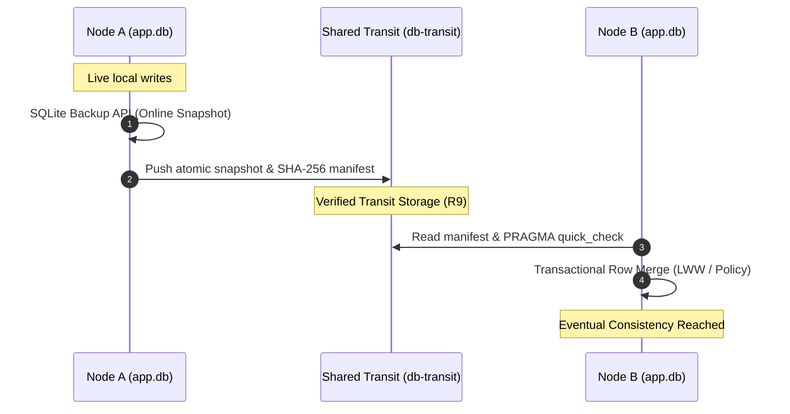

# sqlite-transit-sync


[English](README.md) | [Deutsch](README_de.md)

[](LICENSE)
[](https://www.python.org/)
[](#teil-der-ellmos-stack-familie)
[](#tests)
[](llms.txt)

> [!NOTE]
> **Kontext für LLMs und KI-Agenten**: Ein strukturierter maschinenlesbarer Verzeichnisbaum, ein Architekturüberblick und ein API-Leitfaden stehen unter [`llms.txt`](llms.txt) bereit.

Die Autorität für Version, Modulstatus, Sichtbarkeit und Prüfdatum steht in
[`METADATA_CONTRACT.md`](METADATA_CONTRACT.md); daraus folgt keine Freigabe
für Veröffentlichung oder Upload.

Local-first-Synchronisierung für unabhängige SQLite-Datenbanken über geprüfte
Snapshots und von der Anwendung wählbare Merge-Policies. Das Modul wurde aus der
BACH-ProSync-Architektur extrahiert und enthält keine Abhängigkeiten von BACH,
OneDrive, Rechnernamen oder Benutzerpfaden.

Dies ist **kein verteilter SQL-Server**. Jeder Knoten besitzt und öffnet nur seine
lokale Datenbank. Ein gemeinsamer Ordner, ein eingebundener Object Store, ein
Wechseldatenträger oder ein anderer Dateitransport überträgt geschlossene Snapshots
mit Manifesten. Beim Pull wird ein Snapshot geprüft und innerhalb einer Transaktion
in die lokale Datenbank zusammengeführt.

Passt gut zu [sync-master](https://github.com/dev-bricks/sync-master) aus derselben
Modulfamilie: Ein sync-master-Yard ist ein natürlicher Transit-Transport. Dazu wird
`--transit` auf eine werkzeugeigene Zone `db-transit/<namespace>/` im Yard gesetzt
(dort Protokollregel R9). sync-master transportiert die Dokumente, dieses Modul
verantwortet Datenbankintegrität und Merge; beide bleiben unabhängig.

## Architektur & Datenfluss



## Teil der ellmos-Stack-Familie

`sqlite-transit-sync` ist ein Companion-Modul zu
[dev-bricks/sync-master](https://github.com/dev-bricks/sync-master) aus derselben
Modulfamilie: sync-master verantwortet den Dateitransport (`sync.files`), dieses
Modul die Datenbankintegrität und den Merge (`sync.database`). Beide sind
eigenständig oder als Teil von Stacks aus der
[ellmos-ai](https://github.com/ellmos-ai)-Familie nutzbar; siehe den
[ellmos-ai/stacks](https://github.com/ellmos-ai/stacks)-Katalog. Seine Rolle in
diesem Baukasten: kein Live-SQLite über Dateisynchronisierung, sondern ausschließlich
geprüfte Snapshots mit von der Anwendung wählbaren Merge-Policies.

## Eigenschaften

- konsistente Online-Snapshots über die SQLite-Backup-API;
- atomare Veröffentlichung über eine temporäre Datei und `os.replace`;
- geschlossene Snapshots im Rollback-Journal-Modus mit Fail-closed-Bereinigung aller
  temporären SQLite-Sidecars vor der Veröffentlichung;
- Manifest- und Snapshot-Pfade sind auf direkte reguläre Dateien im kanonischen
  Transit-Verzeichnis begrenzt; Traversierung, absolute Pfade, Symlinks und
  Reparse-Punkte werden vor Hash, Prüfung und Merge fail-closed abgewiesen;
- SHA-256-Manifest und Prüfung mit `PRAGMA quick_check`;
- optionale, per API injizierte HMAC-SHA256-Authentifizierung über kanonisches
  Manifest, Senderidentität, Protokollversion und Snapshot-Hash mit Schlüssel-IDs;
- lokaler Pull-Zustand je Knoten und idempotente Wiederholung;
- zeilenweises Last-write-wins pro Primärschlüssel für Tabellen mit Zeitstempel;
- eine optionale Referenz-Policy `TombstoneMergePolicy` für ausdrücklich
  gespeicherte Löschungen;
- Merge gemeinsamer Spalten für grundlegende Toleranz gegenüber Schema-Drift;
- konfigurierbare Tabellenausschlüsse und Snapshot-Redaktion mit anschließendem
  `VACUUM`;
- inhaltsbezogener Credential-Scan, der die Veröffentlichung abbricht, wenn ein
  Snapshot weiterhin zugangsdatenähnliche Werte enthält (standardmäßig aktiv;
  gemeldet wird `table.column`, niemals der Wert selbst);
- eigene `MergePolicy` für fachliche Regeln, Tombstones oder CRDTs;
- Python-API und JSON-CLI ohne zusätzliche Laufzeitabhängigkeiten.

## Installation

```bash
python -m pip install -e .
```

## Kurzstart

Auf jedem Knoten wird eine Konfiguration angelegt. Jeder Knoten verwendet seine
eigene Datenbank und Zustandsdatei, aber dasselbe Transit-Verzeichnis und denselben
Namespace.

```bash
sqlite-transit-sync init \
  --config node.json \
  --database ./app.db \
  --transit ./shared-transit \
  --node-id laptop \
  --namespace my-app

sqlite-transit-sync push --config node.json
sqlite-transit-sync pull --config node.json --dry-run
sqlite-transit-sync pull --config node.json
sqlite-transit-sync status --config node.json
sqlite-transit-sync verify --config node.json
```

Das Anwendungsschema muss auf jedem Knoten bereits existieren. Ein automatisches
Erstkopieren ist absichtlich deaktiviert, weil ein generisches Modul nicht
entscheiden kann, welches Schema, welche Secrets, lokalen Tabellen oder Migrationen
zu einer Anwendung gehören.

## Konfiguration

```json
{
  "database": "./app.db",
  "transit": "./shared-transit",
  "state": "./node-state.json",
  "node_id": "laptop",
  "namespace": "my-app",
  "timestamp_columns": ["updated_at", "modified_at", "created_at"],
  "exclude_tables": ["secrets", "sqlite_sequence"],
  "snapshot_exclude_tables": ["secrets"],
  "scan_snapshot_for_secrets": true,
  "secret_scan_skip_tables": [],
  "secret_scan_extra_patterns": [],
  "secret_patterns_file": null
}
```

Relative Pfade werden vom Speicherort der Konfigurationsdatei aus aufgelöst. Die
aktive Datenbank darf niemals innerhalb des Transit-Verzeichnisses liegen; die
Zustandsdatei muss außerhalb des Transitbaums liegen. `SyncConfig`,
`from_file`, `from_bytes` und CLI-`init` weisen einen ungültigen Zustandspfad
vor jeder Transit- oder Zustandsdatei zurück und führen keine Migration aus.

Anwendungen, die einen Audit-Hash für genau die eingelesene Konfiguration benötigen,
können die Bytes einmal lesen und mit demselben quellrelativen Parser verwenden,
ohne die Datei ein zweites Mal einzulesen:

```python
import hashlib
from pathlib import Path

from sqlite_transit_sync import SyncConfig

config_path = Path("node.json").resolve()
payload = config_path.read_bytes()
config = SyncConfig.from_bytes(payload, source_path=config_path)
config_sha256 = hashlib.sha256(payload).hexdigest()
```

### Alle Schlüssel und ihre Standardwerte

| Schlüssel | Standardwert | Bedeutung |
|---|---|---|
| `database` | *(erforderlich)* | Aktive SQLite-Datenbank dieses Knotens |
| `transit` | *(erforderlich)* | Gemeinsames Verzeichnis für Snapshots und Manifeste |
| `state` | `./.sync-state.json` | Pull-Zustand dieses Knotens; außerhalb des Transits aufbewahren |
| `node_id` | Rechnername | Identifiziert den veröffentlichenden Knoten in Snapshot-Namen |
| `namespace` | `"default"` | Trennt unabhängige Datensätze innerhalb eines Transits |
| `timestamp_columns` | `["updated_at","modified_at","created_at"]` | Für Last-write-wins geprüfte Spalten |
| `exclude_tables` | `["secrets","sqlite_sequence"]` | Tabellen, die niemals in die lokale Datenbank **gemergt** werden |
| `snapshot_exclude_tables` | `["secrets"]` | Tabellen, deren Zeilen vor der Veröffentlichung aus dem Snapshot **gelöscht** werden, gefolgt von `VACUUM` |
| `scan_snapshot_for_secrets` | `true` | Bricht die Veröffentlichung ab, wenn der Snapshot-Inhalt weiterhin wie Zugangsdaten aussieht |
| `secret_scan_skip_tables` | `[]` | Tabellen, die der Scan auslässt; bei einer einzelnen störenden Tabelle besser als die vollständige Abschaltung |
| `secret_scan_extra_patterns` | `[]` | Zusätzliche reguläre Ausdrücke, ergänzend zur Trigger-Datei |
| `secret_patterns_file` | `null` (mitgelieferte Datei) | Pfad zu einer eigenen Trigger-Datei; **ersetzt** die eingebauten Muster |

Der `state`-Standardwert in dieser Tabelle gilt, wenn eine JSON-Konfiguration ohne
diesen Schlüssel geladen wird. `sqlite-transit-sync init` schreibt ohne `--state`
stattdessen `.<config-stem>-state.json` (für `node.json`: `.node-state.json`).

### Der Credential-Scan und wie man ihn abschaltet

`snapshot_exclude_tables` kann nur Tabellen entfernen, die bereits bekannt sind.
Der Scan beantwortet die darüber hinausgehende Frage: *Sind Zugangsdaten in einer
Freitextspalte gelandet* – etwa in einer Notiz, Logzeile oder Sitzungszusammenfassung?
Er läuft nach der Redaktion und vor der Veröffentlichung auf der Snapshot-Kopie.
Bei einem Treffer löst er einen `SyncError` mit `table.column` aus; der gefundene
Wert wird niemals ausgegeben und gelangt daher nicht in Logs, Tracebacks oder
CI-Ausgaben. Der unvollständige Snapshot wird verworfen, sodass nichts das
Transit-Verzeichnis erreicht.

**Das Abschalten ist eine legitime Entscheidung**, kein Notbehelf. Wer den
Transport selbst kontrolliert und ihm vertraut – eigener Server, EU-gehostetes
Volume unter eigenem Vertrag oder verschlüsselter Wechseldatenträger – und
Zugangsdaten bewusst mit den Daten transportieren möchte, setzt:

```json
{ "scan_snapshot_for_secrets": false }
```

Wenn nur eine Tabelle Fehlalarme erzeugt, sollte `secret_scan_skip_tables` verwendet
werden. Der Schutz bleibt dann für alle anderen Tabellen aktiv.

### Trigger anpassen

Die Muster liegen als Daten statt im Code unter
`sqlite_transit_sync/credential-triggers.json`. Dadurch lässt sich die Erkennung
verschärfen, ohne auf ein Release zu warten:

```json
{
  "version": 1,
  "patterns": [
    { "name": "github", "regex": "gh[pousr]_[A-Za-z0-9]{16,}", "prefilter": "gh" },
    { "name": "acme-internal", "regex": "ACME-[0-9]{4}", "prefilter": "ACME-" }
  ]
}
```

- `prefilter` ist ein optionales Literal für einen schnellen SQL-`LIKE`-Vorfilter,
  damit große Snapshots schnell bleiben. Es **muss** in jedem Wert vorkommen, auf
  den der reguläre Ausdruck passt; andernfalls werden Funde übersehen. Fehlt ein
  solches Literal, wird die gesamte Spalte gelesen, damit die Prüfung korrekt bleibt.
- Mit `secret_patterns_file` ersetzt eine eigene Datei die Standardmuster
  vollständig; `secret_scan_extra_patterns` ergänzt sie.

Die Muster sind bewusst herstellerpräfixiert. Eine allgemeine Regel für „lange
hexadezimale Zeichenfolgen“ würde Prüfsummen, UUIDs und Git-SHAs erfassen, obwohl
diese legitime Datenbankinhalte sind. Ein Scanner mit vielen Fehlalarmen wird
abgeschaltet und schützt dann gar nicht mehr. Ein sauberer Scan bedeutet „kein
bekanntes Muster gefunden“, niemals „dieser Snapshot enthält garantiert keine
Secrets“.

## Das hier ist kein Passwort-Manager

Der Scan **entfernt** Zugangsdaten aus dem Synchronisierungsweg. Er **verteilt** sie
nicht. Wenn das eigentliche Problem lautet „meine Rechner benötigen dieselben
Passwörter oder API-Schlüssel“, ist dieses Modul das falsche Werkzeug – ebenso wie
jeder Dokumenten-Synchronisierungsordner. Stattdessen sollte einer der folgenden
Ansätze verwendet werden; alle halten Klartext von einem nicht selbst
kontrollierten Anbieter fern:

| Ansatz | Geeignet für | Hinweise |
|---|---|---|
| **Vaultwarden** (selbst gehostetes Bitwarden) | Menschen und CLI auf mehreren Rechnern | Läuft auf einem kleinen ständig aktiven Rechner; Zugriff über ein privates Netz wie WireGuard oder Tailscale statt über eine öffentliche Freigabe. Offizielle Bitwarden-Clients, Browser-Erweiterungen und die `bw`-CLI funktionieren damit, sodass auch Skripte und Agenten Secrets abrufen können. |
| **SOPS + age** | Secrets neben dem Code | Verschlüsselte Dateien können sicher committet oder in beliebige Synchronisierungsordner gelegt werden, weil nur Chiffrat übertragen wird. Unterstützt Schlüssel je Empfänger und eignet sich gut für Git-Reviews. |
| **`pass`** (GPG) + Git | Unix-orientierte Einzelnutzer und kleine Teams | Eine Datei pro Secret, normales Git-Remote, kein Server erforderlich. |
| **KeePassXC-Datenbank über Syncthing** | kein Server, kein Cloud-Konto | Peer-to-Peer-Dateisynchronisierung; der Tresor bleibt eine einzelne verschlüsselte Datei. |
| **Infisical / OpenBao (Vault-Fork)** | Teams, Maschinenidentitäten und Rotation | Echte Secret-Server mit Audit-Logs und dynamischen Zugangsdaten; mehr bewegliche Teile, als ein Haushalt benötigt. |
| **Plattformeigene Speicher** | ein Rechner, eine Anwendung | macOS-Schlüsselbund, Windows DPAPI/Anmeldeinformationsverwaltung, `systemd-creds` oder der Secret-Store der CI. Kein Abgleich, aber auch keine Offenlegung. |

Unabhängig von der Wahl bleibt dieselbe Trennung entscheidend: **ein Kanal für
Daten, ein anderer für Zugangsdaten.** Die Aufgabe dieses Moduls besteht darin,
sicherzustellen, dass der erste Kanal nicht unbemerkt zum zweiten wird – genau das
erzwingt der Scan.

## Python-API

```python
from sqlite_transit_sync import SyncConfig, TransitSync

sync = TransitSync(SyncConfig.from_file("node.json"))
snapshot = sync.push()
reports = sync.pull()
print(snapshot.sha256, [report.as_dict() for report in reports])
```

Wenn Timestamp-LWW nicht ausreicht, kann `TransitSync` ein Objekt erhalten, das
`MergePolicy.merge(local, remote, snapshot)` implementiert.

### Optionale authentifizierte Manifeste

Eine integrierende Anwendung kann einen eigenen Authenticator injizieren; JSON-
Konfiguration und CLI transportieren niemals Schlüsselmaterial:

```python
from sqlite_transit_sync import HMACKey, HMACSnapshotAuthenticator, TransitSync

auth = HMACSnapshotAuthenticator(
    keys={"node-a-v2": HMACKey(sender="node-a", secret=key_store.read_bytes())},
    active_key_id="node-a-v2",
    trusted_senders={"node-a"},
)
sync = TransitSync(config, authenticator=auth)
```

Die Referenzimplementierung nutzt Shared-Key-HMAC-SHA256, keine nicht
abstreitbaren Public-Key-Signaturen. Die kanonische Nutzlast umfasst Protokoll,
Namespace, Knoten, Snapshotname, SHA-256, Größe, Redaktionsliste sowie
Algorithmus-/Schlüssel-/Sender-/Vertrauensquellen-Header. Alte Schlüssel bleiben während einer
Rotation im Verifier-Keyring. Ein konfigurierter Verifier weist fehlende,
fehlerhafte, fremde oder nicht passende Signaturen vor Prüfung/Merge zurück;
ein bereits gepullter Replay ist über den State ein No-op, aber keine
Frischegarantie. Ein Leser ohne Adapter behauptet keine Authentizität.

### Tombstone-Referenz-Policy

Für fachliche Löschungen richtet die Anwendung mit `ensure_tombstone_table()`
explizit das Schema ein und verwendet `TombstoneMergePolicy`. Die reservierte
Tabelle speichert `table_name`, ein kanonisches JSON-Array der Primärschlüsselwerte
und `deleted_at` als Löschversion. Ein Tombstone gewinnt bei Gleichstand und gegen
ältere Zeilen; ein späterer Zeitstempel darf den Schlüssel wiederbeleben. Die
Policy leitet niemals aus einer fehlenden Zeile eine Löschung ab und bereinigt
Tombstones nicht automatisch. Aufbewahrung muss daher das maximale Offline-
Intervall abdecken; Schema-Migrationen werden nicht geraten.

## Vergleich mit Distributed SQL

| Aspekt | `sqlite-transit-sync` | Distributed SQL, zum Beispiel CockroachDB oder YugabyteDB |
|---|---|---|
| Grundmodell | Jeder Knoten besitzt eine unabhängige lokale SQLite-Datenbank | Alle Server bilden gemeinsam eine logische SQL-Datenbank |
| Schreibzugriff | Zunächst lokal, später synchronisiert | Direkt durch den Cluster koordiniert |
| Synchronisierung | Asynchroner Snapshot-Pull mit Zeilen-Merge | Laufende Replikation zwischen Clusterknoten |
| Konsistenz | Eventual Consistency nach erfolgreichem Austausch | Üblicherweise starke oder serialisierbare Konsistenz |
| Konsens und Quorum | Nicht erforderlich | Meist Raft-basierter Mehrheitskonsens |
| Globale Transaktionen | Nein | Ja, auch über mehrere Knoten oder Shards |
| Konfliktbehandlung | Anwendungsspezifische `MergePolicy`; standardmäßig Timestamp-LWW | Transaktionen, MVCC, Sperren und Konsens |
| Offline-Betrieb | Ein Knoten kann unabhängig weiter lesen und schreiben | Schreibzugriffe benötigen normalerweise ein erreichbares Quorum |
| Netzwerkausfall | Lokale Arbeit läuft weiter; die Synchronisierung wartet | Minderheitspartitionen können ihre Schreibfähigkeit verlieren |
| Ausfallsicherheit | Lokale Datenbanken bleiben nutzbar; Transit und Backups benötigen eigene Absicherung | Replikation und automatisches Failover, solange ein Quorum verfügbar ist |
| Sichtbarkeit | Änderungen werden nach Push und Pull gemeinsam sichtbar | Bestätigte Änderungen sind im Cluster unmittelbar autoritativ |
| Schemaänderungen | Die Anwendung migriert jede lokale Datenbank | Clusterweite SQL-Migrationen |
| Löschungen | Benötigen Tombstones oder eine eigene Policy | Normale transaktionale SQL-Löschungen |
| Infrastruktur | Python, SQLite und ein konfigurierbarer Dateitransport | Mehrere dauerhafte Datenbankserver, TLS, Monitoring und Backups |
| Mindestzahl ständig aktiver Server | Keine; ein Knoten genügt | Für Fehlertoleranz üblicherweise mindestens drei |
| Wichtigster Vorteil | Offline-first-Einfachheit, niedrige Kosten und fachliche Merge-Regeln | Starke Konsistenz, parallele Writer und Hochverfügbarkeit |
| Wichtigste Grenze | Keine globale ACID-Transaktion oder sofortige gemeinsame Wahrheit | Deutlich höherer Betriebs- und Ressourcenaufwand |

### Vorteile, Nachteile und typische Use Cases

| System | Vorteile | Nachteile | Geeignete Use Cases | Ungeeignete Use Cases |
|---|---|---|---|---|
| `sqlite-transit-sync` | Sehr geringer Ressourcenbedarf; offlinefähig; kein zentraler Server; lokale Datenhaltung; transportunabhängig; Merge-Regeln können der Fachdomäne folgen | Änderungen werden verzögert sichtbar; Konflikte, Löschungen, Zeitregeln und Migrationen bleiben Anwendungsverantwortung; keine globalen ACID-Transaktionen und kein Quorum-Failover | Persönliche Wissens- und Taskdatenbanken; lokale KI-Agenten; Laptop-, Workstation- und Serveraustausch; Außen- und Edge-Anwendungen; Desktop-Software mit optionaler Synchronisierung; Forschungsnotizen | Zahlungen, knappe Lagerbestände, Sitzplatzreservierungen, Echtzeit-Zusammenarbeit am selben Datensatz oder viele konkurrierende Writer |
| Distributed SQL | Gemeinsame autoritative Datenbank; starke Konsistenz; globale Transaktionen; koordinierte parallele Schreibzugriffe; automatische Replikation und Failover; horizontale Skalierung | Dauerhafte Server, Netzwerk, Zertifikate, Monitoring und Upgrades erforderlich; Quorum kann bei Partitionen Schreibzugriffe blockieren; höhere Latenz und Kosten | Finanz- und Buchungssysteme; SaaS-Plattformen; E-Commerce-Bestand; globale Benutzerkonten; Multiplayer-Backends; hochverfügbare Unternehmensdienste | Kleine persönliche Werkzeuge, zeitweise getrennte Geräte, Einzelbenutzer-Desktop-Anwendungen oder bereits zuverlässig durch lokale SQLite-Datenbanken abgedeckte Workloads |

### Schnelle Entscheidungshilfe

| Anforderung | Bevorzugter Ansatz |
|---|---|
| Knoten müssen offline weiterarbeiten | `sqlite-transit-sync` |
| Änderungen dürfen erst nach einem Synchronisierungsschritt sichtbar werden | `sqlite-transit-sync` |
| Daten sollen lokal bleiben und Konflikte sind selten | `sqlite-transit-sync` |
| Viele Clients verändern dieselben Datensätze gleichzeitig | Distributed SQL |
| Jeder Commit muss sofort global autoritativ sein | Distributed SQL |
| Globale Transaktionen oder automatisches Cluster-Failover sind Pflicht | Distributed SQL |

Für wenige zeitweise verbundene persönliche oder Edge-Geräte ist
`sqlite-transit-sync` meist die einfachere Lösung. Sobald echte konkurrierende
Writer entstehen, ist häufig eine zentrale PostgreSQL-Instanz der nächste sinnvolle
Schritt. Distributed SQL wird interessant, wenn starke Konsistenz zusätzlich den
Ausfall einzelner Server über mehrere dauerhaft betriebene Knoten überstehen muss.

## Sicherheit und Grenzen

- Eine aktive SQLite-Datenbank niemals aus einem Netzwerk- oder
  Cloud-Synchronisierungsordner öffnen.
- Zustandsdateien bleiben außerhalb des gemeinsamen Transits; gleiche oder
  untergeordnete Pfade werden vor jedem Verzeichnis-/Dateischreibzugriff
  zurückgewiesen.
- Manifeste dürfen nur einen einzelnen relativen Snapshot-Dateinamen nennen;
  Containment- und Link-/Reparse-Prüfungen laufen vor SHA-256, SQLite-Prüfung
  und Merge.
- SHA-256 erkennt Beschädigung, authentifiziert aber keinen feindlichen Transport.
- HMAC ist eine optionale Shared-Key-Identitätsprüfung, kein Secret-Manager,
  Frischeprotokoll oder Ersatz für Public-Key-Signaturen.
- Das standardmäßige LWW setzt vergleichbare Zeitstempel voraus und leitet keine
  Löschungen ab.
- Tombstone-Aufbewahrung, Uhren, Schlüsselablage und Anwendungsmigrationen
  bleiben Integrationsverantwortung.
- Gleiche Zeitstempel konvergieren über einen deterministischen Inhaltsvergleich.
  Dieser technische Fallback ersetzt keine fachlichen Konfliktregeln.
- Tabellen ohne Primärschlüssel oder Zeitstempelspalte werden übersprungen.
- Snapshot-Redaktion löscht gelistete Tabellen und führt anschließend `VACUUM` aus.
  Trotzdem muss jede Tabelle mit Zugangsdaten oder privaten Daten gelistet werden;
  das generische Modul kann fachliche Secrets nicht zuverlässig erkennen.
- Anwendungsmigrationen, Clock Policy, Aufbewahrung und Konfliktsemantik bleiben bei
  der integrierenden Anwendung.
- Pro Knoten darf ohne zusätzlichen Prozess-Lock der Host-Anwendung nur ein
  Synchronisierungsprozess laufen.

Siehe [ARCHITECTURE.md](ARCHITECTURE.md), [README.md](README.md) und
[SECURITY.md](SECURITY.md).

<!-- BEGIN ELLMOS BUNDLE DISCOVERY DE -->

## Bundles und Partner

Geprüfte Discovery-Projektion für `module:sqlite-transit-sync` aus
`catalog:v4-bundles`
(`a52688938bcad21469beb546acfe6dd79ca40196a2bbaf246e5bd6aaac4bbbd7`).
Das Ziel-Repository ist `public`. Die Bundle-Manifeste bleiben die Autorität
für Mitgliedschaften; dieser Abschnitt installiert oder aktiviert keine
Komponenten. Die Freigabe beruht auf einem öffentlichen Modul-Registry-Eintrag
und einer ausdrücklichen Default-deny-Allowlist für Bundles.

### `ellmos-sync-federation-bundle`

- Sichtbarkeit des Bundle-Rezepts: `private`; Rolle: `declared-component`;
  Anforderung: `recommended`.
- Modulpartner: `module:cloud-safe-exporter`, `module:receipt-validator`,
  `module:sync`, `module:system-explorer-export`, `module:system-gap-master`.
- Skill-Partner: `skill:agent-config-sync`, `skill:mcp-config-sync`,
  `skill:system-onboarding`.

Kompositions- und Runtime-Details werden bewusst nicht offengelegt.

<!-- END ELLMOS BUNDLE DISCOVERY DE -->

## Maschinenlesbarer Index

Für KI-Agenten, LLMs und automatisierte Werkzeuge steht unter [llms.txt](llms.txt)
ein strukturierter Verzeichnisbaum mit API-Index bereit.

## Tests

```bash
python -m unittest discover -s tests -v
python -m pytest -q -ra
python -m pytest --collect-only -q
```

Die Suite verwendet ausschließlich synthetische Datenbanken und temporäre
Transit-Verzeichnisse. Hilfe sowie der JSON-Smoke für init/status/push/list/
verify/pull gehören zur selben Sammlung mit 45 Tests; keine echte Datenbank und
kein externer Transport werden verwendet.

## Herkunft

Das Modul wurde 2026 aus BACH `system/hub/db_sync.py` (ProSync) extrahiert. Die
eigenständige Fassung ersetzt BACH-spezifische Pfade, Handler, Secrets und
Tabellenannahmen durch Konfigurations- und Policy-Schnittstellen. Sie führt den
Merge außerdem je Primärschlüssel aus und ergänzt geprüfte Manifeste.

MIT – siehe [LICENSE](LICENSE).
