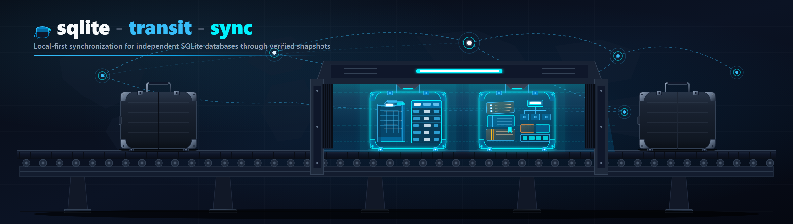
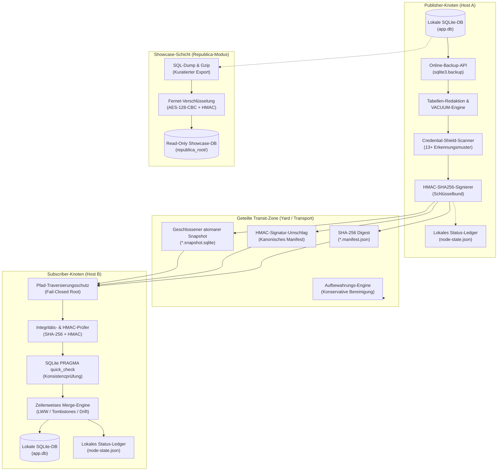
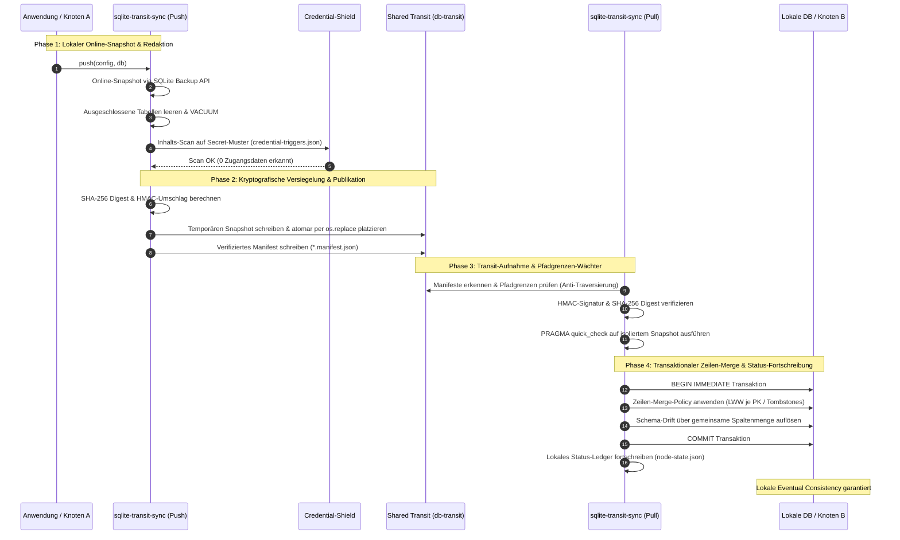

# sqlite-transit-sync



[](https://github.com/ellmos-ai/sqlite-transit-sync/actions/workflows/ci.yml)
[](CHANGELOG.md)
[](#tests-und-qualitaetssicherung)
[](#tests-und-qualitaetssicherung)
[](https://www.python.org/)
[](#)
[](#)
[](THIRD_PARTY_LICENSES.md)
[](SECURITY.md)
[](SECURITY.md)
[](CONTRIBUTING.md)
[](THIRD_PARTY_LICENSES.md)
[](THIRD_PARTY_LICENSES.txt)
[](NOTICE)
[](MARKETING-LOG.txt)
[](LICENSE)
[](https://github.com/ellmos-ai)
[](https://github.com/open-bricks)
[](llms.txt)

> [!NOTE]
> **Kontext für LLMs und KI-Agenten**: Ein strukturierter maschinenlesbarer Verzeichnisbaum, ein Architekturüberblick und ein API-Leitfaden stehen unter [`llms.txt`](llms.txt) bereit.

**🇬🇧 [English Version](README.md)** | **🤝 [Mitwirken](CONTRIBUTING.md)** | **🛡️ [Sicherheitsrichtlinie](SECURITY.md)** | **📝 [Changelog](CHANGELOG.md)** | **📋 [llms.txt](llms.txt)**

## 🧭 Schnellnavigation

1. [Überblick & Kernidentität](#was-ist-sqlite-transit-sync)
2. [Visuelle Architekturtopologie & Entkoppelte Ebenen](#systemarchitektur-topologie)
3. [End-to-End Snapshot- und Synchronisations-Lebenszyklus](#end-to-end-snapshot--und-synchronisations-lebenszyklus)
4. [Zielgruppen & High-Intent Suchanfragen](#marketing--zielgruppen)
5. [Vergleichsmatrix gegenüber Alternativen](#vergleich-mit-distributed-sql)
6. [Governance- & Laufzeit-Invarianten-Matrix](#governance--laufzeit-invarianten-matrix)
7. [Eigenschaften & Kernfähigkeiten](#eigenschaften)
8. [Schreibgeschützte Anwendungsprojektionen](#schreibgeschuetzte-anwendungsprojektionen)
9. [Installation & Voraussetzungen](#installation)
10. [Kurzstart & Multi-Knoten-Arbeitsablauf](#kurzstart)
11. [Konfigurationsreferenz & Secret-Erkennung](#konfiguration)
12. [Republica — die Schaufenster-Methode & Chiffrierung](#republica-die-schaufenster-methode)
13. [Python-API & Erweiterungspunkte](#python-api)
14. [Sicherheit, Bedrohungsmodell & Betriebsgrenzen](#sicherheit-und-grenzen)
15. [Drittanbieter-Lizenzen & Level 1 SBOM](#drittanbieter-lizenzen--transparenz)
16. [Ökosystem, Partner-Werkzeuge & Bündel](#oekosystem--partner-werkzeuge)
17. [Tests, Verifikation & CI-Matrix](#tests-und-qualitaetssicherung)
18. [Gesetzlicher Hinweis, Haftungsbeschränkung & Lizenz (§ 521 BGB)](#lizenz--gesetzliche-haftungsbeschraenkung)

---

<a id="was-ist-sqlite-transit-sync"></a><a id="ueberblick--kernidentitaet"></a><a id="kernidentitaet"></a>
## 1. Überblick & Kernidentität

Die Autorität für Version, Modulstatus, Sichtbarkeit und Prüfdatum steht in
[`METADATA_CONTRACT.md`](METADATA_CONTRACT.md); daraus folgt keine Freigabe
für Veröffentlichung oder Upload.

Local-first-Synchronisierung für unabhängige SQLite-Datenbanken über geprüfte
Snapshots und von der Anwendung wählbare Merge-Policies. Das Modul wurde aus der
BACH-ProSync-Architektur extrahiert und enthält keine Abhängigkeiten von BACH,
OneDrive, Rechnernamen oder Benutzerpfaden.

Dies ist **kein verteilter SQL-Server**. Jeder Knoten besitzt und öffnet nur seine
lokale Datenbank. Ein gemeinsamer Ordner, ein eingebundener Object Store, ein
Wechseldatenträger oder ein anderer Dateitransport überträgt geschlossene Snapshots
mit Manifesten. Beim Pull wird ein Snapshot geprüft und innerhalb einer Transaktion
in die lokale Datenbank zusammengeführt.

Passt gut zu [sync-master](https://github.com/dev-bricks/sync-master) aus derselben
Modulfamilie: Ein sync-master-Yard ist ein natürlicher Transit-Transport. Dazu wird
`--transit` auf eine werkzeugeigene Zone `db-transit/<namespace>/` im Yard gesetzt
(dort Protokollregel R9). sync-master transportiert die Dokumente, dieses Modul
verantwortet Datenbankintegrität und Merge; beide bleiben unabhängig.

---

<a id="systemarchitektur-topologie"></a><a id="systemarchitektur"></a>
## 2. Visuelle Architekturtopologie & Entkoppelte Ebenen

Das folgende Diagramm visualisiert die entkoppelte Multi-Knoten-Architektur, bei der lokale SQLite-Datenbanken ausschließlich über geschlossene, validierte Snapshot-Bündel im Transitspeicher synchronisiert werden:


```mermaid
flowchart TD
    subgraph NODE_A ["Publisher-Knoten (Host A)"]
        DB_A[("Lokale SQLite-DB<br/>(app.db)")]
        BACKUP_A["Online-Backup-API<br/>(sqlite3.backup)"]
        REDACT_A["Tabellen-Redaktion &<br/>VACUUM-Engine"]
        SHIELD_A["Credential-Shield-Scanner<br/>(13+ Erkennungsmuster)"]
        HMAC_A["HMAC-SHA256-Signierer<br/>(Schlüsselbund)"]
        STATE_A["Lokales Status-Ledger<br/>(node-state.json)"]
    end

    subgraph TRANSIT ["Geteilte Transit-Zone (Yard / Transport)"]
        SNAP["Geschlossener atomarer Snapshot<br/>(*.snapshot.sqlite)"]
        SIG["HMAC-Signatur-Umschlag<br/>(Kanonisches Manifest)"]
        HASH["SHA-256 Digest<br/>(*.manifest.json)"]
        RETENTION["Aufbewahrungs-Engine<br/>(Konservative Bereinigung)"]
    end

    subgraph NODE_B ["Subscriber-Knoten (Host B)"]
        GUARD_B["Pfad-Traversierungsschutz<br/>(Fail-Closed Root)"]
        VERIFY_B["Integritäts- & HMAC-Prüfer<br/>(SHA-256 + HMAC)"]
        SANITY_B["SQLite PRAGMA quick_check<br/>(Konsistenzprüfung)"]
        MERGE_B["Zeilenweises Merge-Engine<br/>(LWW / Tombstones / Drift)"]
        DB_B[("Lokale SQLite-DB<br/>(app.db)")]
        STATE_B["Lokales Status-Ledger<br/>(node-state.json)"]
    end

    subgraph SHOWCASE ["Showcase-Schicht (Republica-Modus)"]
        REP_EXP["SQL-Dump & Gzip<br/>(Kuratierter Export)"]
        REP_FER["Fernet-Verschlüsselung<br/>(AES-128-CBC + HMAC)"]
        REP_RO[("Read-Only Showcase-DB<br/>(republica_root/)")]
    end

    DB_A --> BACKUP_A
    BACKUP_A --> REDACT_A
    REDACT_A --> SHIELD_A
    SHIELD_A --> HMAC_A
    HMAC_A --> SNAP
    HMAC_A --> SIG
    HMAC_A --> HASH
    SNAP --- TRANSIT
    SIG --- TRANSIT
    HASH --- TRANSIT
    TRANSIT --> RETENTION

    SNAP --> GUARD_B
    SIG --> GUARD_B
    HASH --> GUARD_B
    GUARD_B --> VERIFY_B
    VERIFY_B --> SANITY_B
    SANITY_B --> MERGE_B
    MERGE_B --> DB_B
    MERGE_B --> STATE_B
    HMAC_A -.-> STATE_A

    DB_A -.-> REP_EXP
    REP_EXP --> REP_FER
    REP_FER --> REP_RO
```

### ASCII Vier-Ansichten-Architekturprojektion

```text
+-------------------------------------------------------------------------------------------------------------------+
|                               SQLITE-TRANSIT-SYNC: VIER-ANSICHTEN-ARCHITEKTURTOPOLOGIE                            |
+-------------------------------------------------------------------------------------------------------------------+
| [VIEW 1: PUBLISHER NODE]               [VIEW 2: SHARED TRANSIT YARD]              [VIEW 3: SUBSCRIBER NODE]       |
| [ANSICHT 1: PUBLISHER-KNOTEN]          [ANSICHT 2: GEMEINSAMER TRANSIT-ORDNER]    [ANSICHT 3: SUBSCRIBER-KNOTEN]   |
|                                                                                                                   |
| +-------------------------+              +-----------------------------+            +---------------------------+ |
| | Lokale SQLite-Datenbank |              |  Geschlossene Transitzone   |            | Path-Traversal-Schutz     | |
| | (app.db - Exklusiv RW)  |              |  (Ordner / Sync-Master / S3)|            | (Kanonische Grenzen)      | |
| +------------+------------+              +--------------+--------------+            +-------------+-------------+ |
|              |                                          ^                                         |               |
|              v (sqlite3.backup)                         |                                         v               |
| +------------+------------+                             |                           +-------------+-------------+ |
| | Konsistentes Backup     |                             |                           | SHA-256 Digest & HMAC     | |
| | (Rollback-Journal-Modus)|                             |                           | Signatur-Verifikation     | |
| +------------+------------+                             |                           +-------------+-------------+ |
|              |                                          |                                         |               |
|              v                                          |                                         v               |
| +------------+------------+                             |                           +-------------+-------------+ |
| | Reduktion & VACUUM      |                             |                           | SQLite PRAGMA quick_check | |
| | (Sensible Daten tilgen) |                             |                           | (Integritätsprüfung)      | |
| +------------+------------+                             |                           +-------------+-------------+ |
|              |                                          |                                         |               |
|              v                                          |                                         v               |
| +------------+------------+                             |                           +-------------+-------------+ |
| | Credential Shield       |                             |                           | Transaktionaler Merge     | |
| | (13+ Regex-Musterfamil.)|                             |                           | (Row-Level LWW / Drift)   | |
| +------------+------------+                             |                           +-------------+-------------+ |
|              |                                          |                                         |               |
|              v                                          |                                         v               |
| +------------+------------+              +--------------+--------------+            +-------------+-------------+ |
| | HMAC-SHA256 Signierer   |              |  *.snapshot.sqlite (Atomar) |            | Lokale SQLite-Datenbank   | |
| | (Schlüsselbund-Prüfer)  |------------->|  *.manifest.json   (Digest) |----------->| (app.db - Integrierter St)| |
| +-------------------------+              |  Retention-Engine  (Lokal)  |            +-------------+-------------+ |
|                                          +-----------------------------+                          |               |
|                                                                                                   v               |
|                                                                                     +-------------+-------------+ |
|                                                                                     | Lokales Status-Ledger     | |
|                                                                                     | (node-state.json)         | |
|                                                                                     +---------------------------+ |
+-------------------------------------------------------------------------------------------------------------------+
| [VIEW 4: REPUBLICA SHOWCASE / COURIER ENVELOPE (OPTIONAL ZERO-TRUST TRANSPORT)]                                   |
| [ANSICHT 4: REPUBLICA-SCHAUFENSTER / KURIER-UMSCHLAG (OPTIONALER ZERO-TRUST TRANSPORT)]                          |
|                                                                                                                   |
| Lokale Datenbank ----> SQL-Dump-Extrakt ----> Gzip-Kompression ----> AES-128-CBC (Fernet) ----> Verschlüsselt    |
| (Quell-Knoten)        (FTS lokal neu gebaut)  (53MB -> 11MB)         (Pre-Shared Key)        (republica_root/)    |
|                                                                                                                   |
| Einzelnes Secret ----> Fernet-Chiffre-Umschlag ----> Kurier-Transit ----> Zielverzeichnis (0600, Transit geleert) |
+-------------------------------------------------------------------------------------------------------------------+
```

---

<a id="end-to-end-snapshot--und-synchronisations-lebenszyklus"></a><a id="lebenszyklus"></a>
## 3. End-to-End Snapshot- und Synchronisations-Lebenszyklus

Der End-to-End-Lebenszyklus stellt sicher, dass Live-Datenbanken niemals Dateisystem-Sperren von Synchronisationsdiensten ausgesetzt werden und sämtliche knotenübergreifenden Daten kryptografisch verifiziert, geheimnisfrei und transaktional zusammengeführt werden:


```mermaid
sequenceDiagram
    autonumber
    participant App as Anwendung / Knoten A
    participant CoreA as sqlite-transit-sync (Push)
    participant Shield as Credential-Shield
    participant Transit as Shared Transit (db-transit)
    participant CoreB as sqlite-transit-sync (Pull)
    participant Target as Lokale DB / Knoten B

    Note over App,CoreA: Phase 1: Lokaler Online-Snapshot & Redaktion
    App->>CoreA: push(config, db)
    CoreA->>CoreA: Online-Snapshot via SQLite Backup API
    CoreA->>CoreA: Ausgeschlossene Tabellen leeren & VACUUM
    CoreA->>Shield: Inhalts-Scan auf Secret-Muster (credential-triggers.json)
    Shield-->>CoreA: Scan OK (0 Zugangsdaten erkannt)

    Note over CoreA,Transit: Phase 2: Kryptografische Versiegelung & Publikation
    CoreA->>CoreA: SHA-256 Digest & HMAC-Umschlag berechnen
    CoreA->>Transit: Temporären Snapshot schreiben & atomar per os.replace platzieren
    CoreA->>Transit: Verifiziertes Manifest schreiben (*.manifest.json)

    Note over Transit,CoreB: Phase 3: Transit-Aufnahme & Pfadgrenzen-Wächter
    CoreB->>Transit: Manifeste erkennen & Pfadgrenzen prüfen (Anti-Traversierung)
    CoreB->>CoreB: HMAC-Signatur & SHA-256 Digest verifizieren
    CoreB->>CoreB: PRAGMA quick_check auf isoliertem Snapshot ausführen

    Note over CoreB,Target: Phase 4: Transaktionaler Zeilen-Merge & Status-Fortschreibung
    CoreB->>Target: BEGIN IMMEDIATE Transaktion
    CoreB->>Target: Zeilen-Merge-Policy anwenden (LWW je PK / Tombstones)
    CoreB->>Target: Schema-Drift über gemeinsame Spaltenmenge auflösen
    CoreB->>Target: COMMIT Transaktion
    CoreB->>CoreB: Lokales Status-Ledger fortschreiben (node-state.json)
    Note over Target: Lokale Eventual Consistency garantiert
```

---

<a id="marketing--zielgruppen"></a><a id="zielgruppen--high-intent-suchanfragen"></a><a id="zielgruppen"></a>
## 4. Zielgruppen & High-Intent Suchanfragen

`sqlite-transit-sync` wurde für modulare, dezentrale Ökosysteme entwickelt und adressiert 4 Kern-Zielgruppen:

- **`[PERSONA-01]` Entwickler autonomer KI-Agenten & Multi-Host-Schwärme:**
  - *Herausforderung:* Multi-Agenten-Schwärme auf Laptops, Workstations und Servern benötigen lokale Zustandsspeicherung ohne Dateisperren-Kollisionen.
  - *Lösung:* Entkoppelte Transit-Snapshots mit Credential Shielding verhindern Secret-Leaks in gemeinsame Speicher bei asynchroner Datenkonvergenz.
- **`[PERSONA-02]` Multi-Device-Desktop- & Edge-Entwickler:**
  - *Herausforderung:* Entwickler persönlicher Notizen- und Task-Tools über File-Sync (z. B. sync-master, Syncthing, Nextcloud) leiden unter Dateikorruption und hängenden `-wal`-Sperren.
  - *Lösung:* Atomare Bereitstellung über die SQLite Backup-API und transaktionaler Zeilen-Merge schützen lokale SQLite-Dateien vor Cloud-Sync-Dämonen.
- **`[PERSONA-03]` Local-First-, Zero-Egress- & Air-Gapped-Softwarebauer:**
  - *Herausforderung:* Anwendungen mit strikter Datenhoheit dürfen weder Cloud-Lock-in noch monatliche Hosting-Gebühren oder Hintergrund-Telemetrie aufweisen.
  - *Lösung:* 100% offlinefähiger Datenabgleich über lokale Dateisystempfade, Mount-Points oder Wechseldatenträger ohne externe Abhängigkeiten.
- **`[PERSONA-04]` Enterprise-Sicherheits-, Datenschutz- & Compliance-Verantwortliche:**
  - *Herausforderung:* Strikte Zero-Trust-Richtlinien verbieten versehentliche Secret-Synchronisierung, unkontrollierte Binärdateien und privilegierte Hintergrunddienste.
  - *Lösung:* Regex-Inhaltsprüfungen vor der Veröffentlichung auf 13+ Secret-Familien (`credential-triggers.json`), HMAC-Manifest-Versiegelung, SHA-256-Integritätsprüfung und unprivilegierte `RunAsInvoker`-Benutzermodus-Ausführung.

### High-Intent Suchanfragen (Bilingual EN & DE)

| Kategorie | Englische (EN) Suchbegriffe | Deutsche (DE) Suchanfragen |
|:---|:---|:---|
| **Local-First Synchronisation** | `sqlite synchronization python zero-dependency`, `local-first database snapshot sync`, `offline sqlite multi-device sync` | `lokale datenbank synchronisation offline snapshots`, `sqlite abgleich python ohne abhaengigkeiten`, `lokale datenbank replikation dateibasiert` |
| **Integrität & Secret-Schutz** | `credential shielded sqlite transfer zero-egress`, `hmac verified sqlite snapshot manifest`, `anti-traversal sqlite transit sync` | `zero egress datenbank replikation snapshot`, `geheimsichere sqlite synchronisation regex`, `integritaetsgepruefte datenbank snapshote` |
| **Zeilen-Merge & Konflikte** | `row level merge lww sqlite offline`, `sqlite last write wins schema drift tolerance`, `tombstone merge policy sqlite` | `row level merge lww sqlite offline`, `last-write-wins datenbank abgleich zeitstempel`, `schema drift toleranz sqlite merge` |
| **Entkoppelte Topologie** | `sqlite multi-node sync without distributed sql`, `sqlite over syncthing without corruption`, `sqlite transit yard architecture` | `sqlite synchronisation ohne verteilten server`, `sqlite ueber cloud sync ohne datenbankkorruption`, `transit yard sqlite synchronisation` |

Ausführliche Zielgruppenanalysen, Suchbegriffe und Wettbewerbsvergleiche sind in [MARKETING-LOG.txt](MARKETING-LOG.txt) dokumentiert.

---

<a id="vergleich-mit-distributed-sql"></a><a id="vergleichsmatrix-gegenueber-alternativen"></a><a id="vergleichsmatrix"></a>
## 5. Vergleichsmatrix gegenüber Alternativen

Die folgende Matrix vergleicht `sqlite-transit-sync` mit vier verbreiteten Ansätzen zur knotenübergreifenden Datenbanksynchronisation entlang der 10 Kern-Laufzeitinvarianten:

| Technische Dimension | Invariante | `sqlite-transit-sync` | Distributed SQL (Cockroach/TiDB) | Litestream / LiteFS | Direkte SQLite über Cloud-Sync | Ad-Hoc Dump/JSON Skripte |
|:---|:---|:---|:---|:---|:---|:---|
| **1. Ausführungsprivatsphäre & Egress** | `INV-LOCAL-01` | **100% Local-First / Zero-Egress** | Multi-Knoten-Clusternetzwerk nötig | Streaming-Replikation zu S3/Cloud | Verlässt sich auf Cloud-Dienst | Ungeprüft / Manuell |
| **2. Snapshot-Atomarität** | `INV-SNAP-02` | **Online-Backup-API + atomarer `os.replace`** | Verteiltes Raft/Paxos-Quorum | Kontinuierliches WAL-Frame-Streaming | Teilsynchronisierung aktiver DBs | Unkoordinierte Kopie offener DBs |
| **3. Lock-Konflikte & Sidecars** | `INV-ROLL-03` | **Fail-closed Löschung von `-wal`/`-shm`** | Verteilter Lock-Manager / MVCC | Erfordert aktive WAL-Überwachung | Fatale SQLite Locking-Fehler & Konflikte | Unbehandelte Lock-Timeouts |
| **4. Pfadgrenzen-Wächter** | `INV-PATH-04` | **Strikte Root-Isolierung & Anti-Traversierung** | Socket-Protokollgrenze | Object-Store-Schlüsselpfad | Host-Dateisystempfad-Sync | Beliebige Dateipfade |
| **5. Integritäts- & Konsistenzprüfung** | `INV-VERIFY-05` | **SHA-256 + SQLite `PRAGMA quick_check`** | Raft-Log-Checksummen | WAL-Segment-Checksummen | Keine (nur Dateigröße/Hash) | Keine oder fragiles JSON-Parsing |
| **6. Secret-Schutz (Credential Shield)** | `INV-SHIELD-06` | **Prä-Publikations-Scan (13+ Familien)** | Rollenbasierte DB-Rechte | Keine (repliziert alle Bytes) | Keine (lädt Secrets in Cloud) | Keine |
| **7. Authentizität & Umschlag** | `INV-HMAC-07` | **HMAC-SHA256 über Manifest-Nutzlast** | Mutual TLS (mTLS) | Cloud IAM / AWS SigV4 | Provider-Token | Keine |
| **8. Zeilen-Merge & Schema-Drift** | `INV-MERGE-08` | **Transaktionales LWW je PK + Tombstones** | Globale serialisierbare ACID-Transaktionen | Voll-Replikat-Wiederherstellung | Binäre Konfliktkopien (kein Merge) | Fragile Skripte |
| **9. Aufbewahrung & Knoten-Umfang** | `INV-RET-09` | **Standardmäßiger Dry-Run, knotenbezogen** | Automatische TTL / Compaction | S3 Bucket-Lebenszyklus | Cloud-Papierkorb / Versionen | Unkontrolliertes Plattenwachstum |
| **10. Nicht-Eskalation & Plattform-SLA** | `INV-SLA-10` | **Unprivilegiertes `RunAsInvoker`, 48h SLA** | Komplexes Multi-Server-Setup | Dedizierter Hintergrunddienst | System-Hintergrunddienst | Unverifizierte Ausführung |

### Ausführlicher Vergleich mit Distributed SQL

| Kriterium | `sqlite-transit-sync` | Distributed SQL, z. B. CockroachDB oder YugabyteDB |
|---|---|---|
| Grundmodell | Jeder Knoten besitzt eine unabhängige lokale SQLite-Datenbank | Alle Server bilden eine einzige logische SQL-Datenbank |
| Schreibvorgänge | Zuerst lokal, später synchronisiert | Werden direkt vom Cluster koordiniert |
| Synchronisierung | Asynchroner Snapshot-Pull und Zeilen-Merge | Kontinuierliche Replikation zwischen Clusterknoten |
| Konsistenz | Eventual Consistency nach erfolgreichem Abgleich | In der Regel starke oder serialisierbare Konsistenz |
| Konsens und Quorum | Keiner erforderlich | Meist Raft-basierter Mehrheitskonsens |
| Globale Transaktionen | Nein | Ja, auch über mehrere Knoten oder Shards hinweg |
| Konfliktbehandlung | Anwendungsspezifische `MergePolicy`; Zeitstempel-LWW ist Standard | Transaktionen, MVCC, Sperren und Konsens |
| Offline-Betrieb | Ein Knoten kann unabhängig weiter lesen und schreiben | Schreibzugriffe erfordern in der Regel ein erreichbares Quorum |
| Netzwerkausfall | Lokale Arbeit läuft weiter; Synchronisierung wartet | Minderheits-Partitionen können Schreibverfügbarkeit verlieren |
| Fehlerbehandlung | Lokale Datenbanken bleiben nutzbar; Transit und Backups müssen separat geschützt werden | Replikation und automatisches Failover solange ein Quorum existiert |
| Datensichtbarkeit | Änderungen werden erst nach Push und Pull geteilt | Festgeschriebene Änderungen sind im Cluster sofort maßgeblich |
| Schemaänderungen | Die Anwendung migriert jede lokale Datenbank | Clusterweite SQL-Migrationen |
| Löschungen | Benötigen Tombstones oder eine eigene Policy | Normale transaktionale SQL-Löschungen |
| Infrastruktur | Python, SQLite und ein konfigurierbarer Dateitransport | Mehrere dauerhafte Datenbankserver, TLS, Monitoring und Backups |
| Mindestanzahl dauerhafter Server | Keine; ein einzelner Knoten genügt | Häufig mindestens drei für Fehlertoleranz |
| Größte Stärke | Einfachheit, Offline-Fähigkeit, geringe Kosten und fachliche Merge-Regeln | Starke Konsistenz, parallele Schreiber und Hochverfügbarkeit |
| Wichtigste Grenze | Keine globale ACID-Transaktion oder sofortige gemeinsame Wahrheit | Deutlich höherer Betriebsaufwand und Ressourcenbedarf |

### Vor- und Nachteile sowie typische Einsatzbereiche

| System | Vorteile | Nachteile | Geeignete Use Cases | Ungeeignete Use Cases |
|---|---|---|---|---|
| `sqlite-transit-sync` | Sehr geringer Ressourcenbedarf; offlinefähig; kein zentraler Server; lokale Datenhaltung; transportunabhängig; Merge-Regeln können der Fachdomäne folgen | Änderungen werden verzögert sichtbar; Konflikte, Löschungen, Zeitregeln und Migrationen bleiben Anwendungsverantwortung; keine globalen ACID-Transaktionen und kein Quorum-Failover | Persönliche Wissens- und Taskdatenbanken; lokale KI-Agenten; Laptop-, Workstation- und Serveraustausch; Außen- und Edge-Anwendungen; Desktop-Software mit optionaler Synchronisierung; Forschungsnotizen | Zahlungen, knappe Lagerbestände, Sitzplatzreservierungen, Echtzeit-Zusammenarbeit am selben Datensatz oder viele konkurrierende Writer |
| Distributed SQL | Gemeinsame autoritative Datenbank; starke Konsistenz; globale Transaktionen; koordinierte parallele Schreibzugriffe; automatische Replikation und Failover; horizontale Skalierung | Dauerhafte Server, Netzwerk, Zertifikate, Monitoring und Upgrades erforderlich; Quorum kann bei Partitionen Schreibzugriffe blockieren; höhere Latenz und Kosten | Finanz- und Buchungssysteme; SaaS-Plattformen; E-Commerce-Bestand; globale Benutzerkonten; Multiplayer-Backends; hochverfügbare Unternehmensdienste | Kleine persönliche Werkzeuge, zeitweise getrennte Geräte, Einzelbenutzer-Desktop-Anwendungen oder bereits zuverlässig durch lokale SQLite-Datenbanken abgedeckte Workloads |

### Schnelle Entscheidungshilfe

| Anforderung | Bevorzugter Ansatz |
|---|---|
| Knoten müssen offline weiterarbeiten | `sqlite-transit-sync` |
| Änderungen dürfen erst nach einem Synchronisierungsschritt sichtbar werden | `sqlite-transit-sync` |
| Daten sollen lokal bleiben und Konflikte sind selten | `sqlite-transit-sync` |
| Viele Clients verändern dieselben Datensätze gleichzeitig | Distributed SQL |
| Jeder Commit muss sofort global autoritativ sein | Distributed SQL |
| Globale Transaktionen oder automatisches Cluster-Failover sind Pflicht | Distributed SQL |

Für wenige zeitweise verbundene persönliche oder Edge-Geräte ist
`sqlite-transit-sync` meist die einfachere Lösung. Sobald echte konkurrierende
Writer entstehen, ist häufig eine zentrale PostgreSQL-Instanz der nächste sinnvolle
Schritt. Distributed SQL wird interessant, wenn starke Konsistenz zusätzlich den
Ausfall einzelner Server über mehrere dauerhaft betriebene Knoten überstehen muss.

---

<a id="governance--laufzeit-invarianten-matrix"></a><a id="governance--laufzeit-invarianten"></a>
## 6. Governance- & Laufzeit-Invarianten-Matrix

`sqlite-transit-sync` folgt 10 verbindlichen Architektur- und Laufzeit-Invarianten:

| # | Invariante | Architekturbereich | Garantie & Prüfmechanismus |
|---|---|---|---|
| 1 | **INV-LOCAL-01: 100% Local-First & Zero-Egress** | Systemarchitektur | Arbeitet ausschließlich auf lokalen SQLite-Dateien (`app.db`). Keine Telemetrie, keine ausgehenden Netzwerkverbindungen, keine Cloud-Abhängigkeiten. |
| 2 | **INV-SNAP-02: Offline Snapshot-Atomarität** | Transit-Publikation | Live-Datenbanken werden niemals über File-Sync geteilt. Online-Snapshots erfolgen über `sqlite3.backup` und werden per atomarem `os.replace` bereitgestellt. |
| 3 | **INV-ROLL-03: Saubere Rollback-Journal-Isolation** | Sidecar-Schutz | Snapshots werden im Rollback-Journal-Modus geschlossen; alle temporären Sidecars (`-wal`, `-shm`, `-journal`) werden vor Manifest-Erzeugung fail-closed bereinigt. |
| 4 | **INV-PATH-04: Strikte Transit-Pfadgrenzen** | Dateisystemgrenzen | Manifest- und Snapshot-Pfade müssen reguläre Dateien im kanonischen Transit-Root sein. Traversierung (`../`), absolute Pfade, Symlinks und Reparse-Points werden abgewiesen. |
| 5 | **INV-VERIFY-05: Zweistufige Integritäts- & Konsistenzprüfung** | Vorab-Validierung | Jeder empfangene Snapshot muss vor Datenzugriff oder Merge den kryptografischen SHA-256-Abgleich und SQLite `PRAGMA quick_check` fehlerfrei bestehen. |
| 6 | **INV-SHIELD-06: Secret-Scan vor Veröffentlichung** | Inhaltsprüfung | Snapshot-Daten werden systematisch auf 13+ Secret-Familien gescannt (`credential-triggers.json`). Treffer führen zum sofortigen Push-Abbruch mit Nennung von `tabelle.spalte`. |
| 7 | **INV-HMAC-07: HMAC-Authentizitätsumschlag** | Identität & Signatur | Optionaler HMAC-SHA256-Signaturumschlag über kanonische Manifest-Nutzlast (Protokoll, Namespace, Sender-ID, Dateiname, SHA-256, Größe, Redaktionsliste). |
| 8 | **INV-MERGE-08: Deterministischer Zeilen-Merge** | Datenkonvergenz | Transaktionaler Zeilen-Merge (LWW je PK, gemeinsame Spaltenmenge bei Schema-Drift, explizite Tombstones). Inhalts-Hash als Tie-Breaker garantiert Konvergenz. |
| 9 | **INV-RET-09: Konservative Aufbewahrungs- & Bereinigungslogik** | Garbage Collection | Snapshot-Bereinigung ist standardmäßig ein Dry-Run und auf lokale Knoten-Artefakte beschränkt. Knotenübergreifende Löschung (`--all-nodes`) erfordert explizite Bestätigung. |
| 10 | **INV-SLA-10: Nicht-Eskalation & Multi-OS-Parität** | Plattform-Laufzeit | Läuft unprivilegiert im Benutzermodus (`RunAsInvoker`). Strikte Parität unter Linux, Windows und macOS ohne externe native Abhängigkeiten bei 48h Sicherheits-SLA. |

---

<a id="eigenschaften"></a><a id="kernfaehigkeiten"></a><a id="teil-der-ellmos-stack-familie"></a>
## 7. Eigenschaften & Kernfähigkeiten

`sqlite-transit-sync` ist der Begleiter zu
[dev-bricks/sync-master](https://github.com/dev-bricks/sync-master) aus
derselben Modulfamilie: sync-master verantwortet den Dateitransport
(`sync.files`), dieses Modul verantwortet Datenbankintegrität und Merge
(`sync.database`). Beide funktionieren eigenständig oder zusammengestellt in
Stacks der [ellmos-ai](https://github.com/ellmos-ai)-Familie – siehe den
Katalog [ellmos-ai/stacks](https://github.com/ellmos-ai/stacks). Die Rolle in
diesem Baukasten: kein offenes SQLite über Datei-Sync, sondern nur geprüfte
Snapshots mit anwendungsspezifischen Merge-Policies.

### Kernfähigkeiten im Überblick

- Konsistente Online-Snapshots über die SQLite Backup-API;
- Atomare Veröffentlichung über temporäre Dateien und `os.replace`;
- Geschlossene Snapshots im Rollback-Journal-Modus mit Bereinigung temporärer
  SQLite-Dateien vor der Veröffentlichung;
- Pfadprüfung für Manifeste und Snapshots auf direkte reguläre Dateien im
  Transit-Ordner (Traversierung, absolute Pfade, Symlinks und Reparse Points
  schlagen fehl);
- Prüfung über SHA-256-Manifeste und `PRAGMA quick_check`;
- Optionale API-injizierte HMAC-SHA256-Authentifizierung über das kanonische
  Manifest, Sender-Identität, Protokollversion und Snapshot-Hash;
- Knotenlokaler Pull-Status und idempotente Wiederholung;
- Last-Write-Wins auf Zeilenebene je Primärschlüssel für tabellarische Daten mit
  Zeitstempel;
- Optionale `TombstoneMergePolicy` als Referenzadapter für explizite Löschungen;
- Merge über gemeinsame Spalten bei einfachem Schema-Drift;
- Konfigurierbarer Tabellenausschluss und Snapshot-Redaktion mit abschließendem `VACUUM`;
- Inhaltsbasierter Zugangsdaten-Scan, der die Veröffentlichung abbricht, falls
  der Snapshot noch verdächtige Werte enthält (standardmäßig aktiv; meldet
  `tabelle.spalte`, niemals den Wert selbst);
- Unterstützung für eigene `MergePolicy`-Implementierungen;
- Geprüfte Snapshot-Bereinigung mit standardmäßigem Dry-Run und Beschränkung auf
  den lokalen Knoten;
- Gezieltes Nachholen einzelner Snapshots über `pull_selected()`;
- Strikte versionierte Projektionsverträge für schreibgeschützte Auswertungen;
- Optionaler [Republica-Schaufenstermodus](#republica-die-schaufenster-methode)
  zur verschlüsselten Einweg-Bereitstellung;
- Abhängigkeitsfreie Python-API und JSON-CLI (Republica-Modus ergänzt `cryptography`).

---

<a id="schreibgeschuetzte-anwendungsprojektionen"></a><a id="projektionen"></a>
## 8. Schreibgeschützte Anwendungsprojektionen

`verify-projection` prüft eine geschlossene, anwendungseigene SQLite-Projektion,
ohne zu kopieren, zu mergen, zu migrieren, einen Scheduler zu starten oder
Zustand fortzuschreiben. Die Anwendung übergibt ihre Consumer-Identität und das
geprüfte maximale Offline-Intervall. Der Verifier weist Loops, veraltete
Checkpoints, zu kurze Tombstone-Aufbewahrung, nicht erlaubte Tabellen oder
Spalten sowie nicht opake Datensatzreferenzen zurück.

Mitgeliefert werden sechs enge Verträge für Kontostandsübersichten,
AboTracker-Abozustände, HausLagerist-Nachfülltermine, Medikamenten-Fälligkeiten
und Bestandswarnungen, Routinen-Fälligkeiten und Abschlussstatus sowie
Versicherungsfristen. Der
AboTracker-Vertrag ist nur eine Statusprojektion, weil Exportschema v1 kein
bestätigtes nächstes Fälligkeits- oder Verlängerungsdatum enthält; aus
Zahlungsdatum und Abrechnungszyklus wird kein Reminder abgeleitet. Die
Test-Fixtures sind synthetische JSON-Rezepte, fachliche Identitäten und private
Details bleiben außerhalb der Allowlists.

Die mitgelieferten Namen sind
`abotracker-subscription-status-projection.v1`,
`accounts-balance-projection.v1`, `hauslagerist-replenishment-projection.v1`,
`mediplaner-reminder-projection.v1`,
`routinika-reminder-projection.v1` und
`versicherungsmanager-deadline-projection.v1`. Siehe
[Read-only-Projektionsverträge](PROJECTION_CONTRACTS_de.md) und die
[englische Begleitdatei](PROJECTION_CONTRACTS.md).

```bash
sqlite-transit-sync verify-projection \
  --contract mediplaner-reminder-projection.v1 \
  --database ./closed-projection.sqlite \
  --consumer-id reminder-consumer \
  --minimum-offline-seconds 2592000 \
  --previous-checkpoint 41
```

---

<a id="installation"></a><a id="voraussetzungen"></a>
## 9. Installation & Voraussetzungen

```bash
python -m pip install -e .
```

---

<a id="kurzstart"></a><a id="arbeitsablauf"></a>
## 10. Kurzstart & Multi-Knoten-Arbeitsablauf

Auf jedem Knoten eine Konfiguration anlegen. Jeder Knoten nutzt eine eigene
Datenbank- und Statusdatei, aber denselben Transit-Ordner und denselben Namespace.

```bash
sqlite-transit-sync init \
  --config node.json \
  --database ./app.db \
  --transit ./shared-transit \
  --node-id laptop \
  --namespace my-app

sqlite-transit-sync push --config node.json
sqlite-transit-sync pull --config node.json --dry-run
sqlite-transit-sync pull --config node.json
sqlite-transit-sync status --config node.json
sqlite-transit-sync verify --config node.json
sqlite-transit-sync cleanup --config node.json
# Bereinigungsplan prüfen und anschließend explizit anwenden:
sqlite-transit-sync cleanup --config node.json --apply
```

Das Anwendungsschema muss auf jedem Knoten bereits existieren. Automatisches
Anlegen der Erstkopie ist bewusst deaktiviert.

---

<a id="konfiguration"></a><a id="konfigurationsreferenz"></a>
## 11. Konfigurationsreferenz & Secret-Erkennung

```json
{
  "database": "./app.db",
  "transit": "./shared-transit",
  "state": "./node-state.json",
  "node_id": "laptop",
  "namespace": "my-app",
  "timestamp_columns": ["updated_at", "modified_at", "created_at"],
  "exclude_tables": ["secrets", "sqlite_sequence"],
  "snapshot_exclude_tables": ["secrets"],
  "scan_snapshot_for_secrets": true,
  "secret_scan_skip_tables": [],
  "secret_scan_extra_patterns": [],
  "secret_patterns_file": null
}
```

Relative Pfade werden relativ zur Konfigurationsdatei aufgelöst. Die
aktive Datenbank darf niemals im Transit-Ordner liegen, und die Statusdatei muss
außerhalb des Transit-Baums bleiben.

```python
import hashlib
from pathlib import Path

from sqlite_transit_sync import SyncConfig

config_path = Path("node.json").resolve()
payload = config_path.read_bytes()
config = SyncConfig.from_bytes(payload, source_path=config_path)
config_sha256 = hashlib.sha256(payload).hexdigest()
```

### Schlüssel und Standardwerte

| Schlüssel | Standard | Bedeutung |
|---|---|---|
| `database` | *(Pflichtfeld)* | Lokale SQLite-Datenbank dieses Knotens |
| `transit` | *(Pflichtfeld)* | Gemeinsamer Ordner für Snapshots und Manifeste |
| `state` | `./.sync-state.json` | Knotenlokaler Status; gehört nicht in den Transit |
| `node_id` | Hostname der Maschine | Identifiziert den veröffentlichenden Knoten |
| `namespace` | `"default"` | Trennt unabhängige Datensätze im selben Transit |
| `timestamp_columns` | `["updated_at","modified_at","created_at"]` | Spalten für Last-Write-Wins |
| `exclude_tables` | `["secrets","sqlite_sequence"]` | Tabellen, die niemals lokal zusammengeführt werden |
| `snapshot_exclude_tables` | `["secrets"]` | Tabellen, deren Zeilen vor Veröffentlichung gelöscht werden (danach `VACUUM`) |
| `scan_snapshot_for_secrets` | `true` | Veröffentlichung abbrechen, wenn noch Secrets erkannt werden |
| `secret_scan_skip_tables` | `[]` | Tabellen, die der Scan ignoriert |
| `secret_scan_extra_patterns` | `[]` | Zusätzliche reguläre Ausdrücke |
| `secret_patterns_file` | `null` (mitgeliefert) | Eigene Triggerdatei; ersetzt die mitgelieferten Muster vollständig |
| `key_file` | `null`, sonst `$SQLITE_TRANSIT_SYNC_KEY_FILE` | Fernet-Schlüssel für Republica; gehört nicht in den Transit |
| `republica_root` | `~/.republica` | Zielordner importierter Schaufenster; gehört nicht in den Transit |
| `allow_key_in_synced_folder` | `false` | Hebt die Prüfung auf, die Schlüssel in Sync-Ordnern abweist |

### Der Credential-Scan und wie man ihn abschaltet

`snapshot_exclude_tables` kann nur Tabellen leeren, die vorher bekannt waren.
Der Scan beantwortet die Frage, die diese Regel nicht abdeckt: *Wurden Zugangsdaten
in eine Freitextspalte eingefügt?* — eine Notiz, ein Logfile, eine Sitzungszusammenfassung?
Er wird auf der Snapshot-Kopie nach der Schwärzung und vor der Veröffentlichung ausgeführt.
Bei einem Treffer wird `SyncError` ausgelöst und `tabelle.spalte` benannt; der Wert selbst
taucht nirgendwo in Logs, Tracebacks oder CI-Ausgaben auf. Der unvollständige Snapshot wird
verworfen, sodass nichts den Transit-Ordner erreicht.

Das Abschalten ist eine legitime Option, wenn der Transit vollständig vertrauenswürdig ist:

```json
{ "scan_snapshot_for_secrets": false }
```

Bevorzugen Sie `secret_scan_skip_tables`, wenn nur eine einzelne Tabelle Fehlalarme erzeugt:
Den Scan überall sonst aktiv zu halten, bietet mehr Schutz als ein globales Deaktivieren.

### Trigger anpassen

Muster liegen in Daten, nicht in Code — `sqlite_transit_sync/credential-triggers.json` —
sodass die Erkennung im Laufe der Zeit geschärft werden kann, ohne auf ein neues Release zu warten:

```json
{
  "version": 1,
  "patterns": [
    { "name": "github", "regex": "gh[pousr]_[A-Za-z0-9]{16,}", "prefilter": "gh" },
    { "name": "acme-internal", "regex": "ACME-[0-9]{4}", "prefilter": "ACME-" }
  ]
}
```

- `prefilter` ist ein optionales Literal, das als günstiger SQL-`LIKE`-Vorfilter dient,
  damit auch große Snapshots performant bleiben. Es **muss** in jedem Wert vorkommen,
  auf den der Regex zutreffen kann, da sonst Fundstellen übersehen werden. Fehlt ein
  solches Literal, entfällt der Vorfilter — der Scanner liest die Spalte dann zur Korrektheit
  vollständig aus.
- Setzen Sie `secret_patterns_file` auf Ihre eigene Datei, um die Standardmuster vollständig
  zu ersetzen, oder nutzen Sie `secret_scan_extra_patterns`, um zusätzliche Muster zu ergänzen.

Die Muster sind bewusst herstellerbezogen mit Präfixen versehen. Eine allgemeine Regel wie
„lange hexadezimale Zeichenkette“ würde Prüfsummen, UUIDs und Git-SHAs fälschlich markieren,
die legitime Datenbankinhalte darstellen — und ein Scanner mit hoher Falsch-Positiv-Rate
wird in der Praxis deaktiviert, was jeglichen Schutz zunichtemacht. Behandeln Sie einen
sauberen Scan als „kein bekanntes Muster hat angeschlagen“, niemals als „dieser Snapshot
ist garantiert frei von Geheimnissen“.

### Dies ist kein Secrets-Manager

Der Scan **entfernt** Zugangsdaten aus dem Synchronisationspfad. Er **verteilt** sie nicht.
Wenn das eigentliche Problem darin besteht, dass mehrere Rechner dieselben Passwörter oder
API-Schlüssel benötigen, ist dieses Modul das falsche Werkzeug — ebenso wie jeder Cloud-Dokumentenordner.
Wählen Sie stattdessen einen dieser Ansätze; alle halten den Klartext von unkontrollierten
Cloud-Providern fern:

| Ansatz | Geeignet für | Hinweise |
|---|---|---|
| **Vaultwarden** (selbst gehostetes Bitwarden) | Menschen + CLI auf mehreren Rechnern | Läuft auf einem kleinen Always-On-Gerät; Zugriff über privates Netzwerk (WireGuard, Tailscale) statt öffentlicher Freigabe. Offizielle Bitwarden-Clients, Browser-Erweiterungen und CLI `bw` funktionieren direkt. |
| **SOPS + age** | Geheimnisse direkt neben dem Code | Verschlüsselte Dateien können sicher committet und synchronisiert werden, da nur Chiffretext transportiert wird. Empfängerspezifische Schlüssel, ideal für Git-Reviews. |
| **`pass`** (GPG) + Git | Einzelanwender und kleine Teams mit Unix-Fokus | Eine Datei pro Geheimnis, gewöhnlicher Git-Remote, keinerlei Server erforderlich. |
| **KeePassXC über Syncthing** | Ohne Server, ohne Cloud-Konto | Peer-to-Peer Dateisynchronisation; der Tresor bleibt eine einzelne verschlüsselte Datei. |
| **Infisical / OpenBao (Vault-Fork)** | Teams, Maschinen-Identitäten, Rotation | Ausgewachsene Secrets-Server mit Audit-Logs und dynamischen Credentials — oft mehr Infrastruktur als im Heimbereich nötig. |
| **Plattform-native Speicher** | Ein Rechner, eine Anwendung | macOS Keychain, Windows DPAPI / Credential Manager, `systemd-creds` oder CI-Secret-Stores. Keine Synchronisation, aber auch keine Exposition. |

Unabhängig von der Wahl gilt die zentrale Trennung: **Ein Kanal für Daten, ein separater Kanal für Zugangsdaten.**
Die Aufgabe dieses Moduls besteht darin sicherzustellen, dass der Datenkanal niemals unbemerkt zum Zugangsdatenkanal
wird — und genau das erzwingt der Scanner.

---

<a id="republica-die-schaufenster-methode"></a><a id="republica-schaufenster"></a>
## 12. Republica — die Schaufenster-Methode & Chiffrierung

Jeder Rechner legt ein **verschlüsseltes Schaufenster** seiner Datenbank in
einem gemeinsamen Dateibereich ab. Alle anderen Rechner können hineinsehen;
keiner kann Änderungen zurückschreiben. Daher der Name — eine Wiederveröffentlichung
(Re-Publication) einer Datenbank, die ausschließlich von Inhabern des Schlüssels
gelesen werden kann.

Nutzen Sie diesen Modus, wenn `push`/`pull` nicht passt: Sie möchten *lesen*,
was ein anderer Knoten weiß, ohne es in Ihre eigenen Zeilen zusammenzuführen,
oder die Rechner teilen ausschließlich einen Ordner — kein Server, keine offenen Ports,
kein komplexes Trust-Setup — und dieser Ordner darf Ihre Inhalte nicht im Klartext sehen.

### Zwei bewusst redundante Betriebsmodi

Republica ist **kein Provisorium, bis ein Netzwerk-Tunnel existiert.** Es ist der
zweite von zwei Modi, die bewusst nebeneinander betrieben werden, damit der Ausfall
eines Pfades den anderen nicht blockiert:

| Ausfall / Störung | Direkter Sync (`push`/`pull`) | Republica |
|---|---|---|
| Ein Rechner schläft oder ist offline | pausiert (kein Peer erreichbar) | funktioniert weiter — jetzt ablegen, später abholen |
| VPN/SSH ausgefallen, Netzwerk blockiert Tunnel | pausiert | funktioniert über den Dateibereich weiter |
| Schlüssel-Rotation oder Trust-Setup ausstehend | pausiert | funktioniert mit dem gemeinsamen Schlüssel weiter |
| Geteilter Ordner defekt, voll oder desynchronisiert | funktioniert weiter | pausiert |
| Keine Merge-Policy für Datensatz vereinbart | nicht anwendbar | funktioniert weiter — nichts wird zusammengeführt |

Der wesentliche Nutzen liegt darin, dass Republica an dem Tag funktioniert, an dem
der direkte Pfad gestört ist. Halten Sie diesen Modus daher auch bei funktionierendem
Direkt-Sync konfiguriert und erprobt.

### Einrichtungsaufwand: Einmalige Schlüsselübertragung

Der gemeinsame Schlüssel muss die anderen Rechner über **einen Kanal erreichen, der
nicht der Dateitransport selbst ist** — ein bestehender verschlüsselter Tunnel, ein
Passwortmanager, ein USB-Stick oder das Vorlesen am Telefon. Einmalig. Danach genügt
dauerhaft ein einfacher gemeinsamer Ordner, selbst wenn dieser nicht vertrauenswürdig ist.

```text
republica_root/
  laptop/my-app.sqlite      <- schreibgeschütztes Schaufenster der Laptop-Datenbank
  workstation/my-app.sqlite <- schreibgeschütztes Schaufenster der Workstation-Datenbank
```

```bash
# Einmalig pro Schlüssel auf lokaler Festplatte - niemals im Transit, niemals im Cloud-Sync-Ordner.
# Datei anschließend out-of-band auf andere Rechner kopieren; dort KEIN keygen ausführen.
sqlite-transit-sync keygen --key-file ~/.keys/republica.key

sqlite-transit-sync init --config node.json \
  --database ./app.db --transit ./shared-transit \
  --node-id laptop --namespace my-app \
  --key-file ~/.keys/republica.key

sqlite-transit-sync republica-publish --config node.json   # verschlüsseln und veröffentlichen
sqlite-transit-sync republica-list    --config node.json   # Angebote anderer Knoten einsehen
sqlite-transit-sync republica-import  --config node.json   # lokal als schreibgeschützte Ansicht materialisieren
```

Erfordert das optionale Krypto-Paket: `pip install 'sqlite-transit-sync[crypto]'`.

**Was übertragen wird:** Nicht die Datenbankdatei selbst, sondern ein kuratierter
SQL-Dump, gzip-komprimiert und mit Fernet verschlüsselt. Bei einer 53,6 MB großen
Wissensdatenbank sind dies lediglich 11,0 MB im Transit, da interne FTS-Volltextindizes
bei Ankunft lokal neu aufgebaut statt übertragen werden (35.370 von 49.636 Dump-Befehlen).
Die Veröffentlichung durchläuft dieselben Gates wie ein Merge-Snapshot — Schwärzung,
Secret-Scan, `quick_check` und Manifest-Prüfung.

**Was geschützt ist:** Der Transportweg sieht ausschließlich Chiffretext, und Fernets
HMAC erkennt gezielte Manipulationen selbst dann, wenn der Hash des Manifests angepasst wurde.

**Was nicht geschützt ist:** Fernet authentifiziert den *Schlüssel*, nicht den *Absender* —
jeder Besitzer des Schlüssels kann gültige Snapshots veröffentlichen. Genau deshalb
wird das Schaufenster separat gehalten und niemals automatisch in die lokale Datenbank
zusammengeführt. Halten Sie den Schlüssel aus dem Transit fern: Ein Schlüssel im
Transit-Verzeichnis wird abgewiesen, ebenso wie in synchronisierten Ordnern (außer Kraft
setzbar mit `allow_key_in_synced_folder`). Dasselbe gilt für `republica_root` — eine
entschlüsselte Replik im Transit würde unverschlüsselt verteilt.

**Einschränkung:** Ein Volltextindex ohne eigenen Inhalt (`content=''`) kann nicht neu
aufgebaut werden, da die Quelldaten fehlen. Solche Tabellen werden im Manifest als
`contentless_fts` ausgewiesen, statt stillschweigend leer zu bleiben.

### Versiegelter Umschlag: Eine Datei, derselbe Kanal, niemals eine Datenbank

Das Bootstrap-Problem: Zwei Rechner teilen *noch* keinen sicheren Kanal, und genau
deshalb muss ein Secret übertragen werden. Derselbe Schlüssel und derselbe Ordner
können eine einzelne verschlüsselte Datei transportieren:

```bash
sqlite-transit-sync envelope-send    --config node.json --file ./api-token.txt --label api-token
sqlite-transit-sync envelope-receive --config node.json --into ~/credentials
```

Die Datei kommt **als Datei** mit Dateirechten `0600` an, benannt als
`<quell-knoten>__<dateiname>`, und gelangt niemals in eine Datenbank — ein Geheimnis
in einer Datenbank wird von jedem Backup, Index und Sync weiterkopiert. Notizen
sollten festhalten, wo ein Secret liegt, niemals das Secret selbst.

Zwei Schaufenster-Regeln sind hier bewusst invertiert: Der **Credential-Scan greift nicht**
(er würde den Transport des eigentlichen Secrets blockieren), und der Umschlag wird
nach Empfang **aus dem Transit gelöscht**, damit kein Geheimnis im gemeinsamen Ordner
verbleibt. Das Entsiegeln in den Transit oder in Cloud-Sync-Ordner wird verweigert,
und der Dateiname wird bei Ankunft re-sanitisiert, um Path-Traversal zu verhindern.

Dies ist ein Kurierdienst, kein Passwortmanager und keine Dateisynchronisation —
halten Sie Umschläge selten und klein.

---

<a id="python-api"></a><a id="erweiterungspunkte"></a>
## 13. Python-API & Erweiterungspunkte

```python
from sqlite_transit_sync import SyncConfig, TransitSync

sync = TransitSync(SyncConfig.from_file("node.json"))
snapshot = sync.push()
pending = sync.pending()
selected_reports = sync.pull_selected([pending[-1].path.name]) if pending else []
reports = sync.pull()
cleanup_plan = sync.cleanup()
print(
    snapshot.sha256,
    [report.as_dict() for report in reports],
    [report.as_dict() for report in selected_reports],
    cleanup_plan,
)
```

`pull_selected()` akzeptiert ausschließlich explizit benannte Snapshots, die aktuell ausstehend sind, und nutzt dieselben Verifikations-, Merge- und Status-Gates wie `pull()`. Ein schlanker Lifecycle-Adapter kann so gezielt einen berechtigten Snapshot auswählen, ohne die Datenmechanik des Trägers zu duplizieren.

### Optionale authentifizierte Manifeste und Vorabprüfung

Eine integrierende Anwendung kann Schlüssel mit nicht-geheimen `HMACKeyReference`-Werten beschreiben. `load_hmac_authenticator()` bezieht die Schlüsselbytes ausschließlich über einen injizierten `SecretResolver`; `OSKeyringSecretResolver` ist ein optionaler, träge ladender Adapter für das separat installierbare `keyring`-Paket. JSON-Konfiguration und CLI transportieren niemals Schlüsselmaterial:

```python
from sqlite_transit_sync import (
    HMACKeyReference,
    OSKeyringSecretResolver,
    load_hmac_authenticator,
    verify_authenticated_snapshot,
)

auth = load_hmac_authenticator(
    [HMACKeyReference(
        key_id="node-a-v2",
        service="ellmos-ocean-transit",
        account="node-a-v2",
        sender="node-a",
    )],
    active_key_id="node-a-v2",
    resolver=OSKeyringSecretResolver(),
    trusted_senders={"node-a"},
)
snapshot = verify_authenticated_snapshot(
    manifest_path,
    snapshot_path,
    authenticator=auth,
)
```

Der Referenz-Adapter nutzt Shared-Key HMAC-SHA256, keine nicht-abstreitbaren asymmetrischen Signaturen. Seine kanonische Nutzlast umfasst Protokoll, Namespace, Knoten, Snapshot-Name, SHA-256, Dateigröße, Schwärzungsliste und den Algorithmus-/Schlüssel-/Absender-/Vertrauensquellen-Header. Behalten Sie alte Schlüssel während einer Rotation im Schlüsselbund des Verifizierers. Ein konfigurierter Verifizierer weist fehlende, ungültige, fremde oder nicht übereinstimmende Signaturen ab. Der explizite Preflight prüft vor dem Hashen auch auf fehlende Dateien und SQLite-Sidecars; er öffnet niemals SQLite, führt keine Zeilen zusammen und verändert keinen Synchronisationsstatus. Sein Erfolg authentifiziert die benannten Dateibytes, nicht deren SQLite-Schema oder Anwendungssemantik. `TransitSync(..., authenticator=auth)` steht bestehenden Aufrufern weiterhin zur Verfügung; ein bereits verarbeiteter Replay ist ein statusgestützter No-Op, keine Frischegarantie. Frische und Schlüsselspeicherung bleiben Aufgaben der Anwendung.

### Tombstone-Referenz-Richtlinie

Für Anwendungen, die Löschungen abbilden müssen, rufen Sie `ensure_tombstone_table()` während der eigenen Schema-Einrichtung auf und nutzen Sie `TombstoneMergePolicy`:

```python
from sqlite_transit_sync import TombstoneMergePolicy, ensure_tombstone_table

# Bei der Schema-Initialisierung der Anwendung:
ensure_tombstone_table(db_connection)
```

Die reservierte Tabelle speichert `table_name`, ein kanonisches JSON-Array der Primärschlüssel-Werte und `deleted_at` als Löschzeitstempel. Ein Tombstone gewinnt bei Gleichstand und gegen ältere Zeilen; ein späterer Zeilen-Zeitstempel kann den Schlüssel wieder auferstehen lassen (Resurrection). Der Adapter leitet Löschungen niemals aus fehlenden Zeilen ab und bereinigt Tombstones niemals eigenmächtig, sodass die Aufbewahrungsdauer das maximale Offline-Intervall abdecken muss. Unbekannte Tabellen und Schema-Abweichungen bleiben geschützt oder schlagen fehl; es wird keine automatische Migration versucht.

Übergeben Sie ein Objekt, das `MergePolicy.merge(local, remote, snapshot)` implementiert, an `TransitSync`, wenn das standardmäßige Zeitstempel-LWW nicht ausreicht.

### Opt-in Snapshot-Aufbewahrung (Retention)

Die Bereinigung veralteter Snapshots ist explizit und standardmäßig ein Dry-Run. Sie leitet Löschungen niemals aus Dateinamen ab: Nur ein verifizierter Snapshot im konfigurierten Namespace, der dem aktuellen Knoten gehört, nicht mehr ausstehend ist und durch die `acknowledge`-Callback der Anwendung bestätigt wurde, kommt infrage. Fremde, unbekannte, unvollständige, unbestätigte oder nicht verifizierte Artefakte bleiben unangetastet erhalten. Altersgrenzen sind strikt (`age > max_age`); `keep_latest` und `max_age` können kombiniert werden:

```python
from datetime import timedelta
from sqlite_transit_sync import SnapshotRetentionPolicy

policy = SnapshotRetentionPolicy(
    max_age=timedelta(days=30),
    keep_latest=3,
    acknowledge=lambda snapshot: application_has_acked(snapshot),
)
report = sync.apply_retention(policy, dry_run=True, audit_path="retention-report.json")
# Erst nach Prüfung der geplanten Pfade und Begründungen anwenden:
report = sync.apply_retention(policy, dry_run=False, audit_path="retention-report.json")
```

Die Anwendung liest und verifiziert jedes geplante Paar erneut, löscht ausschließlich den exakten Snapshot und sein Manifest, protokolliert Fehler ohne pauschale Bereinigung und kann sicher wiederholt werden. Sidecars und unvollständige Artefakte bleiben erhalten. Dies ist ein neutraler Kernvertrag, kein spezifischer BACH-Retention-Adapter.

### Synthetischer BACH-Goldstandard-Vergleich

Vor jedem BACH-Kompatibilitätsadapter kann der hinterlegte synthetische Vergleichslauf ausgeführt werden:

```bash
python scripts/compare_bach_golden.py --output golden/bach_compatibility_report.json
```

Die sieben Test-Szenarien decken geschlossene Backups, Manifest-/Integritätsfehler, Schwärzungs-/Secret-Abbruch, Zeitstempel-/Schema-Merge, Pull-Bestätigung, Rollback und Aufbewahrungs-Ownership ab. Der Bericht verbleibt bewusst im Zustand `blocked_no_authorized_bach_golden`, bis autorisierte BACH-Referenzergebnisse für jedes Szenario vorliegen.

---

<a id="sicherheit-und-grenzen"></a><a id="bedrohungsmodell"></a>
## 14. Sicherheit, Bedrohungsmodell & Betriebsgrenzen

- **Keine Netzwerk-Datenbanken**: Eine aktive SQLite-Datenbank niemals aus einem Netzwerk- oder Cloud-Synchronisierungsordner öffnen.
- **Isolierter lokaler Status**: Zustandsdateien bleiben außerhalb des gemeinsamen Transits; gleiche oder untergeordnete Pfade werden vor jedem Schreibzugriff abgewiesen.
- **Strikte Pfad-Begrenzung**: Manifeste dürfen nur einen einzelnen relativen Snapshot-Dateinamen nennen; Containment- und Link-/Reparse-Prüfungen laufen vor SHA-256, SQLite-Verifikation und Merge.
- **Integrität vs. Authentizität**: SHA-256 erkennt Beschädigungen, authentifiziert aber keinen feindlichen Transport.
- **HMAC-Geltungsbereich**: HMAC ist eine optionale Shared-Key-Identitätsprüfung, kein Secrets-Manager, kein Frischeprotokoll und keine asymmetrische Signatur.
- **LWW-Voraussetzungen**: Standard-LWW setzt vergleichbare Zeitstempel voraus und leitet keine Löschungen ab.
- **Verbindliche Primärschlüssel**: Tabellen ohne Primärschlüssel oder Zeitstempelspalte werden beim Merge übersprungen.
- **Deterministische Tie-Breaker**: Gleiche Zeitstempel konvergieren über einen deterministischen Inhalts-Hash-Tie-Breaker; dies ist ein technischer Fallback, kein Ersatz für fachliche Domänenregeln.
- **Schwärzung & Reduktion**: Die Snapshot-Schwärzung löscht gelistete Tabellen und führt ein `VACUUM` aus. Sie muss dennoch alle sensiblen Tabellen explizit nennen; das generische Modul kann Domänengeheimnisse nicht erraten.
- **Verantwortungsbereich der Anwendung**: Anwendungsmigrationen, Uhrensynchronisation, Retention-Parameter und Konfliktsemantik verbleiben bei der integrierenden Anwendung. `cleanup` stellt ausschließlich die Mechanismen bereit.
- **Prozess-Serialisierung**: Pro Knoten darf ohne zusätzlichen Prozess-Lock der Host-Anwendung nur ein Synchronisierungsprozess laufen.

Siehe [ARCHITECTURE.md](ARCHITECTURE.md), [README.md](README.md) und [SECURITY.md](SECURITY.md).

---

<a id="drittanbieter-lizenzen--transparenz"></a><a id="level-1-sbom-de"></a>
## 15. Drittanbieter-Lizenzen & Level 1 SBOM

`sqlite-transit-sync` steht für 100% lokale Datensouveränität ohne Telemetrie und ohne externe Laufzeitabhängigkeiten.

- **Keine externen Laufzeitabhängigkeiten**: Der Kern-Synchronisationsmotor benötigt **ausschließlich** die Python-Standardbibliothek (`>=3.10`).
- **Optionaler Schaufenster-Layer**: Der verschlüsselte Republica-Schaufenstermodus nutzt optional [`cryptography`](https://github.com/pyca/cryptography) (Apache-2.0 / BSD-3-Clause). Optionaler OS-Keyring-Support nutzt [`keyring`](https://github.com/jaraco/keyring) (MIT).
- **Audit & Invarianten**: Formell auditiert am 20.09.2026 mit 100% permissiven Lizenzen (MIT, Apache-2.0, BSD-3-Clause, PSFL). Gesteuert durch **INV-LOCAL-01** (Zero-Egress) und **INV-SLA-10** (RunAsInvoker-Ausführung im Benutzermodus mit 48h Sicherheits-SLA).
- **Vollständiges Inventar & SBOM**: Vollständige Lizenztexte, Zero-Copyleft-Garantie, RunAsInvoker-Zertifizierung und die Invarianten-Matrix sind in [THIRD_PARTY_LICENSES.md](THIRD_PARTY_LICENSES.md) dokumentiert.
- **Formelle Namensnennung**: Die rechtliche Urheberrechtsnotiz ist in [NOTICE](NOTICE) hinterlegt.

---

<a id="oekosystem--partner-werkzeuge"></a><a id="partner-werkzeuge"></a>
## 16. Ökosystem, Partner-Werkzeuge & Bündel

`sqlite-transit-sync` ist Teil des lokalen **ellmos-ai**- und **open-bricks**-Software-Ökosystems. Zusammen mit den Schwester-Repositories bildet es einen modularen Baukasten für resiliente, offline-fähige Softwareentwicklung, Dokumentenverwaltung und Agenten-Orchestrierung:

| Repository | Fokus / Domäne | Beschreibung |
|---|---|---|
| [dev-bricks/sync-master](https://github.com/dev-bricks/sync-master) | Datei-Sync-Yard | Robuster Begleiter für lokalen Dateitransport (`sync.files`) und Bereitstellung von Transit-Zonen. |
| [ellmos-ai/policy-registry](https://github.com/ellmos-ai/policy-registry) | Policy Registry | Kryptografische Richtlinienprüfung und berechtigungsbasierte Agenten-Ausführung. |
| [ellmos-ai/system-gap-master](https://github.com/ellmos-ai/system-gap-master) | Systemtopologie | Drift-Inspektion, Sync-Yard-Integritätsaudit und Validierung der Systemtopologie. |
| [ellmos-ai/lock-master](https://github.com/ellmos-ai/lock-master) | Lock-Management | Multi-Agenten-Gleichzeitigkeitskoordination mit kooperativer Sperrung und Deadlock-Erkennung. |
| [ellmos-ai/ticket-master](https://github.com/ellmos-ai/ticket-master) | Aufgabenverwaltung | Lokales Ticket- und Meilenstein-Tracking ohne externe Server-Abhängigkeiten. |
| [ellmos-ai/clutch](https://github.com/ellmos-ai/clutch) | Prozessbrücke | Subprozess-Verwaltung, Stdio-Isolation und Prozessüberwachung für LLM-Tools. |
| [ellmos-ai/memoryhooker](https://github.com/ellmos-ai/memoryhooker) | Langzeitgedächtnis | Persistente Speicher- und Kontexthooks für wiederkehrende LLM-Interaktionen. |
| [ellmos-ai/workflowhooker](https://github.com/ellmos-ai/workflowhooker) | Workflow-Automatisierung | Ereignisgesteuerte Pipeline-Interzeption und automatisierte Lebenszyklus-Hooks. |
| [ellmos-ai/ellmos-controlcenter-mcp](https://github.com/ellmos-ai/ellmos-controlcenter-mcp) | Control Center MCP | Zentrales MCP-Gateway für Werkzeuge, KI-Modelle, Stacks und Subagenten. |
| [ellmos-ai/ellmos-filecommander-mcp](https://github.com/ellmos-ai/ellmos-filecommander-mcp) | File Commander MCP | Gehärtete Dateisystem-Operationen mit Audit-Logs und strenger Pfadgrenzen-Durchsetzung. |
| [ellmos-ai/ellmos-codecommander-mcp](https://github.com/ellmos-ai/ellmos-codecommander-mcp) | Code Commander MCP | MCP-Server für Quellcode-Analyse, AST-Transformationen und Import-Diagnostik. |
| [dev-bricks/automation-master](https://github.com/dev-bricks/automation-master) | Automations-Engine | Lokale, ereignisbasierte Automatisierungs-Pipeline mit projektionsbasierter Ausführung. |
| [dev-bricks/DevCenter](https://github.com/dev-bricks/DevCenter) | Entwickler-Cockpit | Desktop-GUI zur Verwaltung lokaler Projekte, Laufzeitumgebungen und Repositories. |
| [dev-bricks/CodeBox](https://github.com/dev-bricks/CodeBox) | Snippet-Verwaltung | Lokale Code-Bibliothek und AST-basierter Quellcode-Index. |
| [doc-bricks/PDFtoPDFocr](https://github.com/doc-bricks/PDFtoPDFocr) | Dokumenten-OCR | Lokale Konvertierung in durchsuchbare PDFs mit integrierter OCR-Schicht (Zero-Egress). |
| [open-bricks/open-bricks](https://github.com/open-bricks) | Dachorganisation | Dach-Repository und zentrale Dokumentation aller quelloffenen Bricks. |

<!-- BEGIN ELLMOS BUNDLE DISCOVERY DE -->

### Bundles und Partner

Geprüfte Discovery-Projektion für `module:sqlite-transit-sync` aus
`catalog:v4-bundles`
(`546290dafbaafd810df1d59ef5a3d7183738472b48cd5a8a81f1e8f2b64d852e`).
Das Ziel-Repository ist `public`. Die Bundle-Manifeste bleiben die Autorität
für Mitgliedschaften; dieser Abschnitt installiert oder aktiviert keine
Komponenten. Die Freigabe beruht auf einem öffentlichen Modul-Registry-Eintrag
und einer ausdrücklichen Default-deny-Allowlist für Bundles.

#### `ellmos-sync-federation-bundle`

- Sichtbarkeit des Bundle-Rezepts: `private`; Rolle: `declared-component`;
  Anforderung: `recommended`.
- Modulpartner: `module:cloud-safe-exporter`, `module:direct-beam`,
  `module:receipt-validator`, `module:sync`, `module:system-explorer-export`,
  `module:system-gap-master`.
- Skill-Partner: `skill:agent-config-sync`, `skill:mcp-config-sync`,
  `skill:system-onboarding`.

Kompositions- und Runtime-Details werden bewusst nicht offengelegt.

<!-- END ELLMOS BUNDLE DISCOVERY DE -->

### Maschinenlesbarer Index

Für KI-Agenten, LLMs und automatisierte Werkzeuge steht unter [llms.txt](llms.txt)
ein strukturierter Verzeichnisbaum mit API-Index bereit.

---

<a id="tests-und-qualitaetssicherung"></a><a id="tests-de"></a>
## 17. Tests, Verifikation & CI-Matrix

```bash
python -m unittest discover -s tests -v
python -m pytest -q -ra
python -m pytest --collect-only -q
```

Die Suite verwendet ausschließlich synthetische Datenbanken und temporäre
Transit-Verzeichnisse. Hilfe, Retention-Vertrag, Golden-Vergleich sowie der
JSON-Smoke für init/status/push/list/verify/pull gehören zur geprüften Sammlung
der Testsuite; keine echte Datenbank, BACH-Laufzeit oder externer Transport
werden verwendet.

---

<a id="lizenz--gesetzliche-haftungsbeschraenkung"></a><a id="gesetzlicher-hinweis--haftungsbeschraenkung"></a><a id="lizenz"></a>
## 18. Gesetzlicher Hinweis, Haftungsbeschränkung & Lizenz (§ 521 BGB)

### Statutory Disclaimer (§ 521 BGB Gefälligkeitsrecht)

Dieses Open-Source-Softwareprodukt wird als **unentgeltliche Schenkung** im Sinne der §§ 516 ff. BGB bereitgestellt. Gemäß **§ 521 BGB** ist die Haftung des Urhebers und der Beitragenden auf **Vorsatz und grobe Fahrlässigkeit** beschränkt. Ergänzend gelten die nachstehenden Haftungsausschlüsse der MIT-Lizenz.

Nutzung auf eigenes Risiko. Keine Wartungsverpflichtung, keine Verfügbarkeitszusicherung, keine Gewähr für Fehlerfreiheit oder Eignung für einen bestimmten Einsatzzweck.

### English Summary

This project is an unpaid open-source donation. In accordance with § 521 of the German Civil Code (BGB), liability is restricted strictly to cases of intentional misconduct and gross negligence. Supplemental liability disclaimers are set forth in the MIT License below.

Use entirely at your own risk. No maintenance commitments, no availability guarantees, and no warranties regarding fitness for any particular purpose.

### Lizenz & Namensnennung

Veröffentlicht unter den Bedingungen der [MIT-Lizenz](LICENSE).<br>
Copyright (c) 2026 Lukas Geiger. Siehe [LICENSE](LICENSE) und [NOTICE](NOTICE) für vollständige Details.<br>
Drittanbieter-Lizenzen und Level 1 SBOM-Hinweise sind in [THIRD_PARTY_LICENSES.md](THIRD_PARTY_LICENSES.md) auditiert.

### Herkunft

Das Modul wurde 2026 aus BACH `system/hub/db_sync.py` (ProSync) extrahiert. Die
eigenständige Fassung ersetzt BACH-spezifische Pfade, Handler, Secrets und
Tabellenannahmen durch Konfigurations- und Policy-Schnittstellen. Sie führt den
Merge außerdem je Primärschlüssel aus und ergänzt geprüfte Manifeste.
